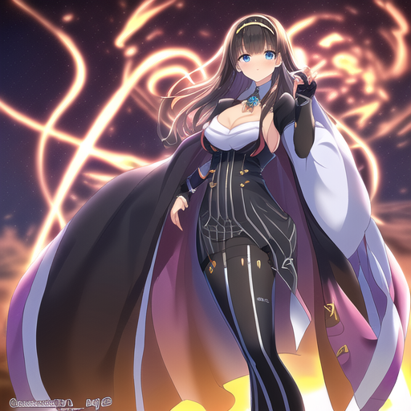

# "NAI Anine" Pure Negative Prompt (and more) #



```
Negative prompt: (bad:0), (comic:0), (cropped:0), (error:0), (extra:0), (low:0), (lowres:0), (speech:0), (worst:0)
Steps: 32, Sampler: Euler, CFG scale: 10.5, Seed: 1337, Size: 512x512, Model hash: 925997e9, Clip skip: 2
```

An *informal* research about "NAI anime" art with pure negative prompt. Such observation may be useful for "data visualization" to show that how the "number" works. **Please be skeptic on this repo.**

[Pixiv album for storing the images](https://www.pixiv.net/en/tags/PureNegativePrompt/artworks)

## Major contents ##
**No explaination. Read the articles instead.**
- **Generic research methods** (CFG-STEP scan) when an *unknown anime model* is received.
- My hands-on experience on [txt2img](https://en.wikipedia.org/wiki/Text-to-image_model) *only*. **Another prompting research.**
- **Generic prompting guide** for a [webui](https://github.com/AUTOMATIC1111/stable-diffusion-webui) compatable "anime model". Core concept (heck what application will support negative prompts?) is viable.
- **Docuementry, journal and ranting.** Read for drama. Actually some of them are *primary sources*. 
- ~~**Astolfo is a good boy.**~~
- Beware of **random docuement style** because I don't have time to explain or even expand it.
- Also beware [model hasing algorithm has been changed into SHA256 for entire model.](https://github.com/AUTOMATIC1111/stable-diffusion-webui/commit/a95f1353089bdeaccd7c266b40cdd79efedfe632) I'll use the new hash, but old hash remains (usually they are famous model isn't it?)

## Index ##
**Too lazy to update constantly. Just iterlate the directories. You will find the pattern.**
- [ch00](ch00/readme.md): ~~My content is probably not popular / legit and even completely non-sense. You shold leave if you want nice AI art.~~ Why I'm writing all these stuffs.
- [ch01](ch01/readme.md): Common content across models. **Most theory / explaination / derive goes there.**
- [ch02](ch02/readme.md): Model specific contents. **Assumed you've already read ch01 and know the context.**
- [ch03](ch03/readme.md): **Data analysis.**  Usually involves model comparasion.
- [ch98](ch98/readme.md): Backup from discord server because I think it is not safe to leave them there forever.
- [ch99](ch99/readme.md): Old segments. I didn't expect this repo draws stars and some attention. The format is being unsuitable again.

## So where to start? ##
- Take the blue pill to return the major comminuty and continue drawing. Take the [red pill](ch00/red_pill.md) if you're prepared to my ~~observation with some legit ML / NLP / AI knowledge~~ complete non-sense (or somewhat closest to the ~~reality of bugs / expolits / [Undefined behavior](https://en.wikipedia.org/wiki/Undefined_behavior)~~ dystopia of the released AI models).

## Scripts (manual scripts for webui) ##
- `step.js [step] [split_comma]`: **I use it frequently.** Generate global static emphasis level on the prompts.
- `node listseed [full_directory]`: Extract seeds inside the filenames, which reduce human error when iterlating mass image production. Use `[seed]-[width]-[height]-[cfg]-[steps]-[datetime]` as Settings > Images filename pattern.
- `aspect512.js [w] [h]`: Find actual width / height with aspect ratio `w:h` under 512x512 px also in unit of 64px.

## Scripts (broken shell scripts) ##
- `anifusion2_win11_vscode_miniconda.sh`: Install Anifusion-SD with Win11 + conda. Run it line by line in manual.

## Contact ##
**Seriously? I'm no different than a random anon in this field.**
- Discord: 6DammK9#2533
- GMail: 6DammK9@gmail.com
- Pixiv: [6DammK9](https://www.pixiv.net/en/users/11525730)