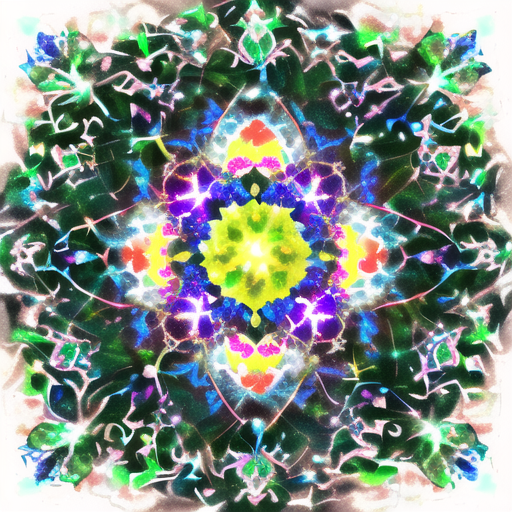

# "NAI Anine" / "anything-v3" Pure Negative Prompt #

A research about "NAI anime" art with pure negative prompt. Such observation may be useful for "data visualization" to show that how the "number" works.

[Pixiv album for storing the images](https://www.pixiv.net/en/tags/PureNegativePrompt/artworks)

### Content has been splitted ###
- NAI / **theory and explanation**: [925997e9.md](https://github.com/6DammK9/nai-anime-pure-negative-prompt/blob/main/925997e9.md)
- NAI / **Focusing on character**: [astolfo_fate.md](https://github.com/6DammK9/nai-anime-pure-negative-prompt/blob/main/astolfo_fate.md)
- NAI / **Focusing on object interation**: [astolfo_wrc.md](https://github.com/6DammK9/nai-anime-pure-negative-prompt/blob/main/astolfo_wrc.md)
- AV3 / **General exploration**: [6569e224.md](https://github.com/6DammK9/nai-anime-pure-negative-prompt/blob/main/6569e224.md)
- AV3 / **Focusing on character**: [astolfo_v3.md](https://github.com/6DammK9/nai-anime-pure-negative-prompt/blob/main/astolfo_v3.md)
- NNAI / **General exploration**: [888886dc.md](https://github.com/6DammK9/nai-anime-pure-negative-prompt/blob/main/888886dc.md)
- NNAI / **Focusing on character**: [astolfo_nnai.md](https://github.com/6DammK9/nai-anime-pure-negative-prompt/blob/main/astolfo_nnai.md)
