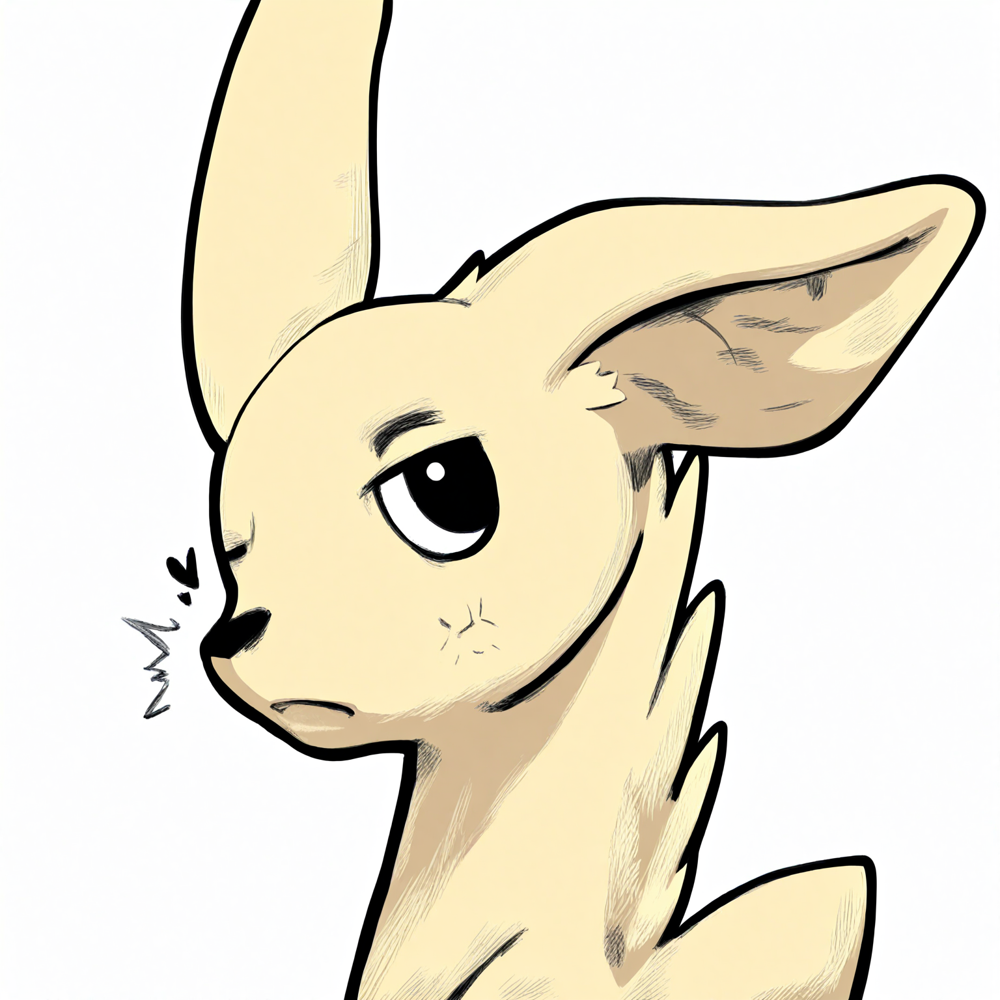
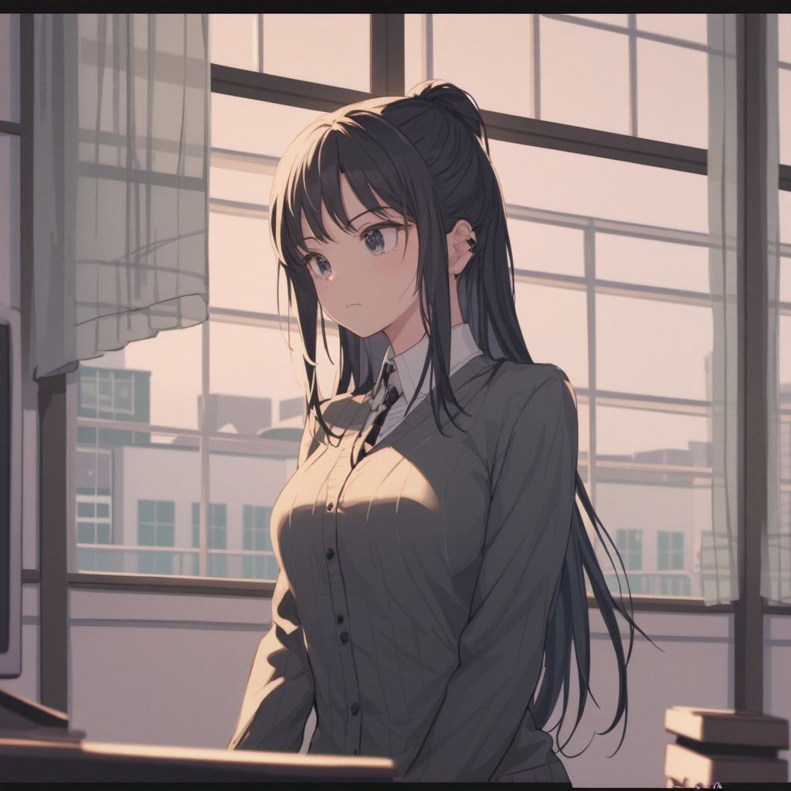
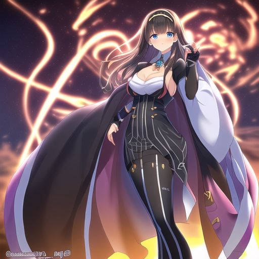

# "AstolfoRF" Unconditional Image Generation up to SDXL (and more) #



```
parameters

,
Negative prompt: ,
Steps: 64, Sampler: Euler, Schedule type: Automatic, CFG scale: 4, Seed: 1703748712, Size: 1024x1024, Model hash: 82e7f6bcb3, Model: x1a-AstolfoRF-3ep, VAE hash: 235745af8d, VAE: sdxl-vae-fp16-fix.vae.safetensors, Denoising strength: 0.7, Hires CFG Scale: 4, Hires upscale: 1.5, Hires upscaler: Latent, advanced_sampling_enabled: True, advanced_sampling_mode: SD3, sd3_shift: 3, dynthres_enabled: True, dynthres_simple_mode: False, dynthres_mimic_scale: 4, dynthres_threshold_percentile: 1, dynthres_mimic_mode: Constant, dynthres_mimic_scale_min: 0, dynthres_cfg_mode: Constant, dynthres_cfg_scale_min: 0, dynthres_sched_val: 1, dynthres_separate_feature_channels: enable, dynthres_scaling_startpoint: MEAN, dynthres_variability_measure: AD, dynthres_interpolate_phi: 0.3, sag_enabled: True, sag_scale: 0.5, sag_blur_sigma: 2, Version: f1.0.0v2-v1.10.1RC-latest-2502-g630cf49b
```

An *informal* research about [unconditional image generation](https://huggingface.co/tasks/unconditional-image-generation) with Stable Diffusion, or "AI", **up to UNet based SDXL**. Such observation may be useful for "data visualization" to show that how the "number" works. **Please be skeptic on this repo.** [My explanantion in CivitAI.](https://civitai.com/articles/5149/untitled-denoising-to-the-random-content)

<details>
    <summary> Title V2 in 2412. </summary>

# "AstolfoMix" Unconditional Image Generation (and more) #



```
parameters

Steps: 48, Sampler: Euler, Schedule type: Automatic, CFG scale: 3, Seed: 3649863581, Size: 1024x1024, Model hash: e276a52700, Model: x72a-AstolfoMix-240421-feefbf4, VAE hash: 26cc240b77, VAE: sd_xl_base_1.0.vae.safetensors, Clip skip: 2, FreeU Stages: "[{\"backbone_factor\": 1.1, \"skip_factor\": 0.6}, {\"backbone_factor\": 1.2, \"skip_factor\": 0.4}]", FreeU Schedule: "0.0, 1.0, 0.0", FreeU Version: 2, Dynamic thresholding enabled: True, Mimic scale: 1, Separate Feature Channels: False, Scaling Startpoint: MEAN, Variability Measure: AD, Interpolate Phi: 0.3, Threshold percentile: 100, PAG Active: True, PAG Scale: 1, Version: v1.9.3
```

An *informal* research about [unconditional image generation](https://huggingface.co/tasks/unconditional-image-generation) with Stable Diffusion, or "AI". Such observation may be useful for "data visualization" to show that how the "number" works. **Please be skeptic on this repo.** [My explanantion in CivitAI.](https://civitai.com/articles/5149/untitled-denoising-to-the-random-content)
</details>

<details>
    <summary> Title V1 in 2210. </summary>

# "NAI Anine" Pure Negative Prompt (and more) #



```
Negative prompt: (bad:0), (comic:0), (cropped:0), (error:0), (extra:0), (low:0), (lowres:0), (speech:0), (worst:0)
Steps: 32, Sampler: Euler, CFG scale: 10.5, Seed: 1337, Size: 512x512, Model hash: 925997e9, Clip skip: 2
```

An *informal* research about "NAI anime" art with pure negative prompt. Such observation may be useful for "data visualization" to show that how the "number" works. **Please be skeptic on this repo.**
</details>

[Pixiv album for storing the images](https://www.pixiv.net/en/tags/PureNegativePrompt/artworks)

[(New) Observation on PonyXL V6](ch02/pony_sd.md)

## Major contents ##
**No explaination. Read the articles instead.**
- **Generic research methods** (CFG-STEP scan) when an *unknown anime model* is received.
- My hands-on experience on [txt2img](https://en.wikipedia.org/wiki/Text-to-image_model) *only*. **Another prompting research.**
- **Generic prompting guide** for a [webui](https://github.com/AUTOMATIC1111/stable-diffusion-webui) compatable "anime model". Core concept (heck what application will support negative prompts?) is viable.
- **Docuementry, journal and ranting.** Read for drama. Actually some of them are *primary sources*. 
- ~~**Astolfo is a good boy.**~~
- Beware of **random docuement style** because I don't have time to explain or even expand it.
- Also beware [model hasing algorithm has been changed into SHA256 for entire model.](https://github.com/AUTOMATIC1111/stable-diffusion-webui/commit/a95f1353089bdeaccd7c266b40cdd79efedfe632) I'll use the new hash, but old hash remains (usually they are famous model isn't it?)

## Index ##
**Too lazy to update constantly. Just iterlate the directories. You will find the pattern.**
- [ch00](ch00): ~~My content is probably not popular / legit and even completely non-sense. You shold leave if you want nice AI art.~~ Why I'm writing all these stuffs.
- [ch01](ch01): Common content across models. **Most theory / explaination / derive goes there.**
- [ch02](ch02): Model specific contents. **Assumed you've already read ch01 and know the context.**
- [ch03](ch03): **Data analysis.**  Usually involves model comparasion.
- [ch04](ch04): *A (very dumb) batch script for multiple WebUI instances.*
- [ch05](ch05): *Astolfo mix. Existing technology, original idea.*
- [ch06](ch06): *Finetuning in vanilla approach.* ~~Guess what? Original content! What?~~
- [ch97](ch97): **Uncategorized contents.** Usually "not article".
- ch98: ~~Backup from discord server because I think it is not safe to leave them there forever.~~ **Removed. Merged / moved to different articles.**
- [ch99](ch99): A "House-Tree-Person" test towards SD, as well as the oldest articles. *Still following this pracice today.*

## So where to start? ##
- Take the *blue pill* to return the major comminuty and continue drawing. Take the [red pill](ch00/red_pill.md) if you're prepared to my ~~observation with some legit ML / NLP / AI knowledge~~ complete non-sense (or somewhat closest to the ~~reality of bugs / expolits / [Undefined behavior](https://en.wikipedia.org/wiki/Undefined_behavior)~~ dystopia of the released AI models).

## (260504) Capping of research topics ##
- I am not going to continue exploring Diffusion / AutoRegressive models based from DiT e.g. [Anima](https://huggingface.co/circlestone-labs/Anima) or MoT e.g. [SenseNova-U1](https://huggingface.co/sensenova/SenseNova-U1-8B-MoT) because of **lacking of research support**. Math properies, scientitic study and engineering application should be studied from scratch. Relying on [designer tools / creator based community](https://comfy.org/) will not be sustainable. ~~I will fade out with A1111 which he is a great inventor by blending many useful tools within math properties.~~

## Contact ##
**Seriously? I'm no different than a random anon in this field.**
- Discord: 6DammK9#2533
- GMail: 6DammK9@gmail.com
- Pixiv: [6DammK9](https://www.pixiv.net/en/users/11525730)
