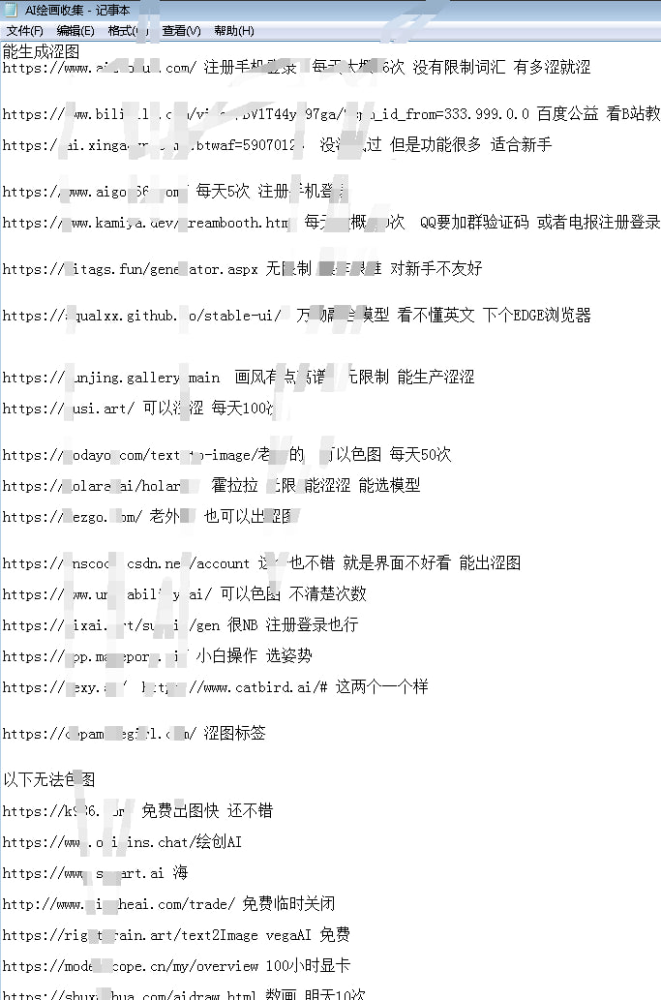

# Red pill #

- ~~Coming soon~~ Screw it I have no time to write anything. Even do AI arts.

## Blue pill (wiki) ##

- Looking for a "wiki"? [AI艺术天堂](https://a2a.top/)
- Looking for "another wiki"? [AiDraw - AiDraw](https://stable-diffusion-book.vercel.app/en/)
- Search for "元素法典" for prompt samples. Same as "tag".
- Looking for models? [AI绘画模型博物馆](https://aimodel.subrecovery.top/)
- Similar to [SD RESOURCE GOLDMINE](https://rentry.org/sdgoldmine)
- "Stashes" [SD - WebUI 资源站](https://www.123114514.xyz/)
- "Stashes" but encrypted [PCIA](https://huggingface.co/Cinnamomo/pcia)

## Blue pill (WebUI Variants) ##

- [VLAD Diffusion](https://github.com/vladmandic/automatic): [EN article](https://generativeai.pub/complete-guide-to-vlad-diffusion-installation-an-automatic1111-alternative-for-stable-diffusion-25b43fbc67e7), [CN article](https://zhuanlan.zhihu.com/p/624417721)
- [ComgyUI](https://github.com/comfyanonymous/ComfyUI): [CN article](https://zhuanlan.zhihu.com/p/620297462)

## Blue pill (一鍵安裝包) ##

- **Just learn CLI and DIY!**
- [A1111 WebUI Easy Installer and Launcher](https://github.com/EmpireMediaScience/A1111-Web-UI-Installer)
- Super Easy AI Installer Tool: [Github](https://github.com/diStyApps/seait), [CivitAI](https://civitai.com/models/27574/super-easy-ai-installer-tool)
- [Easy Diffusion](https://github.com/easydiffusion/easydiffusion)
- SD-WebUI启动器 / 秋葉aaaki 整合包: [CN article](https://zhuanlan.zhihu.com/p/607573450), [CN article](https://zhuanlan.zhihu.com/p/596417901), [CN article](https://zhuanlan.zhihu.com/p/607573450), [CN article](https://blog.csdn.net/supperman_009/article/details/130618045), [Author's Discord](https://discord.gg/Uu3syD9PnR), [Author's Bilibili](https://space.bilibili.com/12566101)
- [绘世启动器](https://apps.microsoft.com/store/detail/%E7%BB%98%E4%B8%96%E5%90%AF%E5%8A%A8%E5%99%A8/9NXBR1M0V7M1?hl=zh-cn&gl=cn)
- ["App Store" (multimedia focused)](https://pinokio.computer/)

## Blue pill (General community) ##

- **Some official discord may be omitted. Use [i18n code](https://github.com/ladjs/i18n-locales) instead of natural language.**
- (Advanced) AI Art `zh`: [場外AI繪圖討論區](https://discord.gg/k57gkxWgev) 
- (General) AI Art `zh`: [鳥巢AI 藝術學園](https://discord.gg/gUSqkYE7)
- AI detector `en/ko`: [Illuminarty](https://discord.gg/YeTYaUe8)
- AI general (with legal and debate)  `ja`: [AI 絵作り研究会](https://discord.gg/ai-jp)
- AI application developer based `en`: ~~Shinonome AI Lab~~ [sail](https://discord.gg/TXW8tAvU)
- Waifu Diffusion `en/ja`: [東方Project AI](https://discord.gg/touhouai)
- Pure debate server `ja`: [議論一般チャンネル](https://discord.gg/HjYRv2rZ)
- 2b2t `zh`: [SDCN](https://t.me/StableDiffusion_CN)
- ~~victim~~ `ru`: [Novel AI](https://t.me/Novel_AI_Group)
- ~~attacker~~ `ru`: [FoxyAI | Chat](https://t.me/ai_regeneration_chat)
- Thanks for sharing `ru` [Neuroartists](https://t.me/neuroartists)- 
- FB, Average `en`: [Stable Diffusion AI ( HK 香港 )](https://www.facebook.com/groups/401633922161662/) ~~Blocked my main account lol~~
- FB, Active `zh`: [Stable Diffusion 台灣社群v2](https://www.facebook.com/groups/619813739922551/)
- FB, Active `zh`: [AIGC視覺藝創聯盟 ( 原 Midjourney AI 台灣社群 )](https://www.facebook.com/groups/1014779572745632/)
- FB, Active `kr`: [Stable Diffusion Korea](https://www.facebook.com/groups/1394143228095187)
- FB, Active `th`: [Stable Diffusion Thailand](https://www.facebook.com/groups/1091513994797057)
- Forum, Active `kr`: [AI 그림 채널](https://arca.live/b/aiart)
- Blog, Active `zh`: [AI加速器社区](https://www.acceleratori.com/d/11152)

## Blue pill (Photorealistic community) ##

Why there is so many TG CN groups: As there are some sensitive LoRA and abusive use of [some models](https://huggingface.co/TASUKU2023/Chilloutmix), some big community groups has been shut down [img](img/Screenshot_2023-02-20-20-00-53-46_18fe6f119af5ae2c728d929083699df1.jpg) [img](img/Screenshot_2023-02-20-20-00-48-50_18fe6f119af5ae2c728d929083699df1.jpg) [img](img/photo_2023-02-22_01-11-17.jpg).

- TG, Active `zh`: [丹鼎派炼丹房](https://t.me/aisetu2333)
- TG, Inactive `zh`: [AI绘画xp交流群](https://t.me/AIpainting)
- TG, Inactive `zh`: [元素法典 魔法交流群](https://t.me/+6Qj1Zr714ZI4OTRl)
- TG, Average `zn`: [三次元讨论群](https://t.me/huatu3d)
- ~~TG, Active `zh`: Deleted by request~~
- ~~TG, R18G `zh`: Deleted by request~~
- TG, Inactive `zh`: [AI绘图 福利群R18](https://t.me/AIaek86)
- ~~[AI Stable Diffusion [Ybyv Pic Share]](https://t.me/AI_StableDiffusion_Ybyv)~~  **ROT13**

Note that "SDCN" is not categorized here.

## Blue pill (AI art platform) ## 

Definitely not Pixiv.

- `jp`: [AIPIC](https://ai-arts-iota.vercel.app/zh)
- `kr`: [NOVELLAL.IO](https://novelai.io/)
- `en`: [Prompt Search](https://ptsearch.info/)
- `en`: [Draft](https://draft.art/)
- `jp`: [MajinAI](https://majinai.art/)
- `jp`: [Aivy](https://aivy.run/)
- `jp`: [chichi-pui（ちちぷい](https://www.chichi-pui.com/)
- `en`: [AIBooru](https://aibooru.online/)
- `kr`: [PixAI](https://pixai.art/)
- `jp`: [AIピクターズ](https://www.aipictors.com/)
- `jp`: [PerfTile ART](https://perftile.art/)

## Blue pill (AI marketplace) ##

- `zh`: [LiblibAI•哩布哩布AI](https://www.liblibai.com/)
- `zh`: [吐司 Tusi.Art](https://tusi.art/)
- `en`: ~~[Hugging Face](https://huggingface.co/)~~
- `kr`: [Civitai](https://civitai.com/)

## Not blue pill ##

*Stolen from [internet](https://t.me/StableDiffusion_CN/1199467)*. I will recover and format the content if I have time (probably don't). Ignore the `zh` comments because *all platforms are similar.*



## Not red pill ##
- `en`: [ReaLifecyborg/My-Stable-Diffusion-Notes](https://github.com/ReaLifecyborg/My-Stable-Diffusion-Notes)
- `jp`: [sp8999.log](https://sp8999.com/)

## Before taking the red pill ##

- **Here are just my original works. Not even a proper academic research!** Make sure you're skeptical on me.


~~No red pill actually. Ignore the danfbooru tags because CLIP is trained with LAION5B.~~

```
(the_matrix: 0.98), [[1boy]], [[male_focus]], [[agent_smith]], [[red_pill]]
Negative prompt: (bad:0), (comic:0), (cropped:0), (error:0), (extra:0), (low:0), (lowres:0), (speech:0), (worst:0)
Steps: 48, Sampler: Euler, CFG scale: 8, Seed: 3227634410, Size: 512x512, Model hash: 38c1ebe3, Clip skip: 3, ENSD: 31337
```
