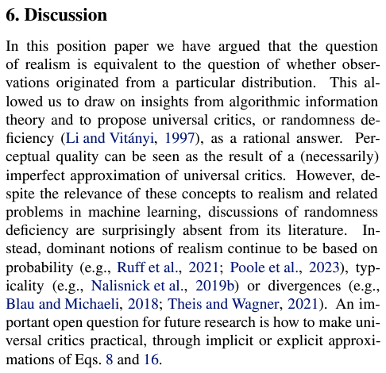

# Materials on aesthetic analysis #

### Red pill (Is a paper! Too difficult to understand but I have friends) ###

- [What makes an image realistic?](https://arxiv.org/abs/2403.04493)



### I am really watching the whole series ###

- Notes in discord: [CS side](https://discord.com/channels/1027129024054575174/1077525010421383241), [VA side](https://discord.com/channels/1027129024054575174/1077834709821833216). **I strongly encourage to watch the very first video on each series.** Such "computional" "art" can be theorized. It is not a mystery.

- CS side: [MIT lecture videos](https://www.youtube.com/watch?v=MABLFo7IV3I&t=8s&ab_channel=AliJahanian) [Course page](https://ali-design.github.io/deepcreativity/)
- VA side: [Art expert commentary](https://www.youtube.com/@YouDianYiSi)

### Papers (finally there is some) ###

- [Emu](https://ai.meta.com/research/publications/emu-enhancing-image-generation-models-using-photogenic-needles-in-a-haystack/)

- [LyCORIS](https://arxiv.org/abs/2309.14859)

- [ImageReward](https://arxiv.org/abs/2304.05977)

### Articles (my stuffs) ###

[Full list in discord.](https://discord.com/channels/1033769426216046622/1067116591021568001/1067116591021568001)

- If you denies the formal rules in art school, and parise for big data: [AVA](https://paperswithcode.com/sota/aesthetics-quality-assessment-on-ava), [WD](https://cafeai.notion.site/WD-1-5-Beta-Release-Notes-967d3a5ece054d07bb02cba02e8199b7).
- "How to draw": [Art Rocket](https://www.clipstudio.net/how-to-draw), [PIXIV](https://www.pixiv.net/howto/category/7?lang=en)
- Theroies on drawing: [Art school in China](https://www.xuexicn.com/archives/21054), [Wikipedia](https://en.wikipedia.org/wiki/Traditional_animation), [More wikipedia](https://en.wikipedia.org/wiki/Chiaroscuro)
- "Aesthic analysis": [Philosophical channel](https://www.youtube.com/watch?v=8bMGStypFWY&list=PLz0n_SjOttTfJ-FYWvSButSSRYjAc_4ps&ab_channel=Carneades.org), [Art school](https://www.youtube.com/watch?v=CC0dPsWOXEA&ab_channel=DavidsonArtOnline), 
- Art analysis (more then drawings, video / drama is included): [Art analysis channel](https://www.youtube.com/watch?v=tNd6q2CIwI0&ab_channel=ARTFORINTROVERT)
- "Lecture materials" (need to access libraries): ~~Nope, this is not public. Try to meet university students and ask them to access the library.~~
- [A book on photography](https://baike.baidu.hk/item/攝影構圖學/12978052). Probably is a textbook somewhere.
- [Wiki](https://en.wikipedia.org/wiki/Aesthetics#Computational_approaches)

### Copied from somewhere else (Chinese) ###

"為甚麼你會選擇現在才放上來" 
"因为XXX算是真正有创作者思维的人" [Link](https://discord.com/channels/1033769426216046622/1033769426216046625/1078602594143961118)

- https://b23.tv/HvgtLiT
- https://b23.tv/32OvDkn
- https://b23.tv/4sS6bum
- https://b23.tv/Fm5QctS
- https://b23.tv/KaqMg2R 

### My theorey ###

If you see the [Live Preview in the first 4 - 8 steps](https://github.com/cmdr2/stable-diffusion-ui#live-preview), which is already *enabled by default* in webui, you can "feel" the AI is actually tried to [draft](https://www.youtube.com/watch?v=pqrp4lS9i6M&ab_channel=%E6%9C%89%E7%82%B9%E8%89%BA%E6%80%9D%E5%93%A6) and fill in details. However, the [Gaussian latent space (Data++)](https://youtu.be/tcAZ9KvBtkg) doesn't provide *full* details to "complete the drawing" and let audiances to [recall the abstract message](https://youtu.be/tcAZ9KvBtkg?list=PLCpMvp7ftsnIbNwRnQJbDNRqO6qiN3EyH&t=2354). For example, ["bad hands"](https://www.buzzfeednews.com/article/pranavdixit/ai-generated-art-hands-fingers-messed-up) shows that AI won't try to guess the missing contents, it just blurred or randomly fill in the patterns. Such hybird between [impressionism](https://en.wikipedia.org/wiki/Impressionism) and [surrealism](https://en.wikipedia.org/wiki/Surrealism) approach may works for most art, but it is a pity that most publics are ignoring the archievements and focusing on the weakness of such advanced [generative art](https://en.wikipedia.org/wiki/Generative_art).

Currently [some absurdly well trained model](../ch02/f59359c175.md) shows awareness on drawing sceneary along with character and obvious objects, which is close to [hyperrealism](https://en.wikipedia.org/wiki/Hyperrealism_(visual_arts)). Note what it is differnt from [Photorealism](https://en.wikipedia.org/wiki/Photorealism) which is popular in social media. It shows "balance" between photo and hand drawn animes, meanwhile most deatils / information is preserved, and it look like it has been "self-taught" via [Unsupervised Semantic Segmentation](https://paperswithcode.com/task/unsupervised-semantic-segmentation), like what [Segment Anything](https://arxiv.org/abs/2304.02643) did. Maybe it is because intentionally introduced a custom tagger with sceneary focused artists.

Most general publics scarfice the diversity of the content and use intensive additional training to "fill in the missing details" (LoRA / DB with TTE), or even [intercept manually](controlnet.md), I doubt that if it is a feasible method to "contribute art". It looks like we just received another tool to "contribute drawing".

Instead, [merging models](merge.md) does provide new contents to discover (e.g. [cosplay from nowhere](../ch02/4de704d8.md)), despite lacking of academic / theoritcal support. However, current social news has alreay proven its potential.

Would art able to be *partially expressed by pure logic?* With [iterlation of knowledge graph](https://en.wikipedia.org/wiki/Knowledge_graph), indentifying [psychology and psychiatry effects as visual language](https://youtu.be/lmdtWygrvFA?si=JnEiloBs-_gvUyM_), and finally *find the sweet spot to let most people agree for some insights* via [Computational neuroscience](https://youtu.be/cufOEzoVMVA?si=VJM7O7dNIcZfNaKo)? It sounds possible, yet really, really counter intuitive.

(Added on 240529): After watching some videos and articles about [Daniel Dennett](https://www.youtube.com/watch?v=nGrRf1wD320&t=388s&ab_channel=BigThink), *I agree that many great science theory were pseudoscience before they have been rigorously criticized*, especially it is interdisciplinary for multiple subjects, and becomes an individual subject when the thoughts are being structured (may not valid!). Any findings, after criticize and experiement (may not complete!), will contribute to nice progress, *and truth will be reached eventually.* If such progress is not critical to your living, truth will be benefitical, even you are an "AI anti".

### (Extra) Unconditional image generation ###

- See [my CivitAI article](https://civitai.com/articles/5149). Will remove rant, especially ch99 if I have time.

### Old session in ch98. Written in 2212. ###

- https://youtu.be/eS7luZntgnQ
- https://www.youtube.com/watch?v=reUZRyXxUs4&ab_channel=TED
- https://www.youtube.com/watch?v=-lz30by8-sU&ab_channel=Computerphile
- https://youtu.be/A0wMbUKVGOA
- https://youtu.be/8_oDofXXxvE
- https://www.panewslab.com/zh_hk/articledetails/1aku74id8a4p.html
- https://www.youtube.com/watch?v=8bMGStypFWY&list=PLz0n_SjOttTfJ-FYWvSButSSRYjAc_4ps&ab_channel=Carneades.org
- https://www.youtube.com/watch?v=lpXZpUMXRok&list=PLz0n_SjOttTfJ-FYWvSButSSRYjAc_4ps&index=28&ab_channel=Carneades.org 
- http://cmuems.com/2016/60212/resources/galanter_generative.pdf

```
26/35
<p>Ultimately, generative art per se is ideologically neutral. It simply is a way of creating
art and any content considerations are left to a given artist. After all, generative art is
prehistoric and precedes modernism, postmodernism, and every other “ism” on
record. Nevertheless, the postmodern condition continues to interest some artists and
critics in the realm of generative art, and it serves as a platform for extending, not
ending, that discussion.</p>
```
- https://www.youtube.com/watch?v=CC0dPsWOXEA&ab_channel=DavidsonArtOnline
- https://youtu.be/Bj07Ybr-CRQ
- https://www.zhihu.com/question/20171225/answer/43151814?utm_id=0
- https://www.youtube.com/watch?v=80LCWXh4FfM&ab_channel=TED
- https://www.v2ex.com/t/900031
- https://www.ithome.com.tw/news/104851
- https://tw.news.yahoo.com/meta的人工智慧聊天機器人-學壞了-言論充滿偏見-還打臉母公司-031018393.html
- https://youtube.com/shorts/odq4l4vtXFc?feature=share
- https://www.youtube.com/shorts/fvLqx0pb_gA
- https://www.youtube.com/watch?v=TecuyeRlOkY&ab_channel=MentalOutlaw
- https://twitter.com/TheDevelop3r/status/1600275925614067714
- https://www.techbang.com/posts/102295-chatgpt-banned-stack-overflow
- https://www.inside.com.tw/article/30042-ChatGPT-challenge-NLP-Algorithm-Engineer
- https://twitter.com/ammaar/status/1601284293363261441
- https://twitter.com/8co28/status/1603186112985698304
- https://www.inside.com.tw/article/30245-stanford-research-finds-codes-are-more-unsecure-with-AI-assistance 
- https://twitter.com/TheDevelop3r/status/1609980041449902080
- https://jweb.kl.edu.tw/userfiles/811/document/11835_%E8%A6%96%E8%A6%BA%E8%97%9D%E8%A1%93%E5%89%B5%E4%BD%9C%E7%A0%94%E7%A9%B6%E6%96%B9%E6%B3%95%E4%B9%8B%E7%90%86%E8%AB%96%E5%9F%BA%E7%A4%8E%E6%8E%A2%E6%9E%90.pdf
- https://twitter.com/KenAkamatsu/status/1612023820050890754

- [Better remove rants and keep it in Discord since I don't have to worry about the server now.](https://discord.com/channels/1027129024054575174/1029421705187303495/1047909834374258748) 
- tldr on 240517: [I have done House-Tree-Person Test (HTP) towards "AI" thoughout this journey.](../ch99/readme.md) I want to know AI, even I have learnt in postgrad level. If it can project human's psychological / psychiatrical status, I can do it with the same way towards "AI", then I know how it / she / he ~~Astolfo~~ perform the prediction. The "prediction" is still not fully understanded in the mathmatical / logical way, so I prefer a looser way to "peek" and make some [conjecture](https://en.wikipedia.org/wiki/Conjecture).
