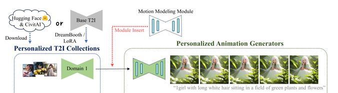
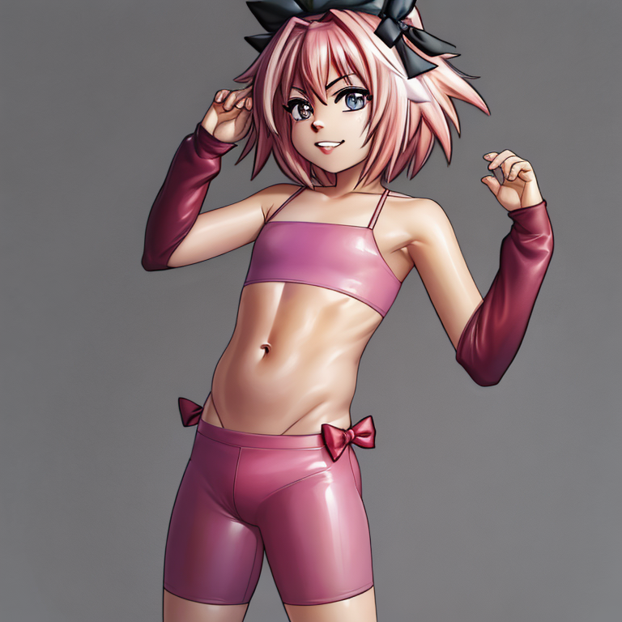
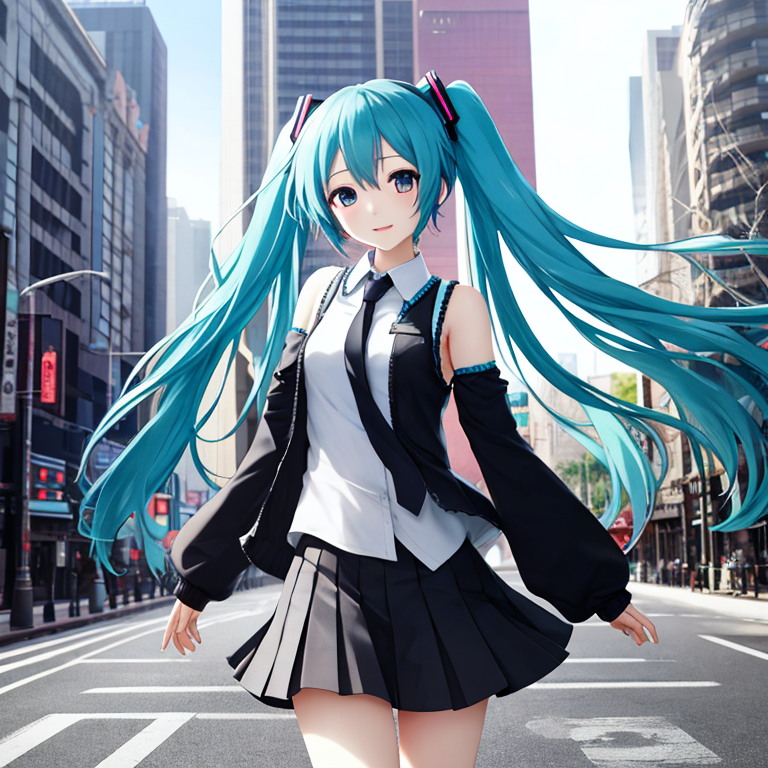
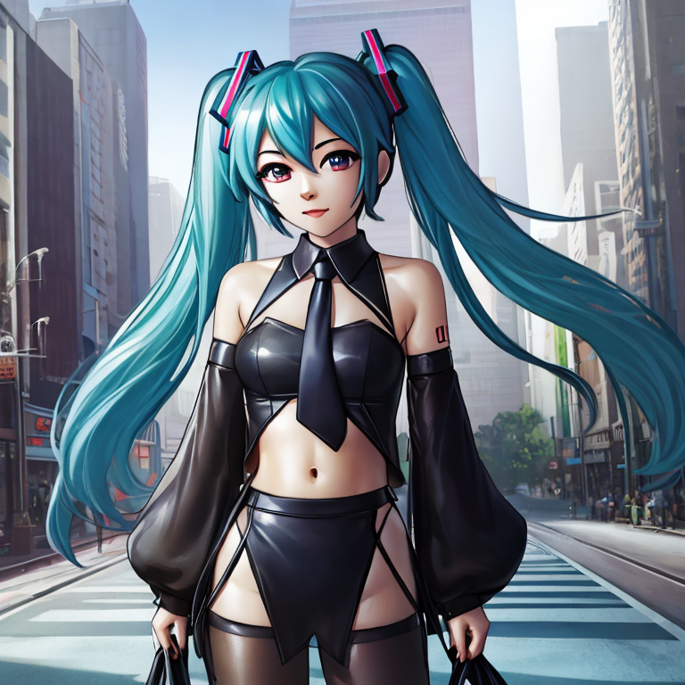
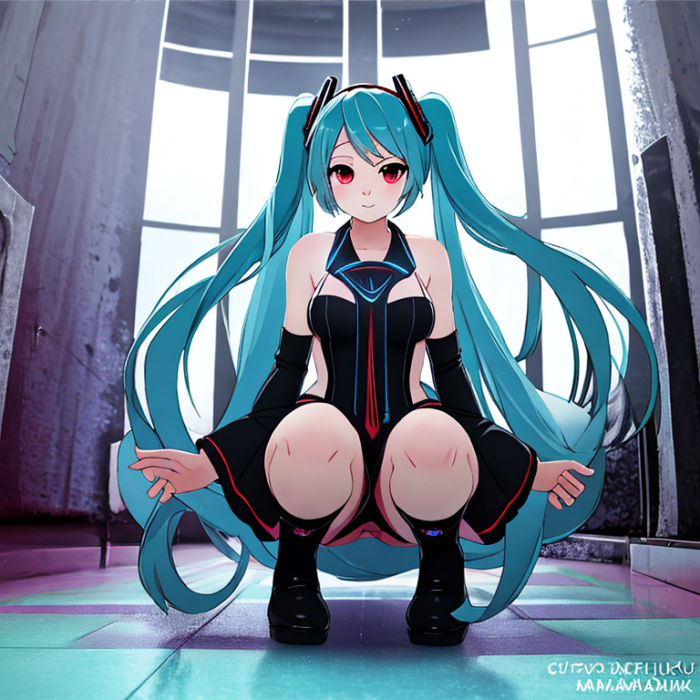
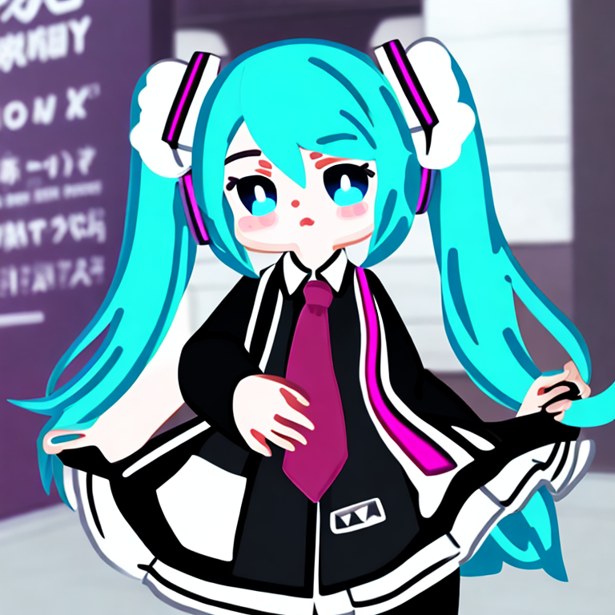

# AnimateDiff #

## Introduction ##

- [Why I'm interested in using this (I will spend less to almost none time on image generation).](../ch97/vid2vid.md) I need some serious use case for my lovely [AstolfoMix](../ch05/README.MD).

- [The WebUI integration.](https://github.com/continue-revolution/sd-webui-animatediff) Academically not great, but it should be the best integration for community. It also make use of [ControlNet](./controlnet.md), which is also a popular application.

- It introduce a whole lot of new parameters to explore (including models), it will be tedious. I'll try my best to correlate the parameters I've used.

## Explorered hyperparameters ##

- It will be arranged in order from "do not touch" to "just change it".
- For "reasonable ranges", [this chapter (ch01)](./readme.md) should be enough, and [ch99](../ch99/readme.md) for "basic parameters". 
- It can (and it should) be aligned to the hyperparameters used in text2img. It actually try to respect the original "domain model".



### "Do not touch or it will break" ###

- Motion module: **Must be SD v1.4 based, NOT v1.5.** i.e. `mm_sd_v14`. [It is because NAI is rumored to be trained from SD 1.4.](../ch02/animevae_pt.md) I have tried v1.5 based, it malformed so hard. For realistic models, unless you are sure that it is finetuned from SD 1.5 (pure fine tune, no merge), don't use them. `mm-Stabilized_mid.pth` is plausible but it still breaks occasionally. `temporaldiff-v1-animatediff` and `mm_sd_v14` is not useable.

- Context batch size: **Stick with 16.** I've tried 24 and 32, it really breaks.

### It should be changed ###

- Sampler: **DDIM** from Euler. You will see `Setting DDIM alpha.` in console log. [Slight difference may be amplified in process.](../ch98/k_euler.md)

- CFG: **Slightly increase to 6** from 4. 8 is too high.

- Prompts: Since it is motion based, we will need something stable in motion. Currently I select `navel` to make sure core body is present.

- Closed loop / Stride: `N` / `1` because I'm not going to make gif loop. It also damage diversity.

- Sampling Steps: "Keep it low" (24 or 48). I won't use 256 as usual.

- Dimension: 768x768. 1024x1024 will ~~give you OOM with 24GB card (currently 3090)~~ crash instantly. 

- Looks like it is not recoverable. Reboot WebUI then.

- Number of frames / FPS: 32 / 8 (For testing)

### No change from text2img ###

- [FreeU](./freeu.md) is compatable. 

- [Dynamic CFG](./dynamic_cfg.md) is compatable, but effect is not good. If you choose DDIM, it will automatically disabled because it doesn't support DDIM.

- VAE / UNET (original text2img model) / LoRA: *There shouldn't be limitation.*

## Result (text2vid) ##

- Off AnimateDiff. Note that [style LoRA](https://civitai.com/models/164160/ph-draw-style) has been used.



```
(aesthetic:0), (quality:0), (solo:0), (boy:0), [[navel]], (astolfo:0.98), <lora:ph_draw:0.9>
Negative prompt: (worst:0), (low:0), (bad:0), (exceptional:0), (masterpiece:0), (comic:0), (extra:0), (lowres:0), (breasts:0.5)
Steps: 24, Sampler: DDIM, CFG scale: 6, Seed: 680973778, Size: 768x768, Model hash: 41429fdee1, Model: 20-bpcga9-lracrc2oh-b11i75pvc-gf34ym34-sd, VAE hash: 551eac7037, VAE: vae-ft-mse-840000-ema-pruned.ckpt, Clip skip: 2, FreeU Stages: "[{\"backbone_factor\": 1.2, \"skip_factor\": 0.9}, {\"backbone_factor\": 1.4, \"skip_factor\": 0.2}]", FreeU Schedule: "0.0, 1.0, 0.0", FreeU Version: 2, Lora hashes: "ph_draw: 3e4f2671b6f7", Version: v1.6.0
```

<details>
    <summary>Click to open img/00030-680973778.mp4</summary>


https://github.com/6DammK9/nai-anime-pure-negative-prompt/assets/10937874/5b9d99d3-5dd6-4f38-b798-4951184abd44


</details>

```
(aesthetic:0), (quality:0), (solo:0), (boy:0), [[navel]], (astolfo:0.98), <lora:ph_draw:0.9>
Negative prompt: (worst:0), (low:0), (bad:0), (exceptional:0), (masterpiece:0), (comic:0), (extra:0), (lowres:0), (breasts:0.5)
Steps: 24, Sampler: DDIM, CFG scale: 6, Seed: 680973778, Size: 768x768, Model hash: 41429fdee1, Model: 20-bpcga9-lracrc2oh-b11i75pvc-gf34ym34-sd, VAE hash: 551eac7037, VAE: vae-ft-mse-840000-ema-pruned.ckpt, Clip skip: 2, FreeU Stages: "[{\"backbone_factor\": 1.2, \"skip_factor\": 0.9}, {\"backbone_factor\": 1.4, \"skip_factor\": 0.2}]", FreeU Schedule: "0.0, 1.0, 0.0", FreeU Version: 2, Lora hashes: "ph_draw: 3e4f2671b6f7", Version: v1.6.0
```

## Applying with ControlNet ##

- Read [the guide about ControlNet first](./controlnet.md). The parameter searching will based from there.

- Number of frames / FPS: 0 / 20 (80 frames in total, from given dataset)

- *4 folders for batch*

- For a 768x768 48 STEPS video, **it takes 60 minutes to render and 23GB of VRAM.** It will be very costly to scan parameters.

### Applying Style LoRA ###

- Style LoRA seems work (slight change in color tone and shape in small segments)

|Style|PNG (no CNet / Animediff)|Result|
|---|---|---|
|Default||``|
|Moderate style||``|
|Another style||Coming soon|
|Agressive style||Coming soon|

<details>
    <summary>Click to open img/00037-2541798183.mp4</summary>

https://github.com/6DammK9/nai-anime-pure-negative-prompt/assets/10937874/61ae8d74-1599-4f24-a5ab-a4ebbdb3f016

</details>

<details>
    <summary>Click to open img/00038-2541798183.mp4</summary>

https://github.com/6DammK9/nai-anime-pure-negative-prompt/assets/10937874/990799a8-c8fe-4d5a-bb37-37e042004b5d

</details>

### Why it works ###

- Consider as [Layered IPO Model](https://en.wikipedia.org/wiki/IPO_model).

|Layer or Order|Input|Processor|Output|
|---|---|---|---|
|Zero|Text Prompt|Base Model (SD) + LoRA|Art Style (Color / shape / semantics / linguistics)|
|One|Preprocessed source video Frame|ControlNet|Coordination|
|Two|Text Prompt with result video frames|AnimateDiff|Motion (Relation between Coordinates)|

- It tries to [deompose the complicated question in to subproblems, and solve them together](https://en.wikipedia.org/wiki/Divide-and-conquer_algorithm). Since SD and related models successfully [shows "coorporation" together](../ch05/README.MD#associative-property) (however "common ground" is not easy to find), it ["sounds"](https://en.wikipedia.org/wiki/Soundness) feasible.
