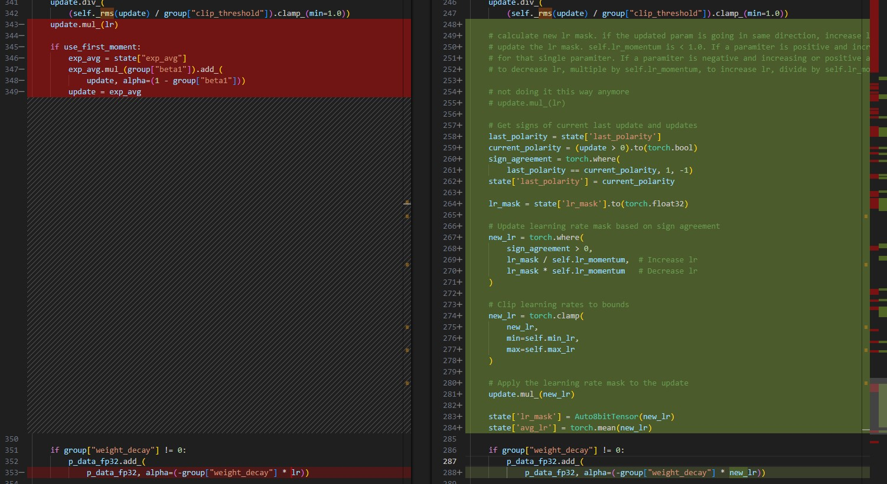
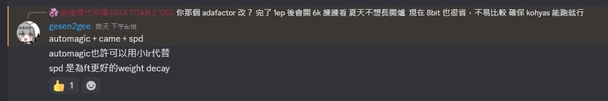

# Findings on "Automagic Optimizer" #

- As on 250506, it is still a developing optimizer. There is also no academic discussion (e.g. math formula) yet, we can treat it as "Ostris' optimizer".

## Primary Source of the optimizer ~~abstract~~ ##

- The [automagic.py](https://github.com/ostris/ai-toolkit/blob/main/toolkit/optimizers/automagic.py), and [commit history](https://github.com/ostris/ai-toolkit/commits/main/toolkit/optimizers/automagic.py), hinted that it started on 2411.

- The [tweet](https://x.com/ostrisai/status/1917679501909057777) on 240501.

> built in stochastic rounding
>
> gradient accumulation
>
> auto adjusts (learning rate)
>
> scaled 8bit learning rate for every parameter... singly
>
> binary polarity mask for every parameter... speed up learning for parameters traveling a fixed direction

- The only major change is **Binary polarity mask**. See next session.

## Inspection of the base algorithm ~~Related works~~ ##

- By direct code comparasion between the initial version and current version of the `automagic.py`, there is **direct code reference** to [adafactor](https://arxiv.org/abs/1804.04235).

- [Adafactor](https://paperswithcode.com/method/adafactor) is a stochastic optimization already in general.

> In several recently proposed stochastic optimization methods (e.g. RMSProp, Adam, Adadelta)...
>
> At each step, we receive a stochastic realization...

- The "stochastic rounding" refers to [the Random Rounding discussion in the Gopher paper](https://arxiv.org/abs/2112.11446). However, the [pytorch implementation result](https://github.com/pytorch/pytorch/issues/120376) is quesitonable, which may be outpaced by FP8 training which yields a lot more "floating point errors". ~~Meanwhile 8bit optimizer with random rounding will be even more questionable.~~

- "Relative step" has been removed without reason. However [community opinion](https://www.reddit.com/r/StableDiffusion/comments/1cyxvjh/lora_training_prodigy_or_adafactor_learning_rate/?rdt=45965) is generally negative either.

- RMS part, and weight decay is preserved. ~~Inherited from adamw. Original Adafactor has no weight decay.~~

- The major difference is  **Binary polarity mask**. It try to control learning rate by **sign agreement**. [signSGD](https://arxiv.org/abs/1802.04434) and [TIES-Merging](https://arxiv.org/abs/2306.01708) has considerations of sign agreement also, which prevents fluctuation while learning.



## Potential improvements ~~more related works~~ ##

- From [a discord message](https://discord.com/channels/1077423770106597386/1093732075355525331/1368812620496506910), it can be combined with "confidence factor" from [CAME](https://arxiv.org/abs/2307.02047) and [SPD](https://arxiv.org/abs/2411.01713) which replace RMS part with another parameter.

- It may appears as Kohyas PR so I decided to leave the screenshot raw. Will remove once PR has been made.



```py
from library.custom import Automagic_CameAMP8bit
```
