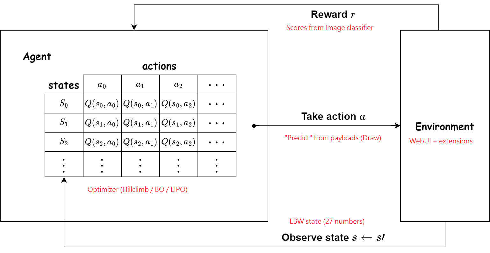

# Findings on AutoMBW #

## What is it? ##

- [This WebUI extension.](https://github.com/Xerxemi/sdweb-auto-MBW) Sadly there is scarce infomration about the whole mechanism.

## Basic concept for the extension ##

- It will be explained by my forked on [auto-MBW-rt](https://github.com/6DammK9/auto-MBW-rt) and [sd-webui-runtime-block-merge](https://github.com/6DammK9/sd-webui-runtime-block-merge). Note that the actual UI may varies. Docuements has been maded there. It won't be repeated here.

- It requires "payloads", "search algorithm (optimizer)", and an "image classifier" to work. Generally the *optimizer* finds the best "MBW receipe" for 2 models *to obtain the highest score* from "image classifier".

- **AutoMBW models are rare.** It is because it lacks of effective promotion, and such ML technique is generally worse then human evalulation (optimization), with the developed "MBW theories."

## AutoMBW models ##

- I've tried my best to discover any models based from this technique. Hopefully there are more outside my observation.

- [mzpikas_tmnd_enhanced](https://huggingface.co/ashen-sensored/mzpikas_tmnd_enhanced)

- [Silicon29](https://huggingface.co/Xynon/SD-Silicon)

- [CGA9](https://t.me/StableDiffusion_CN/1170018)

- [218XL](https://civitai.com/models/216159/218xl)

- [~~AstolfoMix Boosted~~](../ch05/README.MD)

## Linking the concept between "AutoMBW" with AI / ML techniques ##

- In a narrow sense, it is [hyperparameter optimization](https://en.wikipedia.org/wiki/Hyperparameter_optimization).  *27 hyperparameters* has been identified and use an algorithm to optimize the "evalulation metric" under a set of static tasks.

- However **the "payloads" are not defined, and subject to author's choice**, meanwhile **there is no actual ground truth to trace** (the "image classifier" is blackbox, meanwhile the score metric is still subjective). Although the "environment", "action", and "reward", are static throughout the process, **but all of them are not analytical (way too large), and subjective to interprept.** This can be loosely indentified as a [RL scenario.](https://en.wikipedia.org/wiki/Reinforcement_learning) It is also can loosely identified as  [Boosting](https://en.wikipedia.org/wiki/Boosting_(machine_learning)), because it involves multiple SD models with different model weights.

- To make it fully [RLHF](https://en.wikipedia.org/wiki/Reinforcement_learning_from_human_feedback), human feedback is obvious: *Replace the aesthic score with an UI slider (no I won't implement it)*, or just pursuate yourself [it is RLHF already](https://huggingface.co/blog/trl-ddpo)

- From the [optimizer list](https://github.com/SimonBlanke/Hyperactive#overview), we can discovered that [a "policy gradiant" has been applied](https://spinningup.openai.com/en/latest/spinningup/rl_intro3.html), and the [hill climbing](https://en.wikipedia.org/wiki/Hill_climbing) sounds similar but different to [gradient descent](https://en.wikipedia.org/wiki/Gradient_descent) (meanwhile "Stochastic hill climbing" is referred as the famous [SGD](https://en.wikipedia.org/wiki/Stochastic_gradient_descent)), forming the [basic VPG proposed by OpenAI ~~before Sam~~.](https://spinningup.openai.com/en/latest/algorithms/vpg.html)

- In special case, [bayesian optimization](https://en.wikipedia.org/wiki/Bayesian_optimization) made some mathmatical assumpotions ([gaussian process](https://en.wikipedia.org/wiki/Gaussian_process)) to keep track on the learning progress, like what [Q learning](https://en.wikipedia.org/wiki/Q-learning) does. "Without suprise", [hybird of Bayesian Q Learning](https://brandinho.github.io/bayesian-perspective-q-learning/), or [Bayesian RL](https://www.semanticscholar.org/paper/Bayesian-Reinforcement-Learning-with-Gaussian-Engel-Mannor/aa8cddad98d78e462da70eed0595ec2b0970eb58), [are appeared.](https://zhuanlan.zhihu.com/p/338298513)

- See ["AutoMBW" as a variant of Boosting](../ch05/README.MD#autombw-as-a-variant-of-boosting) for a comment that it *will work as an alternative way to optimize a SD model, and hopefully learn most knowledge with strict constraint.*

## Misconception found in related works ##

- The description of [mzpikas_tmnd_enhanced](https://huggingface.co/ashen-sensored/mzpikas_tmnd_enhanced) is somewhat a bit exaggerated. From the extension [sd-webui-runtime-block-merge](https://github.com/ashen-sensored/sd-webui-runtime-block-merge) and [sd_webui_SAG](https://github.com/ashen-sensored/sd_webui_SAG), it is probably **an AutoMBW model based on SAG score, and payloads generating 2048x2048 images.** Note that the "payload" is an "action" from ["agent"](https://en.wikipedia.org/wiki/Intelligent_agent), which is not related to ["training"](https://www.tensorflow.org/js/guide/train_models).

- [SiliconSD](https://medium.com/@media_97267/the-automated-stable-diffusion-checkpoint-merger-autombw-44f8dfd38871) used a ["Binary Mid Pass" searching](https://github.com/Xerxemi/sdweb-auto-MBW/blob/master/scripts/mbw/auto_mbw.py#L612). *It is not an effective optimization algorithm* (comparing with [Random Search](https://en.wikipedia.org/wiki/Random_search)). The cloest approximation is [A* search algorithm](https://en.wikipedia.org/wiki/A*_search_algorithm) or [Monte Carlo tree search](https://en.wikipedia.org/wiki/Monte_Carlo_tree_search) which treat the "searching space" as a huge binary tree.