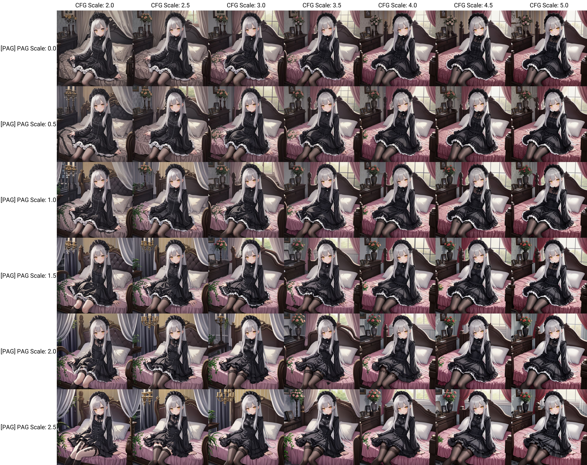
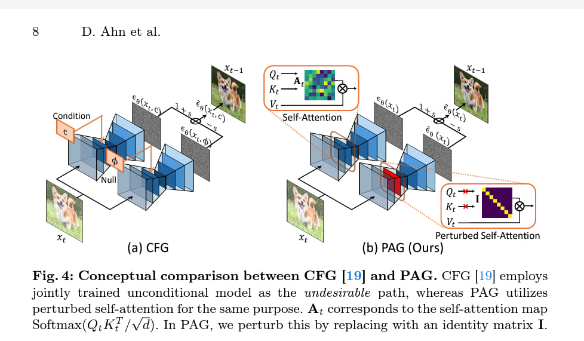
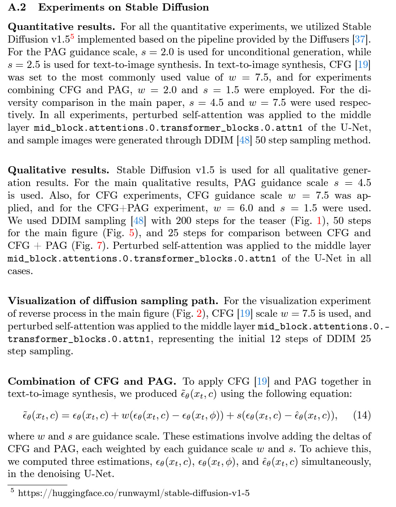
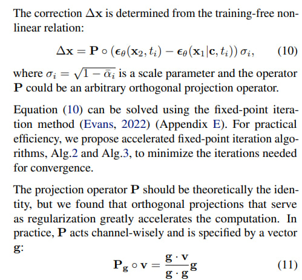
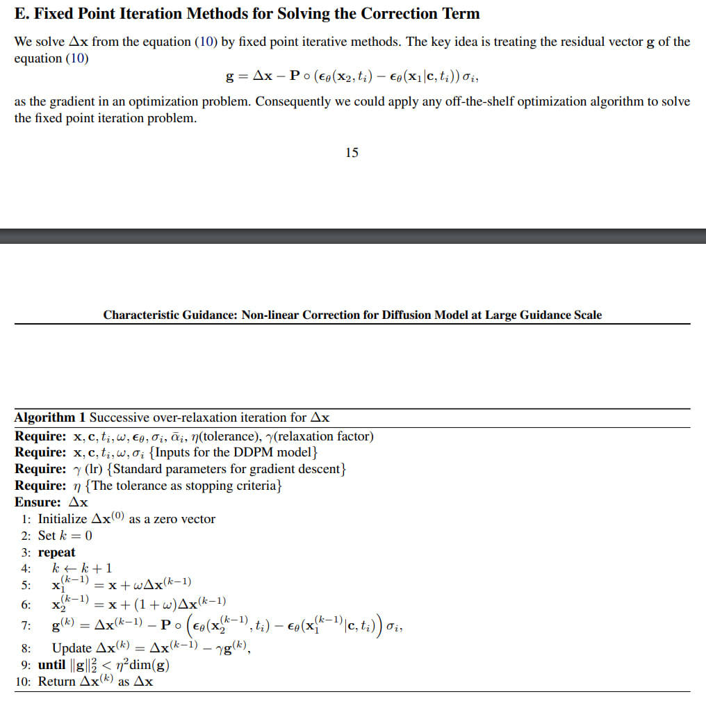
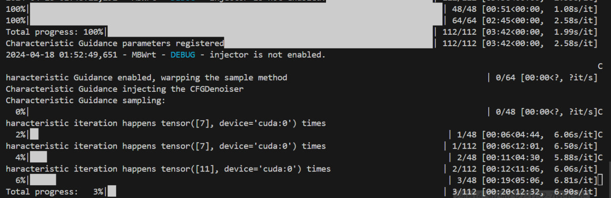

# Compound effect of PAG / CHG and known additives #

## Resource Table ##

- Note that original github repo / youtube seminar of the papers are not included. Google them instead.

|Abbr.|Full name|arXiv|A1111 Extension|
|---|---|---|---|
|CFG|Classifier-Free Diffusion Guidance|[2207.12598](https://arxiv.org/abs/2207.12598)|(Built in)|
|Dyn|Dynamic CFG / CFG Rescale|[2305.08891](https://arxiv.org/abs/2305.08891)|[sd-dynamic-thresholding](https://github.com/mcmonkeyprojects/sd-dynamic-thresholding)|
|FreeU|Free Lunch in Diffusion U-Net|[2309.11497](https://arxiv.org/abs/2309.11497)|[sd-webui-freeu](https://github.com/ljleb/sd-webui-freeu)|
|PAG|Perturbed-Attention Guidance|[2403.17377](https://arxiv.org/abs/2403.17377)|[sd-webui-incantations](https://github.com/v0xie/sd-webui-incantations)|
|CHG|Characteristic Guidance|[2312.07586](https://arxiv.org/abs/2312.07586)|[CharacteristicGuidanceWebUI](https://github.com/scraed/CharacteristicGuidanceWebUI)|

## Plots ##

- Since FreeU ([my finding](./freeu.md)) is affecting different components, it will be independent from most parameters.

- Dynamic CFG ([my finding](./dynamic_cfg.md)) introduce parameters related to embeddings, somehow $mimic=1$ is recommended (affects but respect CFG), and $\varphi=0.3$ is independent from most parameters. 

- With *assuming it follows the same pattern* (going [greedy](https://en.wikipedia.org/wiki/Greedy_algorithm)), plotting graphs with FreeU + Dynamic CFG freezed, with hyperparameter against raw CFG will be fine.

- Note that PAG is *incompatable* with CHG. The plot will be seperated as XY plot.

- Also due to [my model](../ch05/README_XL.MD)'s characteristics, *there are no negative prompts or quality tags for the prompt*.

- My preferred CFG only will be $CFG_0=4.5$. Then $CFG=3.0,PAG=1.0$ will yields more content but still organized.

- Left: Dynamic CFG, Right: CHG (default setting).

## Finding of PAG ##

- It **deny negative prompts** and use [identity matrix](https://en.wikipedia.org/wiki/Identity_matrix) instead. Luckily most embeddings across prompts (both positive and negative) are having [matrix norm](https://en.wikipedia.org/wiki/Matrix_norm) (or [magnitude](https://en.wikipedia.org/wiki/Magnitude_(mathematics))) close to $I$. Therefore $PAG=1$ meanwhile $CFG=CFG_0-1$ is recommended.

- Meanehile author has tested PAG + CFG also, recommending different number. However since OG SDXL is used, it varies on finetuned ~~fried~~ anime models.

## Finding of CHG ##

- It looks better **without raising yield**, meanhile **it takes 8x time to render an image.** There is non-linear solver for each sampling step. Iterlation of the solver is ranged from 5 to 50 steps.

