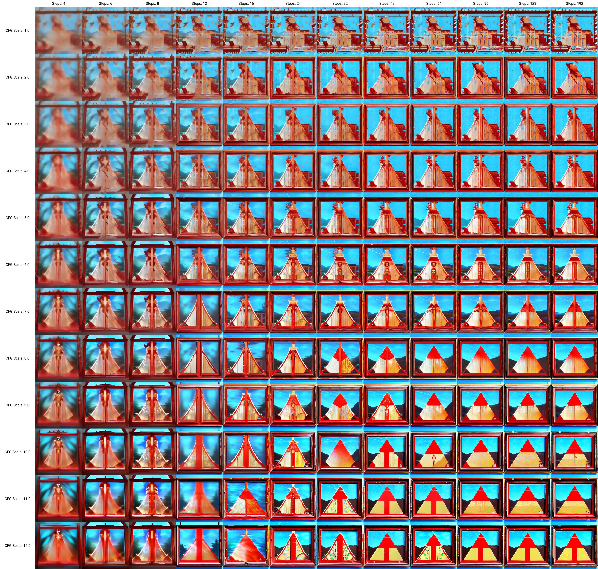

# CFG-STEP scan #

- [Rant moved. About what is "Unconditional".](./aesthetic.md#extra-unconditional-image-generation)

- Not to be confused with [Dynamic CFG / CFG rescale](./dynamic_cfg.md). This article is to encourage user ~~artist~~ to actively **search exhaustively for hyperparameters**.

- [Diffusion Models — DDPMs, DDIMs, and Classifier Free Guidance](https://betterprogramming.pub/diffusion-models-ddpms-ddims-and-classifier-free-guidance-e07b297b2869#5cf1)

- This "scan" (procedure) aims to find the sweet spot for the balance between "richness of content" and "obediance for prompts". Although both [FID score](https://en.wikipedia.org/wiki/Fr%C3%A9chet_inception_distance) and [subjective justification](https://pubmed.ncbi.nlm.nih.gov/26903834/) are not effective or accurate to evaluate the performance of a model, they are the best obtainable and interpretable information without relying or waiting for external judgement, which changes constantly.

- Perform this procedure when you received a new moedel. CFG depends on the model and the trained dataset, why will be hard to determince once you include prompts to "guide the model".

- In rare occurance (e.g. [ALunarDream V1.5](https://huggingface.co/lunachan/ALunarDream)), you may find the "scan results" contains multiple kinds of content. For example, both anime and realistic images (not posted because of NSFW).

- Prompt: Just the **minimal prompt which can generate legit images** (e.g. reconizable objects)
```
(bad:0), (comic:0), (cropped:0), (error:0), (extra:0), (low:0), (lowres:0), (speech:0), (worst:0)
```

- Sampler: Euler (Momentum based, smooth curve.)
- SEED: ~~1337~~ 4015663762 (Or any seed you can see legit images on "initial setting")
- Initial settings: **CFG 7, STEP 48** (Most models should work)

- STEP (512x512): `4,6,8,12,16,24,32,48,64,96,128,192` (Exponential scale)
- CFG (512x512): `1,2,3,4,5,6,7,8,9,10,11,12` (Linear scale)

- STEP (512x512): `48,64,96` (Exponential scale)
- CFG (768x768): `11.0,11.5,12.0,12.5,13.0,13.5` (2.25 * "512x512")
- CFG (768x768): `13.5,15.0,16.0,18.0,20.0` (2.25 * "512x512")

### Procedure ###
- Use "initial settings" to search "SEED".
- XY-prompt, size 512x512, STEPxCFG.
- Choose the optimal setting for *reconizable and legit objects*.
- Usual result: **CFG 6-8, STEP 48-96.** (some biased / well trained models may hit as low as 2)
- Repeat for 768x768. **Usually 2-2.25x CFG in 512x512.** (maybe 1x if there is prompt fillers)
- *Or just choose what you think is good.*

### Example (obvious) ###
- [NAI](../ch99/925997e9.md)
- Result: **CFG 10, STEP 48**. ~~Originally choose 10.5~~


- [WD 1.4](https://huggingface.co/hakurei/waifu-diffusion-v1-4)
- Result: **CFG 8, STEP 96**


### Example (hard to decide) ###

- [bp_mk5](https://huggingface.co/Crosstyan/BPModel)
- Result: **CFG 5, STEP 48**. ~~But I choose CFG 6, STEP 64 afterward.~~


- Then I choose CFG 13.5 (6*2.25) for 768x768:


### Example (even harder) ###

- [bp_nman_e29](https://huggingface.co/Crosstyan/BPModel/blob/main/NMFSAN/README.md)
- Result: **CFG 5, STEP 64**.


### Example (very hard) ###

- [VBP2.2](https://t.me/StableDiffusion_CN/924998)
- Result: **CFG 3, STEP 48**. Yep just try segmentation by yourself.


- Somehow I tried CFG 5 / 7 for 768x768:


### Example (very hard) ###

- [AnythingV5](https://civitai.com/models/9409/anything-v5-or-anything-diffusion-original)
- Result: **CFG 2, STEP 24**. Later I use CFG 4.5 in 768 x 768, which is so low.

