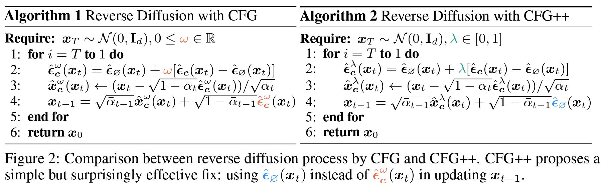
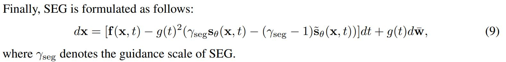
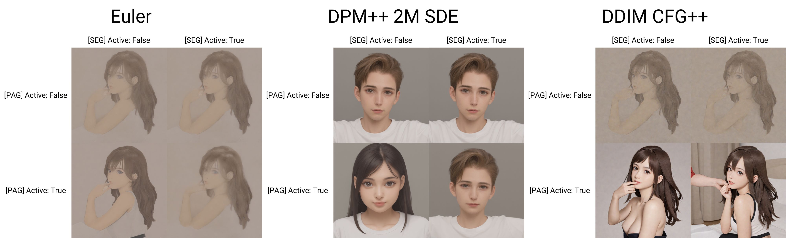
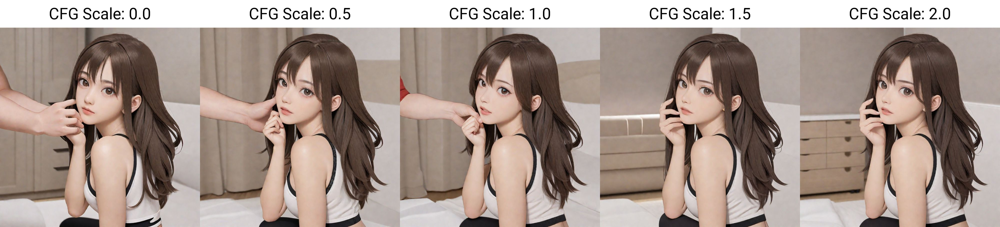
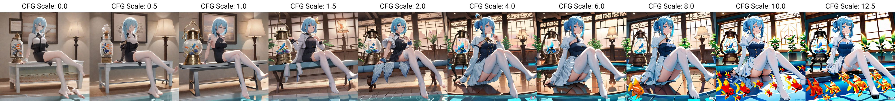

# Compound effect of CFG++ / PAG / SEG and tuned model #

## Resource Table ##

- Note that original github repo / youtube seminar of the papers are not included. Google them instead.

|Abbr.|Full name|arXiv|A1111 Extension|
|---|---|---|---|
|CFG++|CFG++: Manifold-constrained Classifier Free Guidance for Diffusion Models|[2406.08070](https://arxiv.org/abs/2406.08070)|(Built in)|
|PAG|Perturbed-Attention Guidance|[2403.17377](https://arxiv.org/abs/2403.17377)|[sd-webui-incantations](https://github.com/v0xie/sd-webui-incantations?tab=readme-ov-file#perturbed-attention-guidance)|
|SEG|Smoothed Energy Guidance: Guiding Diffusion Models with Reduced Energy Curvature of Attention|[2408.00760](https://arxiv.org/abs/2408.00760)|[sd-webui-incantations](https://github.com/v0xie/sd-webui-incantations?tab=readme-ov-file#smoothed-energy-guidance)|

## Description ##

- Continued from [previous work](./cfg_pag_chg.md).

- However, some core additives are not used. [FreeU](./freeu.md) introduce bias (via a lot of hyperparameters) which is against the *unconditional* approah, meanwhile [Dynamic CFG](./dynamic_cfg.md) just break the formula and yield pure noise.

- Since the mathematics involved are very complicated, I'll post screenshots later. However I can assume no parameters are required. You can generate images already without even looking at the "default" parameters (such as $$\sigma\rightarrow\infty $$ and $$CFG_{++}=0$$ (or 1 due to the code level offset in A1111) )





## Special Notes in CFG++ ##

- [As listed in the PR, it is just scaled with 12.5 with the 1.0 offest "to make it work".](https://github.com/AUTOMATIC1111/stable-diffusion-webui/pull/16035)

> CFG scale is divided by 12.5 if the sampler has "CFG++" in name. CFG scale maps to CFG++ scale: [1.0, 12.5] -> [0.0, 1.0].

- After some testing, **using A1111's parameter as above,** 6.0 is good for style conversion. However 1.0 will be more accurate and natural.

- It behaves much different from [the of original CFG.](./cfg_step.md). The STEPS now has a lot more visible change, making it has a optimal STEP instad of dumping as much as I can afford.

- However "Hires. fix" (Global i2i after upscale) is not affecting much. Still good for 0.7. *From oberservation, hires STEPs should equal to base STEPs (i.e. 0)*

## Plots ##

- Model: [AstolfoMix XL "DGMLA-216"](../ch05/README_XL.MD#findings-on-sdxl-dgmla-modified-della). [Should be good for this experiment.](https://civitai.com/articles/5149/untitled-denoising-to-the-random-content-v15)






```
parameters

Steps: 48, Sampler: DDIM CFG++, Schedule type: Exponential, CFG scale: 1, Seed: 3045266444, Size: 1024x1024, Model hash: bdb9f136b6, Model: x215a-AstolfoMix-24101101-6e545a3, VAE hash: 235745af8d, VAE: sdxl-vae-fp16-fix.vae.safetensors, Clip skip: 2, SEG Active: True, SEG Blur Sigma: 11, SEG Start Step: 0, SEG End Step: 2048, PAG Active: True, PAG SANF: True, PAG Scale: 1, PAG Start Step: 0, PAG End Step: 2048, Version: v1.10.1
```

