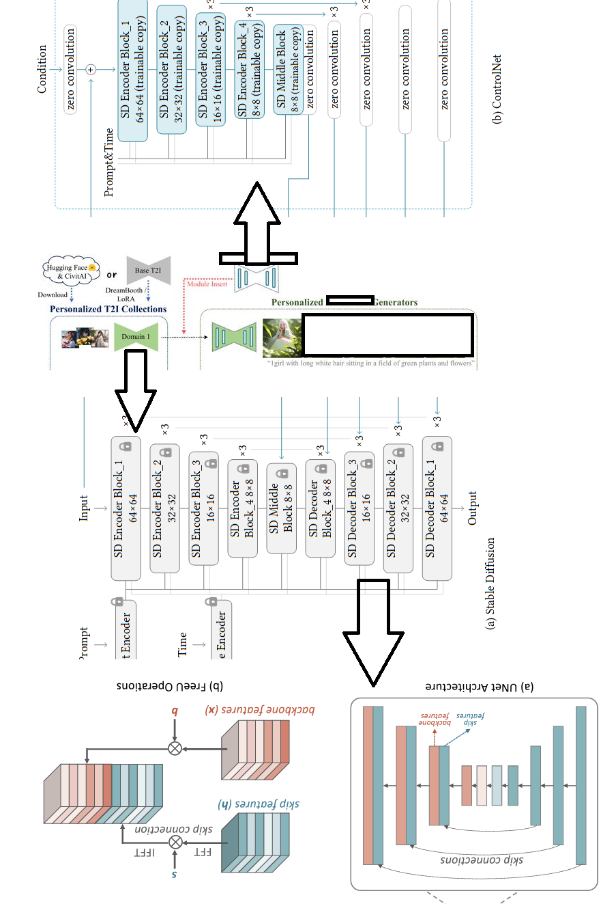
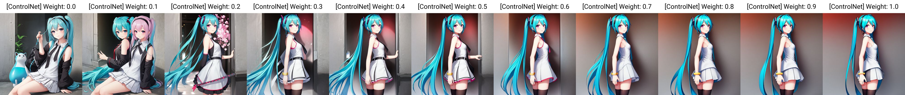
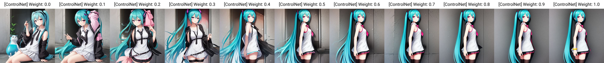
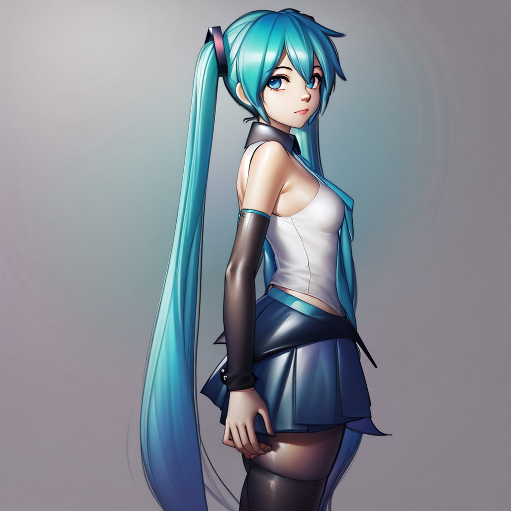
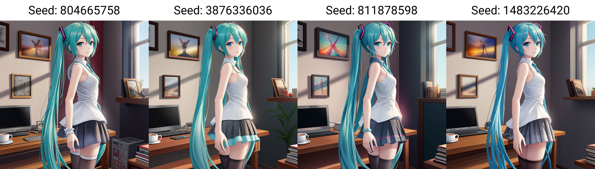
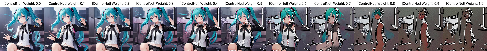
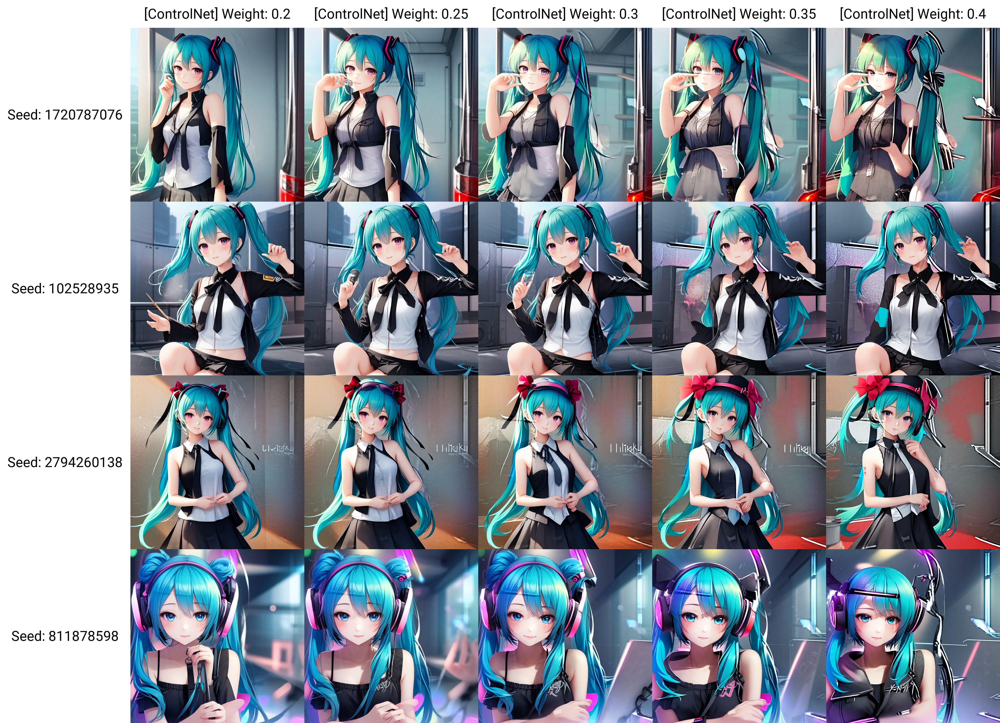
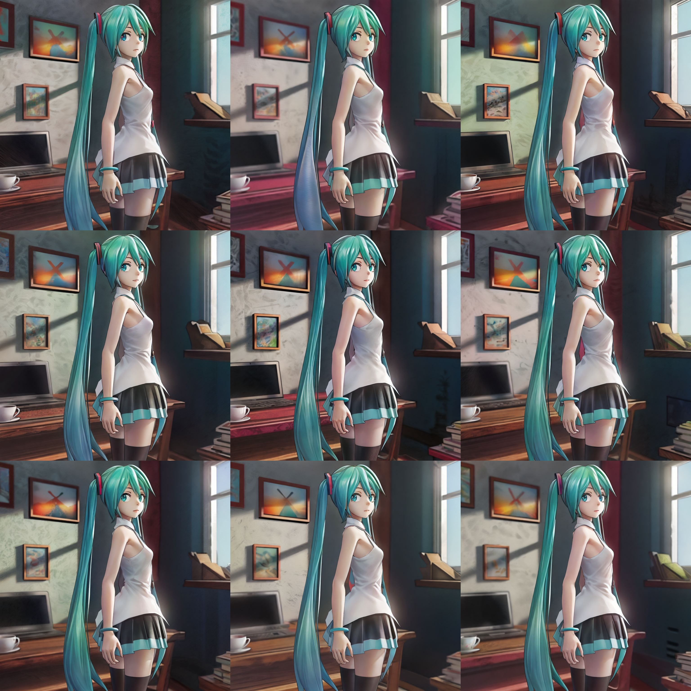

# Materials of ControlNet and related research #

Note: ~~I never use any of them~~ I started using them, but as part of "AnimeDiff". It is just some examples to intercept manually, instead of "automatic approach". See the findings below. Related works are kept here.

## Guides (For docuementry, I never draw) ##

- [重绘学派法术绪论1.2](https://docs.qq.com/pdf/DR2pJcWdTRXVpWEty)

### ControlNet ###

- [Github repo](https://github.com/lllyasviel/ControlNet)

- [WebUI integration](https://github.com/Mikubill/sd-webui-controlnet)

- [Guess Mode is CFG Based ControlNet + Exponential decay in weighting.](https://github.com/Mikubill/sd-webui-controlnet#guess-mode-non-prompt-mode-experimental)

- [arXiv paper](https://arxiv.org/abs/2302.05543) ~~Looks like a blog post.~~

### Composer ###

- [Github repo](https://github.com/damo-vilab/composer)

- [arXiv paper](https://arxiv.org/abs/2302.09778) 

### Latent Couple ###

- [Github repo](https://github.com/opparco/stable-diffusion-webui-two-shot)

- No paper.

### DragGAN ###

- [Github repo](https://github.com/XingangPan/DragGAN)

- [Is a LDM (sort of)](https://kexue.fm/archives/9662)


## Findings on using ControlNet ##

- **I only use machine generated output.** For example, segmentation map, "line art" after tons of `cv2` operations etc. I have my very first dataset, thanks to [@streamline](https://twitter.com/kaizirod), but I will not publish the dataset.

- Also, it is continued from [AnimeDiff](./animatediff.md). The parameters will be integrated to there.

### General usage ###

- If you have already preprocessed the images, **choose "All" for Control Type**. It will give accurate result.

- You will find that it does almost the same as AnimeDiff (or FreeU). Then the **optimation target** is obvious: Align to original image once again. 



- Controlnet weight acts like prompt weight / LoRA weight. *More then 1.0, even selected with "My prompt is more important"*, it will break original "draft" and return undesirable result (no, it won't look better). Instead, *try below 1.0 with "ControlNet is more important"*. Currently **I pick 0.7 with "ControlNet is more important"**. This is generated by line art:



- 0.5 - 0.7 are plausible. Sometimes 0.5 still works. This is seg art:



```
parameters
(aesthetic:0), (quality:0), (solo:0), (girl:0), (miku:0.98)
Negative prompt: (worst:0), (low:0), (bad:0), (exceptional:0), (masterpiece:0), (comic:0), (extra:0), (lowres:0)
Steps: 24, Sampler: DDIM, CFG scale: 6, Seed: 680973778, Size: 1024x1024, Model hash: 41429fdee1, Model: 20-bpcga9-lracrc2oh-b11i75pvc-gf34ym34-sd, VAE hash: 551eac7037, VAE: vae-ft-mse-840000-ema-pruned.ckpt, Clip skip: 2, ControlNet 0: "Module: none, Model: control_v11p_sd15_seg [e1f51eb9], Weight: 0.0, Resize Mode: Crop and Resize, Low Vram: True, Guidance Start: 0, Guidance End: 1, Pixel Perfect: False, Control Mode: ControlNet is more important", FreeU Stages: "[{\"backbone_factor\": 1.2, \"skip_factor\": 0.9}, {\"backbone_factor\": 1.4, \"skip_factor\": 0.2}]", FreeU Schedule: "0.0, 1.0, 0.0", FreeU Version: 2, Script: X/Y/Z plot, X Type: [ControlNet] Weight, X Values: "0,0.1,0.2,0.3,0.4,0.5,0.6,0.7,0.8,0.9,1.0", Version: v1.6.0
```

- To apply style LoRA, once again, once they are aligned, parameter can be reused.



```
(aesthetic:0), (quality:0), (solo:0), (girl:0), (miku:0.98), <lora:ph_draw:0.9>
Negative prompt: (worst:0), (low:0), (bad:0), (exceptional:0), (masterpiece:0), (comic:0), (extra:0), (lowres:0)
Steps: 24, Sampler: DDIM, CFG scale: 6, Seed: 1847485688, Size: 1024x1024, Model hash: 41429fdee1, Model: 20-bpcga9-lracrc2oh-b11i75pvc-gf34ym34-sd, VAE hash: 551eac7037, VAE: vae-ft-mse-840000-ema-pruned.ckpt, Clip skip: 2, ControlNet 0: "Module: none, Model: control_v11p_sd15_lineart [43d4be0d], Weight: 0.7, Resize Mode: Crop and Resize, Low Vram: True, Guidance Start: 0, Guidance End: 1, Pixel Perfect: False, Control Mode: ControlNet is more important", FreeU Stages: "[{\"backbone_factor\": 1.2, \"skip_factor\": 0.9}, {\"backbone_factor\": 1.4, \"skip_factor\": 0.2}]", FreeU Schedule: "0.0, 1.0, 0.0", FreeU Version: 2, Lora hashes: "ph_draw: 3e4f2671b6f7", Version: v1.6.0
```

### Line art model ###

- There is 2 models available: `control_v11p_sd15_lineart` and `control_v11p_sd15s2_lineart_anime`. Currently `control_v11p_sd15_lineart` is better for me. Anime version is suprisingly has more fade.

### Segmentation model ###

- Nothing special.

### Tile / Blur ###

- Nothing special. However you will find some slight difference in the backgound.



### "Light Composition Controlnet" ### 

- [Model page.](https://huggingface.co/ioclab/control_v1p_sd15_brightness). [One of few docuemention.](https://aigc.ioclab.com/sd-showcase/light_controlnet.html) I received `control_v1p_sd15_illumination` personally also. **Not useable, at least in stand alone, unless you switch back to ControlNet 1.0, as it was designed on 2305.** Expected usage: "All" with "model path".



- Further seeked for advice from [@streamline](https://twitter.com/kaizirod), *I am expected to use all of them*. I will expect "locked bright / dim area" instead of reconizing the subject. Therefore, I choose **0.25** for the lightening effect.



### Combining all of them together ###

- *Things go complicated.* As the seeked advice, the dataset is **preprocessed with CV algorithms, and then pass to neural networks for style transfer.** 4 CNets are being used together. **It will take a lot of VRAM (7G for 1024x1024 with xformer and "Low VRAM" enabled).**

- Instead of guessing all hyperparameter at once, [divide and conquer](https://en.wikipedia.org/wiki/Divide-and-conquer_algorithm) will save a lot of time (at least 40x because AnimateDiff is a higher dimensional task) on finding optimal hyperparameters. But before hand, I must make sure the associative property of SD as UNET / CLIP ensemble is valid. Luckily, [I have already found and proven it](../ch05/README.MD#associative-property).

- Now "ControlNet is more important" is [unsatisfiable](https://en.wikipedia.org/wiki/Boolean_satisfiability_problem) because we don't know what CNet should be followed, therefore **switching Control Mode of All CNet into "Balanced"** will be a safe bet. Also, since we are overriding original CNet's implementation (no code inspection yet), we must turn off all preprocessor (**Preprocessor are all None**). However CNet weight can be saved. 

|CNet|Control Mode|Preprocessor|Model|Control Weight|Control Mode|
|---|---|---|---|---|---|
|1|All|**None**|`control_v11p_sd15_seg`|0.7|**Balanced**|
|2|**Lineart**|**None**|`control_v11p_sd15_lineart`|0.7|**Balanced**|
|3|**Tile/Blur**|**None**|`control_v11f1e_sd15_tile`|0.7|**Balanced**|
|4|All|**None**|`control_v1p_sd15_illumination`|0.25|**Balanced**|

- Finally we roll a batch for consistancy (accidentally applied style LoRA). It looks good, *but style transfer is not obvious. Seems that the weight above should be tuned.*


