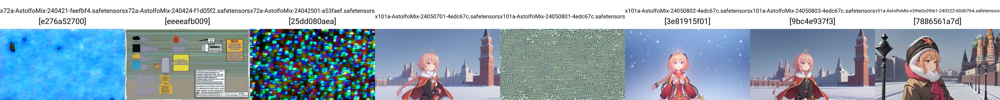
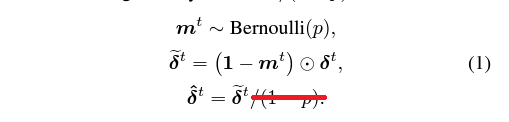
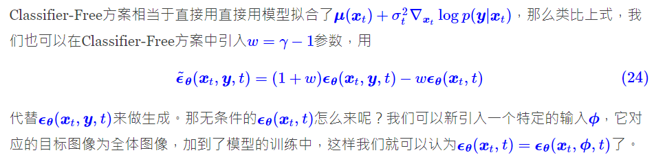

# Findings on "DARE Merge" in SD #

- Paper: [Language Models are Super Mario: Absorbing Abilities from Homologous Models as a Free Lunch](https://arxiv.org/abs/2311.03099)

- Implementation: [Supermario merge(DARE).](https://github.com/martyn/safetensors-merge-supermario) [Ported to SD.](https://github.com/groinge/sd-webui-untitledmerger/)

- [Official Github repo](https://github.com/yule-BUAA/MergeLM/) **WOW it is in ICML 2024!** [OP](https://github.com/yule-BUAA/MergeLM/commit/6d49ad96fd69c92013654b837041b868aa806564)

- [EN article](https://medium.com/@minh.hoque/paper-explained-language-models-are-super-mario-2ebce6c2cf35), [CN article](https://zhuanlan.zhihu.com/p/668809641)

- Until I'm sure how [my primary merger implement this algorithm,](https://github.com/ljleb/sd-mecha/blob/main/examples/binomial_dropout_merge.py), I won't comment on the algorithms.

- However, there are some important glossaries: DARE as "**D**rop **A**nd **RE**scale", SFT as "**S**upervised **F**ine-**T**uning".

- Given the success of ~~modified~~ [TIES merging](./ties.md), and the author's experience in merging "Encoder-based LMs" (BERT), it sounds promising. *Spoiler: Added 20 Pony models, reaching 94 models, and the mix still function!*

## TIES with DARE ##

- [This article describes the relationship between DARE, TIES, and a brunch of other merging algorithms,](https://slgero.medium.com/merge-large-language-models-29897aeb1d1a). *Relationship "with" is accurate in this case.*

- The description / algorithm expression of DARE paper is kind of messy ~~the idea is actually simple but exotic~~, let me make a *simple* description.

- DARE's core concept is **Prune > Merge > Rescale, without specifying what merge method to be used.** Meanwhile, TIES is a **merge method focusing on sign election.** Combining them together will be **Make delta > Bernoui dropout > TIES > Rescale from dropout > Rescale delta**.

- This is the *simple* part: $m^t \sim Bernoulli(p)$ means the "mask" under [Bernoulli distribution](https://en.wikipedia.org/wiki/Bernoulli_distribution), which is a binary matrix with random $1$ and $0$ s, then $\odot$ will be the [Hadamard product](https://en.wikipedia.org/wiki/Hadamard_product_(matrices)), i.e. "multiply the mask" to produce the [dropout](https://medium.com/@amarbudhiraja/https-medium-com-amarbudhiraja-learning-less-to-learn-better-dropout-in-deep-machine-learning-74334da4bfc5) effect.

- People may confused this distribution from [Binomial distribution](https://en.wikipedia.org/wiki/Binomial_distribution), however the paper is expecting *independent binary ouput for every trials*, hence $B(1,p)$. Also, as stated above, Bernoulli distribution doesn't have its own notation, e.g. $\mathcal{N}(\mu,\sigma^2)$ for [Normal distribution](https://en.wikipedia.org/wiki/Normal_distribution). [Wiki has clearly stated the relationship,](https://en.wikipedia.org/wiki/Bernoulli_distribution#Related_distributions)

- The exotic part will be the *undocumented implicated merging operation* on $\tilde{\delta}^t$ and becomes $\theta_{DARE}$ i.e. $\tilde{\delta}^t\leftarrow\tau_m=TIES(\tau_t), \tau_t=\tilde{\delta}^t$. 

- (Draft, prior to change) As seen in [author's code](https://github.com/yule-BUAA/MergeLM/blob/main/model_merging_methods/mask_weights_utils.py#L9), sinlge line of `torch.bernoulli` is *so simple*, and it can hit [one-liner](https://en.wikipedia.org/wiki/One-liner_program) if programmed nicely.

- From the experience on [TIES-SOUP](./ties.md), *I expect hyperparameter change and even more on algorithm hack.* 

### Spinoff: DROP without rescale ###

- I have found that DARE doesn't solve any problem created by the original TIES, so that TIES-SOUP should be applied instead of plain TIES.  Then I find that **rescale will perform worse than expected**.

    
Some tuning log. Click to open.

This time I edited the code manually to use the TIES-SOUP instead of original TIES.

- TIES-SOUP: `240421`. Works ~~but not this prompt~~. `k=1.0,alpha=1.0,vote_sgn=1.0`
- TIES: `240424`. Not working. `k=1.0,alpha=1.0,vote_sgn=0.0`
- TIES: `24042501`. Not working. `k=0.2,alpha=1.0,vote_sgn=0.0`
- DARE-TIES-SOUP: `24050701`. This is underfit. Pale image. `p=0.1,k=1.0,alpha=1.0,vote_sgn=1.0`
- DARE-TIES: `24050801`. Not working. `p=0.5,k=0.5,alpha=1.0,vote_sgn=0.0`
- DARE-TIES-SOUP: `24050802`. This is overfit. Bright image. `p=0.5,k=1.0,alpha=1.0,vote_sgn=1.0`
- DARE-TIES-SOUP: `24050803`. Works like TIES-SOUP. `p=0.5,k=1.0,alpha=0.5,vote_sgn=1.0`
- AVERAGING: `240222`. Control test, sorta works.

- With minimal "subjective art critism", I think that [normalization](https://en.wikipedia.org/wiki/Normalization_(statistics)) should be applied, therefore the "rescale" should be dropeed, or directly set $\lambda=1-p$ in the last stage.

### Why LLM merging algorihms works in principle? ###

- The reason behind this ("it works") is not sure, at least I don't have math proof for this. The UNET is supposed to handle *time token* (e.g. layer `model.diffusion_model.time_embed.0.weight`), which is clearly stated in the sampler eqaution as $t$, I find that the UNET is likely ignore the time factor and being applied for multiple iterlations. Is it being [autoregressive](https://en.wikipedia.org/wiki/Autoregressive_model), like a NLP model in [visual language](https://en.wikipedia.org/wiki/Visual_language)? 

- ~~This may need further study.~~ [Yes, MDP is AR(1)](https://stats.stackexchange.com/questions/23789/is-ar1-a-markov-process), when the "state space" is under [ Borel space](https://en.wikipedia.org/wiki/Measurable_space). Then [is SD's latent space a Borel space also?](https://math.stackexchange.com/questions/4346780/rigorous-definitions-of-probabilistic-statements-in-machine-learning) I'm not PhD in Maths, so I can just guess for it: Looks like every data points (image samples) are *countable*, and all the data contents are *finite* (obviously pixels are *digitalized*, and text are *tokenized*), and *in practice*, extreme values (0,1,inf) and NaNs are well handled, so **the latent space should be a Borel space.**

- Given some mathmateical similarity between diffusion (SD) and transformer (LLM), with my [loose House-Tree-Person test](../ch99) ~~will discuss in a full article~~, even I don't design the experiment [in a formal way](https://arxiv.org/abs/2309.14859), somehow I can merge for what I am expected for.
