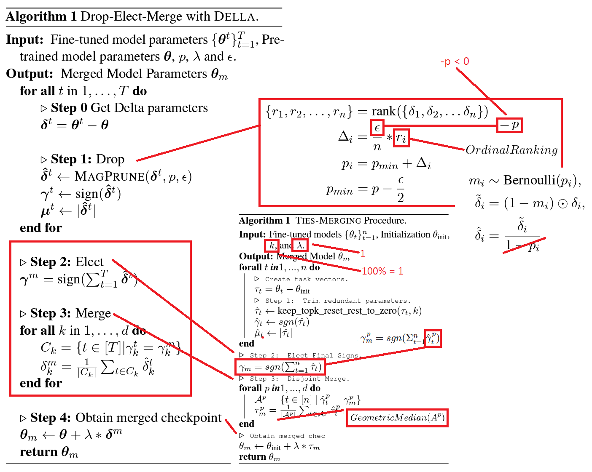

# Findings on "DELLA Merge" in SD #

- Paper: [DELLA-Merging: Reducing Interference in Model Merging through Magnitude-Based Sampling](https://arxiv.org/abs/2406.11617)

- Implementation: [My PR in sd-mecha.](https://github.com/ljleb/sd-mecha/pull/41)

- [Official Github repo](https://github.com/declare-lab/della) *Ported to mergekit.*

- tldr: It is a small tweak of DARE. DARE use uniform [probability density function](https://en.wikipedia.org/wiki/Probability_density_function) for dropping, meanwhile TIES is [deterministic](https://en.wikipedia.org/wiki/Deterministic_system) by taking the ranking of the particular weight, DELLA choose the combined approach: *Manually create probability density by rank.*

- However, the paper doesn't state which [ranking method](https://en.wikipedia.org/wiki/Ranking) is being chosen. For practical scenario, when multiple community models are selected, there will be many ties (literally ties, e.g. same TE / VAE because it is just untouched) while ranking, then tie breaker will affect the $r_i$ and finally $p_i$ to be chosen.

- Also, for ranking data, it is also an algorithm topic to be calculated efficiently. For example, [scipy.stats.rankdata](https://docs.scipy.org/doc/scipy/reference/generated/scipy.stats.rankdata.html) will use [merge sort](https://en.wikipedia.org/wiki/Merge_sort) for [ordinal rank](https://en.wikipedia.org/wiki/Ranking#Ordinal_ranking_(%221234%22_ranking)), which will be more efficient meanwhile makes $p_i$ spread wider. *Expected value of tied ranks still goes central but others will be pushed away.*

## Spinoff: DGMLA ##

- In paper, $\epsilon$ **was never discussed**, however diving into codes will imply to a positive parameter. From the experience in [TGMD](./fermat_pt.md#tsd-v21), [MDP really inherits some characteristic with plain RNN](./dare.md#why-llm-merging-algorihms-works-in-principle), to keep the "inference chain as gradient" smooth, **great negative** $\epsilon=-p$ will make the selected weights move closer to the base model (SDXL 1.0 for my case, meanwhile it can be [specific model](../ch02/pony_sd.md)).

- Before choosing the agressive $\epsilon=-p$, parameter searching would be tedious since the algorithm stack has a core concept of "N to 1 merging", which N can be as large as possible (currently 216 models), with local $O(NlogN)$ time complexity of merge sort, it will take days to merge. It is common to *take sample* from the model pool, since I gather models from *chronological order*, it will be effective by just [taking sample in pure random form](https://en.wikipedia.org/wiki/Simple_random_sample). Then it is quite obvious for the above phenomenon.

    
Some tuning log. Click to open.

This time I edited the code manually to use the TIES-SOUP instead of original TIES.

- DGMLA: `24100201`. 192 models. `p=0.1,eps=-0.05`. Baseline.
- DGMLA: `24100601`. 20 models. `p=0.1,eps=-0.05`. Still works.
- DGMLA: `24100602`. 20 models. `p=0.3,eps=-0.30`. Doesn't work.
- DGMLA: `24100603`. 20 models. `p=0.1,eps=0.05`. Works in a different way.
- DGMLA: `24100604`. 20 models. `p=0.1,eps=-0.1`. Works in the same way.
- DGMLA: `24101101`. 216 models. `p=0.1,eps=-0.1`. Works as expected.
- DGMLA: `25022801`. 256 models. `p=0.1,eps=-0.1`. **Kinda works, but image so abstract. Need more study.**

