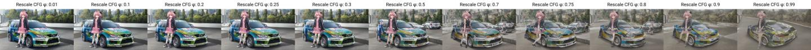
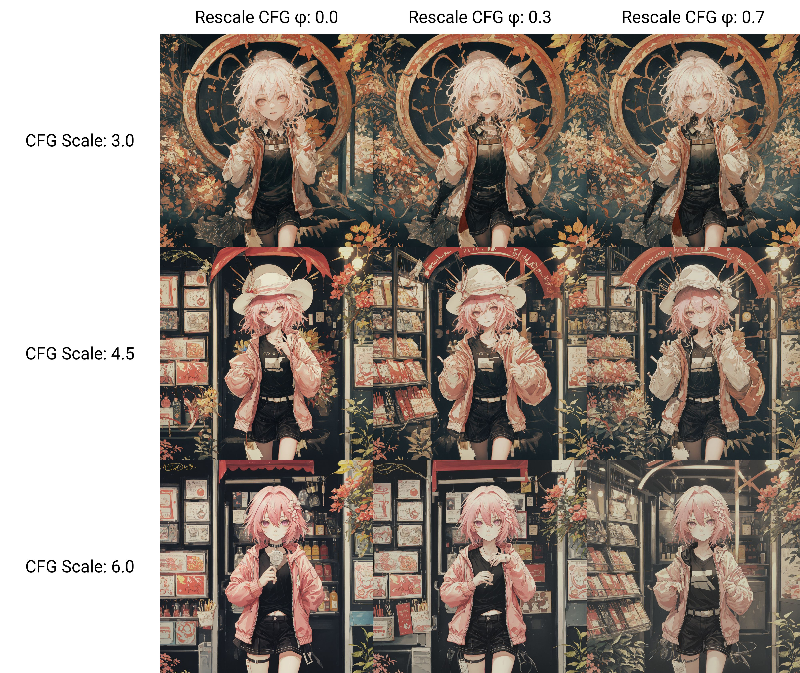
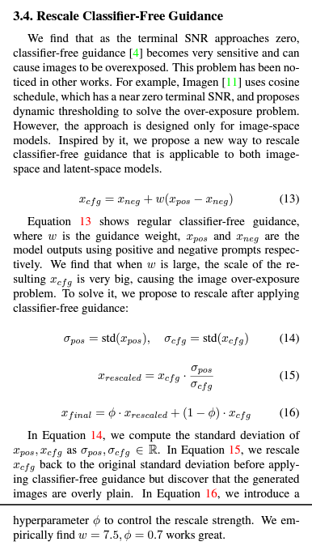

# Dynamic CFG / CFG rescale #

- [Dynamic CFG](https://github.com/mcmonkeyprojects/sd-dynamic-thresholding)
- [CFG rescale](https://github.com/AUTOMATIC1111/stable-diffusion-webui/pull/10555)
- Both are referencing to paper [Common Diffusion Noise Schedules and Sample Steps are Flawed](https://arxiv.org/abs/2305.08891).
- User ~~artist~~ are expected to have [found the optimal static CFG first](./cfg_step.md).

## Dynamic CFG ##

- Is an extension. [Comparasion with CFG rescale](https://github.com/AUTOMATIC1111/stable-diffusion-webui/pull/10555#issuecomment-1679346072). Maybe read the remaining session first. I use this extension after a month.

- **It does not support DDIM**. You will received `Cannot use sampler DDIM with Dynamic Thresholding`. Meanwhile [AnimateDiff](./animatediff.md) need DDIM for its own operation, I will update if there is updates. 

|Parameter|Recommended value|Description / Reason|
|---|---|---|
|Mimic CFG Scale|1|As low as you can, as long as φ is low in precise|
|Top percentile of latents to clamp|100|Same as your original CFG|
|Interpolate Phi|Same φ in CFG rescale||
|Mimic Scale Scheduler|Constant|Too much parameter for me|
|CFG Scale Scheduler|Constant|Too much parameter for me|
|Separate Feature Channels|OFF|CFG is a "global static" operation. It can preserve some content created in high CFG state|
|Scaling Startpoint|MEAN||
|Variability Measure|~~AD~~ STD|CFG rescale looks like AD|

## CFG rescale ##

- **Do not** switch to branch `cfg-rescale` (it is 77 commits behind already, and not being maintained).
- `git cherry-pick e508db474a579aff4d2aa42c4d16f074de333766`
- Before XYZ plot, "add config entries" by "Settings > Classifier-Free Guidance Rescale φ"
- Paper recommended to use $\varphi=0.7$, A1111 also shows similar result, however **it is based from a modified SD 2.X model**.
- From my experience, it is better to choose $\varphi=0.3$.
- Original static CFG implies to $\varphi=0$.

|Too low|Just right|Too high|
|---|---|---|
|No sinificant change|Minor detais improvement *without major detail loss*|Major detail loss (background), color tone is heavily shifted.|





- For the "just right" value, I see the facial expresson is even more ~~irregular~~ natural, instead of something mediocore. ~~"Closer to the mean of a cluster."~~

## Down to the paper ##

- "You know your prompt". $std(x_{pos})$ is an **unknown intrinsic property** ([example in computer vision](https://towardsdatascience.com/what-are-intrinsic-and-extrinsic-camera-parameters-in-computer-vision-7071b72fb8ec)) depends on prompts only. Meanwhile static CFG $std(x_{cfg})$ is an **extrinsic property** depends on both model and prompts, which is a little bit more obvious.
- Looks like my prompt (tons of "weight 0" trick) makes $std(x_{pos})$ reachs 0, which make $\varphi=0.7$ invalidate. Meanwhile the common SD1.x model (heavily merged and finetuned) steers the optimal value more futher.



```
parameters
(aesthetic:0), (quality:0), (solo:0), (boy:0), (astolfo:0.98)
Negative prompt: (worst:0), (low:0), (bad:0), (exceptional:0), (masterpiece:0), (comic:0), (extra:0), (lowres:0), (breasts:0.5)
Steps: 256, Sampler: Euler, CFG scale: 4.5, Seed: 1100683391, Size: 768x768, Model hash: f59359c175, Model: VBP23-1024-ep49, Denoising strength: 0.7, Clip skip: 2, Hires upscale: 2, Hires upscaler: Latent, CFG Rescale φ: 0.3, Version: v1.3.2-1-gaf2705ea
```


