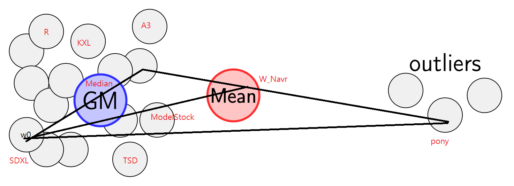
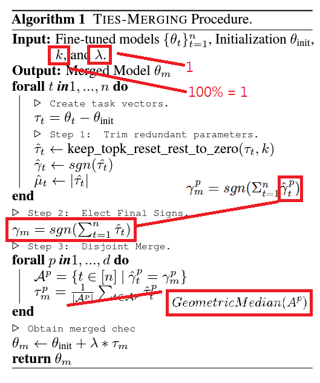
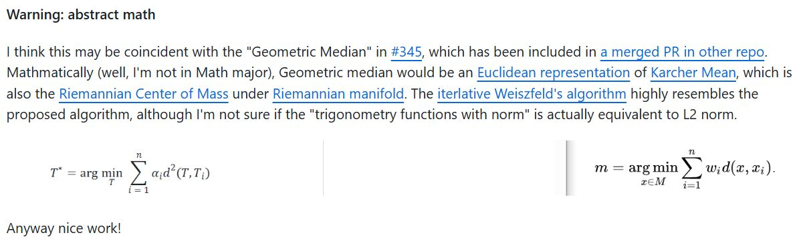
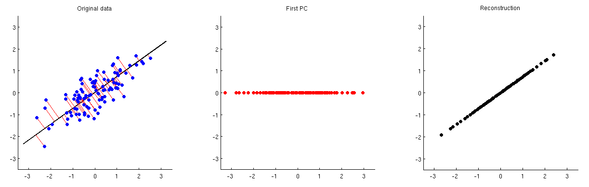

# Findings on Geometric Median over merging models #

## Properties of Geometric Median and relationship on Machine Learning ##

- *Not factual at all, but if you know how I played with the literals, you know the concept already. LLM will help you.*

|Name|General type|Simple math|Loss to minimize|Regression method|Clustering Method|Fancy name|Statstics|
|---|---|---|---|---|---|---|---|
|[Geometric Median](https://en.wikipedia.org/wiki/Geometric_median)|[Medoid](https://en.wikipedia.org/wiki/Medoid)|[Median](https://en.wikipedia.org/wiki/Median)|[MAE](https://en.wikipedia.org/wiki/Mean_absolute_error)|[LASSO / L1](https://en.wikipedia.org/wiki/Lasso_(statistics))|[k-medoids](https://en.wikipedia.org/wiki/K-medoids)|[Fermat point](https://en.wikipedia.org/wiki/Fermat_point)|[Robust Statistics](https://en.wikipedia.org/wiki/Robust_statistics)|
|[Geometric mean](https://en.wikipedia.org/wiki/Geometric_mean)|[Centroid](https://en.wikipedia.org/wiki/Centroid)|[Mean](https://en.wikipedia.org/wiki/Mean)|[MSE](https://en.wikipedia.org/wiki/Mean_squared_error)|[Ridge / L2](https://en.wikipedia.org/wiki/Ridge_regression)|[k-mean](https://en.wikipedia.org/wiki/K-means_clustering)|[Karcher mean](https://en.wikipedia.org/wiki/Fr%C3%A9chet_mean)|[Oridinary Statistics](https://en.wikipedia.org/wiki/Statistics)|

## How I discovered Geometric Median ##

- After getting stuck for a few days while researching [Model Stock](./modelstock.md), *I decided to ditch this approach becuase I can't get the result in range.* I decided to calculate [Geometric Median](https://en.wikipedia.org/wiki/Geometric_median) with [Weiszfeld's algorithm](https://github.com/scoutant/l1-median/tree/main) instead.

- Since $cos(\theta)$ is troublesome to calcule for N-Model case, I decided to calculate [Geometric Median](https://en.wikipedia.org/wiki/Geometric_median) with [Weiszfeld's algorithm](https://github.com/scoutant/l1-median/tree/main) instead. Conceptally [it is a bit different from geometry median](https://www.geeksforgeeks.org/geometric-median/), which lies between midpoint $w_{12}$ and  and vertex $w_0$, but it is well known for ignoring outliers and robust training. Such concept can be brought into model merging, *which is similar to TIES (ignoring outliers as math sign) and Model Stock (bring towards center)*. Although gradient descent is involved, *it converges in linear time* ( i.e. $O(N)$ ) because of nature of $l1-median$ problem.

- After some reading, "it is the high dimension of [Fermat point](https://en.wikipedia.org/wiki/Fermat_point)". High dimension of [centroid](https://en.wikipedia.org/wiki/Centroid) is easily found by averaging per component (i.e. ModelSoup). The finding of ModelStock is somewhat legit, but failed to link to any known and solid ML idea, or it just somehow forgot to include $W_0$ for the "finding of center". Since LLM / SD is also an [computation model](https://en.wikipedia.org/wiki/Model_of_computation) (which is as generic as it is), I think this should be a vaild idea extended from the paper.

- Also, (this may be difficult to understand), [some blockchain paper really features Geometric Median](https://arxiv.org/abs/1705.05491), because **Geometric Median has a breakdown point of 0.5.** It is same as the [51% attack](https://www.investopedia.com/terms/1/51-attack.asp): *Pony's dangerous weight shifting only break the SDXL merge when it reaches more than 51%. Meanwhile, there are ML papers mentioned Geometric Median, mentioning that it can be used as [Robust Aggregation for Federated Learning](https://arxiv.org/abs/1912.13445), and... it is about decentralized training. Along with TIES / DARE, it can minimize any contradicting weights after the voting, and being super robust.

- Implementation was easy, [there are codes almost reusable immediately](https://github.com/krishnap25/geom_median/blob/main/src/geom_median/torch/weiszfeld_list_of_array.py), [but I still need to rewrite myself](https://github.com/6DammK9/sd-mecha/commit/f2119b812e3483036183468c8b0d763e0a288dad). [List Comprehension](https://www.w3schools.com/python/python_lists_comprehension.asp) is used for parallelization and efficiency.

- It spends around 6-10x more time on merging, comparing with DARE (40x for averaging). However the result is reasonable. "Median vs Mean" is a widely discussed topic, they do behave differently. Therefore I need more image generation to determine if it works good.

## TSD v2.1 ##

- I'd call it $GeometricMedian(A^p)$ directly.

- Suprisingly, it inherits quite a lot of "styles" from median, rather than DARE. Therefore I can generate images from this implemention directly, without testing the plain median.

## Spinoff: Karcher Mean Merge ##

- Originated from [this PR in Mergekit](https://github.com/arcee-ai/mergekit/pull/546#event-17064776631). Although the discussion is being abstract, they will have similar effects.

- Someone applied it as ["Karmix"](https://huggingface.co/NullAxis/karmix-merge-experiments/blob/main/pca-tv-mtd-illv20-idx0-personalv30-r-te0.4-oeaiv12ue-r-te0.4.safetensors), along with [PCA](https://stats.stackexchange.com/questions/229092/how-to-reverse-pca-and-reconstruct-original-variables-from-several-principal-com), which is similar to [KNOTS merge](https://arxiv.org/abs/2410.19735) or [Isotropic merge](https://arxiv.org/abs/2502.04959).

