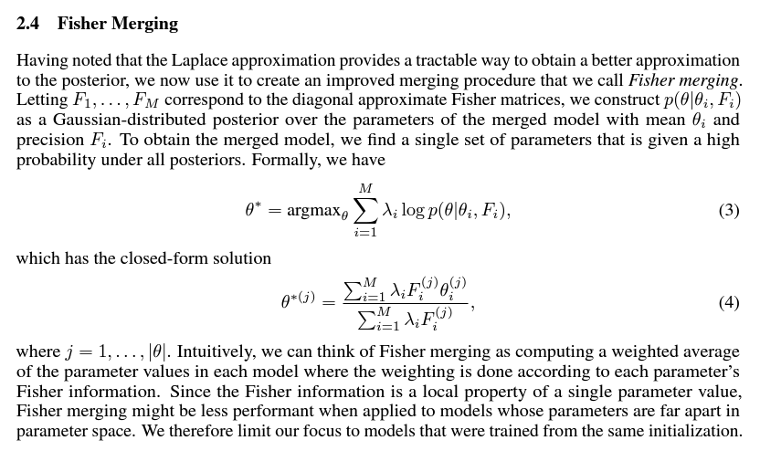

# Findings on "Fisher Merge" in SD #

- Paper: [Merging Models with Fisher-Weighted Averaging](https://arxiv.org/abs/2111.09832)

- [Implementation on Fisher-Weighted Averaging.](https://github.com/mmatena/model_merging/tree/master)

- It make use of [Fisher infomration](https://en.wikipedia.org/wiki/Fisher_information), and it *requires some data to evalulate*.

- [Some more repos](https://github.com/csunlab/fisher-information/blob/master/v2.00/fisher.py), [and this repo,](https://github.com/wiseodd/natural-gradients) hopefully can avoid evaluating the $X$ (input of SD) because the implementaion will be complicated.

- [Youtube video about Fisher Information.](https://youtu.be/pneluWj-U-o?si=H2IcZcti30Cp2IkK)

