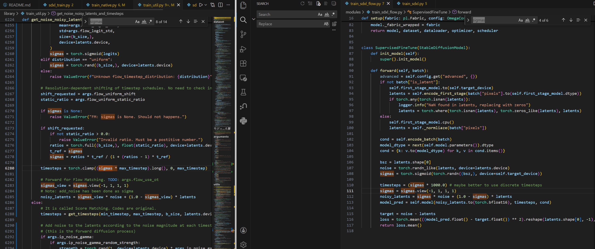
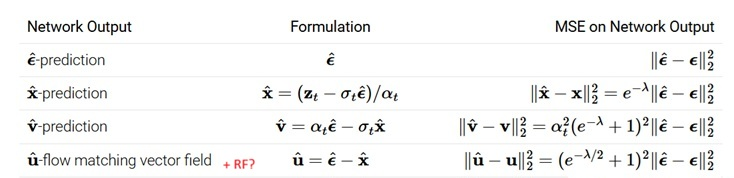
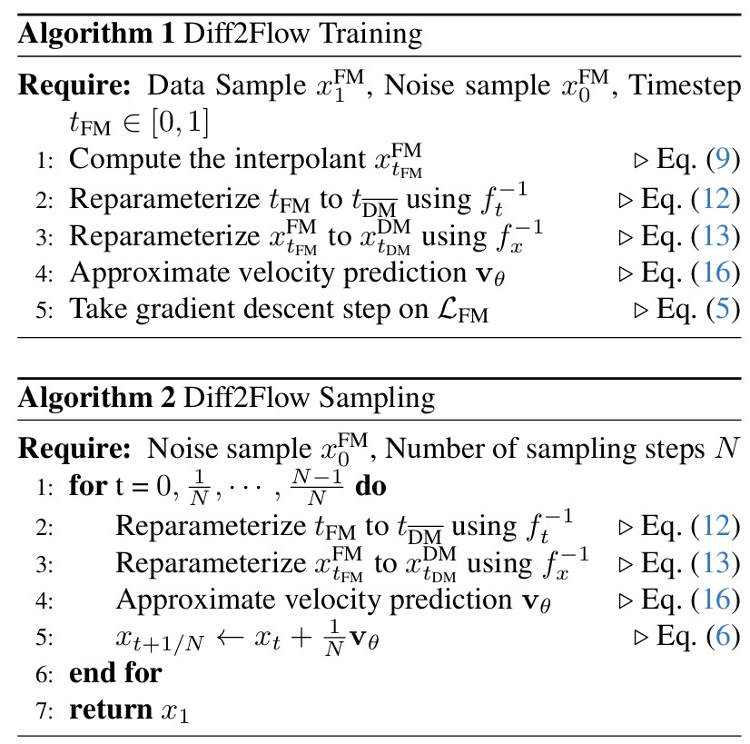
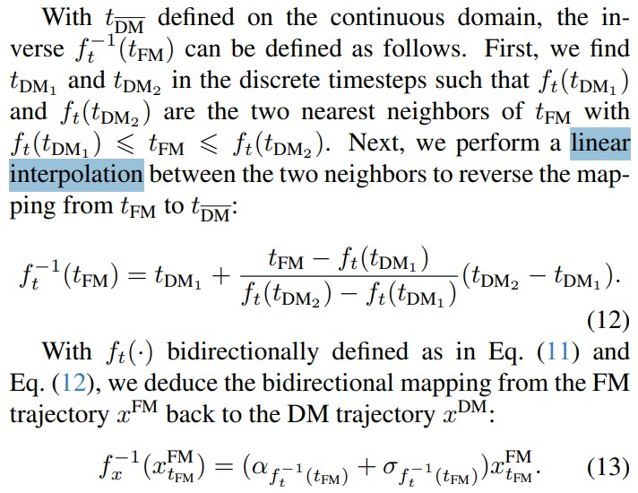

# Findings on flow matching #

- [The paper from Meta](https://arxiv.org/abs/2210.02747), and [from SD3](https://arxiv.org/abs/2403.03206).

- [The MIT lecture series on flow matching](https://diffusion.csail.mit.edu/) *Relies on this, but I didn't complete the labs.*

- [Medium article in 2505](https://harshm121.medium.com/flow-matching-vs-diffusion-79578a16c510).

- [CN article in 2412 (incomplete)](https://zhuanlan.zhihu.com/p/12591930520).

- Maybe just look at [Diffusion Model](https://en.wikipedia.org/wiki/Diffusion_model) in wiki (not applicable years ago!)

- (260201 update) It is *similar* to [vpred](./vpred.md), but with reparamaterizing the timestep and sampling. The "continious time" representation can be eiher "interpolated (Diff2Flow)", or drop entirely to be [Rectified Flow](./rf.md) with *negligible difference*.

## Comparasion with "score matching" ##

- *They can be easily validated by updated online LLM, because they just scrape all the contents above.*

- "Diffusion" in application, or products, or in "user space" / layman sense, are specified as DDPM or DDIM. They are specified in some details over generalized rules. **The original paper did not mention any generalized concepts!** It is likely that the author doesn't even know the relationships.

- For example, [Normalizing Flows (2019)](https://arxiv.org/abs/1912.02762) exists before the [DDPM (2020)](https://arxiv.org/abs/2006.11239), meanwhile [Score based SDE (2020)](https://arxiv.org/abs/2011.13456) appears almost in parallel, exposing both [probablity flow](https://en.wikipedia.org/wiki/Probability_current) and [vector field](https://en.wikipedia.org/wiki/Vector_field) ~~borrowed from QFT but removed physical quantity~~, but [flow matching (2022)](https://arxiv.org/abs/2210.02747) appears a bit later with consolidated relationships, which DDPM utilitizes [discrete time markov chain](https://en.wikipedia.org/wiki/Discrete-time_Markov_chain) *without realizing* (Countable state space a.k.a [Standard Borel space](https://en.wikipedia.org/wiki/Standard_Borel_space)), and proposing [Continuous Normalizing Flows(2018)](https://arxiv.org/abs/1709.01179) with [continuity equation](https://en.wikipedia.org/wiki/Continuity_equation) and [Fokker-Planck equation](https://en.wikipedia.org/wiki/Fokker%E2%80%93Planck_equation) in contrast (as "Optimal Transport objective"). Nevertheless, [it spreads on 2024](https://arxiv.org/abs/2403.03206), as a technical report.

- Vector field can be easily rewritten as another [gradient](https://en.wikipedia.org/wiki/Gradient#Gradient_of_a_vector_field), **but do not confuse with the common gradient descent!** [Latent space](https://en.wikipedia.org/wiki/Latent_space) is different from [Parameter space](https://en.wikipedia.org/wiki/Parameter_space) even they are both [Euclidean space](https://en.wikipedia.org/wiki/Euclidean_space) and depends on data. Pixels are all real numbers without physical quantity / [geodesic](https://en.wikipedia.org/wiki/Geodesic). *Folding protein may consider quantum mechanic or gravity field, but in common folding models, they are still lies on classicial physics, which are still in Euclidean space.* Predicting the image via denoising is not considered as [gradient descent](https://en.wikipedia.org/wiki/Gradient_descent) which refers to [optimization algorithm](https://en.wikipedia.org/wiki/Global_optimization) instead of "following the continuity and probablity flow". **Repeat: No physical quantity involved.**

## Training / Inference with SDXL models ##

**There is no "plain Flow Matching For SD". The "interpolation of (timestep) sampling trajectories" are undefined.** If we use linear [interpolation](https://en.wikipedia.org/wiki/Interpolation) instead of NN, we have Diff2Flow. When we drop the `alphas_cumprod[timesteps]`, we have Rectified Flow.

- For trainer side, [naifu](https://github.com/Mikubill/naifu) is ~~supported~~ **adapted from SD3's implementation** (i.e. RF + logit-normal + timestep shift), leading to [nyaflow-xl-alpha](https://huggingface.co/nyanko7/nyaflow-xl-alpha) in 2411. 

- kohyas has no dedicated integration, but [a fork](https://github.com/bluvoll/sd-scripts) has further adapted from naifu code (instead of SD3 branch), claimed as [rectified flow](./rf.md), which is in fact "RF + logit-normal + timestep shift" also, and lead to [the ongoing experimental model](https://huggingface.co/CabalResearch/NoobAI-RectifiedFlow-Experimental) in 2511.

- Code reference: [forked kohyas](https://github.com/bluvoll/sd-scripts-f2vae/blob/main/train_network.py#L1108), [naifu](https://github.com/Mikubill/naifu/blob/main/modules/train_sdxl_flow.py#L115), [diff2flow](https://github.com/CompVis/diff2flow/blob/main/diff2flow/flow_obj.py#L134), [reForge](https://github.com/Panchovix/stable-diffusion-webui-reForge/blob/main/ldm_patched/modules/model_sampling.py#L256)

- For runtime (webui), [vpred](./vpred.md) config will work, despite having minor issue. The "velocity prediction" is loosely consistint across implementations. A dedicated "discrete model sampling" is required, and appears arch dependent. ["model_sampling" in reForge](https://github.com/Panchovix/stable-diffusion-webui-reForge/blob/main/ldm_patched/modules/model_base.py#L72), ["ModelSamplingFlux" as A1111 PR](https://github.com/wkpark/stable-diffusion-webui/blob/minimal-flux-with-fp8-freeze/modules/models/flux/flux.py#L129), ["ModelSamplingDiscreteFlow" as A1111 SD3](https://github.com/AUTOMATIC1111/stable-diffusion-webui/blob/master/modules/models/sd3/sd3_impls.py#L15). Also, the "stochastic sampler" variant over plain Euler Method is tolerated, with "ancestral" sampler  being broken (not explored much).

> The model is trained to predict the velocity V_t = \frac{dX_t}{dt}...

- Image comparasion has moved to [rectified flow](./rf.md#image-comparasion) because the model development eventually groups multiple topics together (rectification is a seperated process). *This topic is stuck for so long because the implementation and citation of the v-prediction on SDXL took months to verify across users and eventually develop actual codes to run.* Meanwhile, SD3 / Flux1 got supressed by Qwen (and ComfyUI) eventually, making the discussion / experiment lacks of community support.

## "Equlivance / Similarity" between "velocity" (Diffusion) and "vector" (Flow Matching) ##

- [Interactive article explaining the theory and comparasions.](https://diffusionflow.github.io/)

> Using simple algebra, we can derive that for ..., where ... is the “velocity”, “flow”, or “vector field”. 

> Flow matching weighting == diffusion weighting of v-MSE loss + cosine noise schedule.

> Diffusion with DDIM sampler == Flow matching sampler (Euler).

> Difference in network outputs: The network output proposed by flow matching is new, which nicely balances x-prediction and ϵ-prediction, similar to v-prediction.

- [Lecture Notes (14)](https://cs231n.stanford.edu/slides/2025/lecture_14.pdf) in ["CS231n"](https://cs231n.stanford.edu/schedule.html)

> Warning: Terminology and notation in this area is a mess!

> We’ll just cover the basics of a modern “clean” implementation (Rectified Flow)

- [Diff2Flow](https://arxiv.org/abs/2506.02221)

> Our work extends this by explicitly formulating a method to map discrete diffusion trajectory to a continuous flow matching trajectory.

