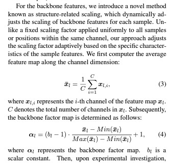
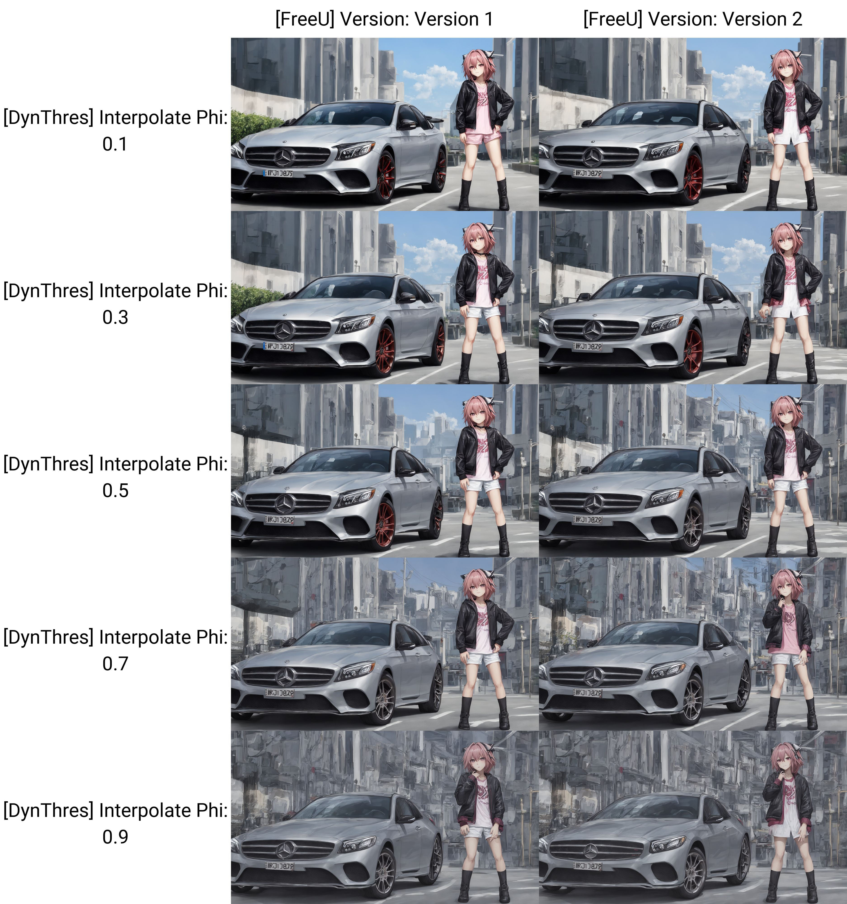

# FreeU #

- [WebUI Extension](https://github.com/ljleb/sd-webui-freeu), [arxiv paper](https://arxiv.org/abs/2309.11497)

- Paper: Didn't read yet. Seems that it *change the connection of the layers of UNET*, and *provided codes* to make quick downstream development possible. Also [it may not work with Control Net which is using the same method](./controlnet.md) 

- Hyperparameter: *4 numbers are too much for me. Just use default.* **All 1.0** $b_1=s_1=b_2=s_2=1$ = Off FreeU

- **Use with [Dynamic CFG](./dynamic_cfg.md)**. Change the $\varphi$ instead. For my case, with author's recommended value (also extension's default), I'll use **0.7 instead of 0.3**, which returns to another author's recommended value. *What a coincidence.*

- Also it supports Controlnet, and potentially Animatediff.

## Findings on "Version 2" ##

- *If you cannot update the extension via WebUI, head to the extention directory (`SD_DIR/extensions/sd-webui-freeu`) and then `git pull`.*

- [Github closed issue.](https://github.com/ljleb/sd-webui-freeu/issues/37) [And the "updated FreeU code".](https://github.com/ChenyangSi/FreeU#freeu-code)

- I am not fully understand the mentioned "hidden mean" in the paper, but this should have been reinterprepted:

- Sure it has slight difference. 

- Now the optimal CFG $\varphi$ go down to 0.5. 

