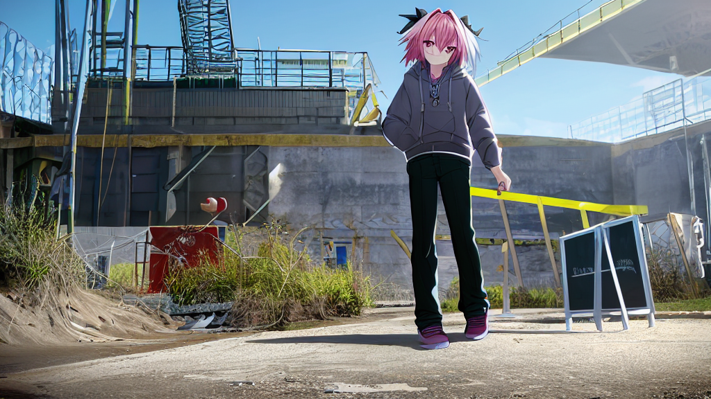
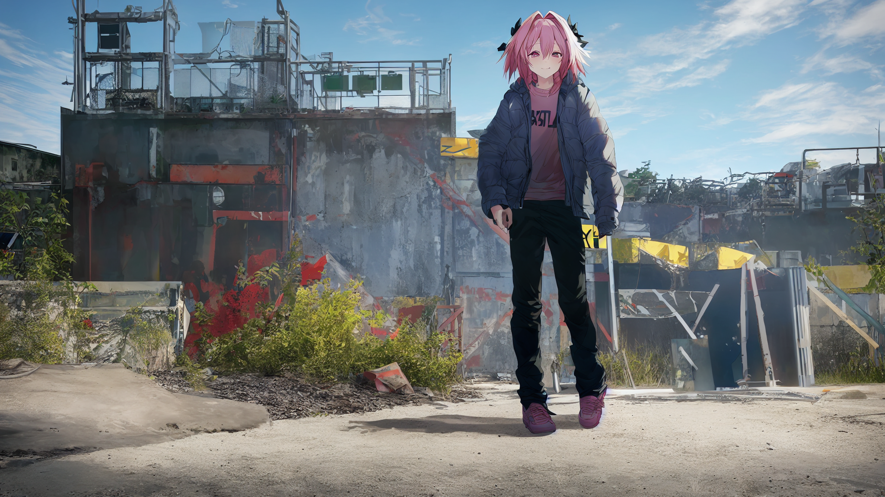

# More then Hi-Res Fix #

### What is this (feature)? ###

- [Original description.](https://github.com/AUTOMATIC1111/stable-diffusion-webui/wiki/Features#hires-fix)
- [Hi-Res Fix in ComfyUI.](https://comfyanonymous.github.io/ComfyUI_examples/2_pass_txt2img/)
- [Hi-Res Fix in a JP Blog.](https://kurokumasoft.com/2023/04/06/web-ui-hires-fix/)

### My findings (Result first) ###

 *Original image. Broken face.

 *2x "Hi-res fix" with denoising ration 0.707. It is fixed with richer content!

```
parameters
(aesthetic:0), (quality:0), (1girl:0), (boy:0), [[pants]], [[braid]], [astolfo], [[[[pripyat, chernobyl]]]]
Negative prompt: (worst:0), (low:0), (bad:0), (exceptional:0), (masterpiece:0), (comic:0), (extra:0), (lowres:0), (breasts:0.5)
Steps: 256, Sampler: Euler, CFG scale: 4.8, Seed: 3190768820, Size: 1024x576, Model hash: f59359c175, Model: VBP23-1024-ep49, Denoising strength: 0.707, Clip skip: 2, Hires upscale: 2, Hires upscaler: Latent
```

### My findings ###

- First at all, **the theory is valid**. It is T2I in base resolution, upscale (Lancos?), then **immediately run I2I on the image**. It is known as "latnet upscaling".
- However, the comparasion could be *"Non-latent upscaling" vs "latent upscaling"*, instead of directly compare with a high resolution T2I.
- Because UNet has its own size (expected 512px), also the training dataloader (up to 1024 ARB), and the dataset itself (maybe 8K?), the ouput content **is bounded by a base dimenasion**, which is 64px to 512px in the UNet. Therefore when you directly go to a high dimension T2I, you will see **multiple objects instead of enlarged object.** Even the model is trained with 1024px ARB (image in this page), the subject may still sized with around 512px. For example, you still see upper body in 512px, and then full body in 768px, but not likely half body in 1024px or larger.
- Therefore, instead of "fixing images in Hi-Res", **it also "fixing corrupted details in original dimension".** To decide if it is "corrupted details", you can look for an area if it is *fused and blurred*, like not being sampling well in the original T2I process. However this case is rarly seen with popular "human portrait", which would be easily overlooked. 
- One of the possible use case would be "2x latent upscale + 2x oridinary upscaler" instead of directly "4x upscaler". The image will be fixed with *both latent content and image  noise*. Latent upscaling doesn't always "fix" stuffs, you still need to familiar with the probilities estimation with new introduced hyperparameter (my case is denoising 0.7 instead of 0.5, which 0.5 produce blurry images, but 0.9 may alter the contents.)
- If you prefer full body image, standing, but in landscape image, because of sceanary or wide objects, this would be a handy fix to increase yield. For this case, yield increase *from "1 out of 200" to "1 out of 2"*. However, **it is an expansive fix, with average 8x time per image.** If the yield is high (1/8 obviously), just discard the image and keep rolling.
- To choose the hyperparameter (I2I denoise ratio), it depends on model, as most people are saying 0.5 is fine, but I need 0.7:

|Denoise ratio|Too low|Just right|Too high|Absolute value|
|---|---|---|---|---|
|My case|0.5|0.7|0.9|0.95|
|Observation|Blurry image|Consistant content, with some fused area fixed|Inconsistant content, some details are changed|Another image, kind of interpolate|
