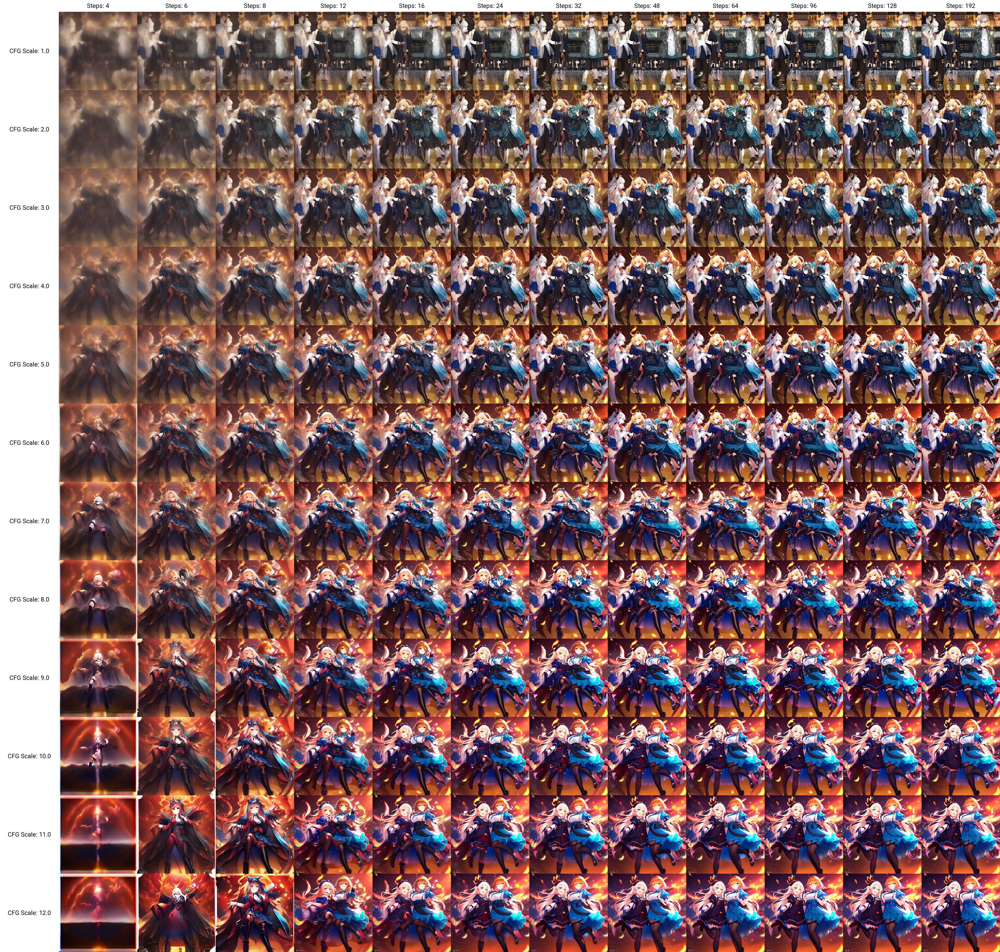
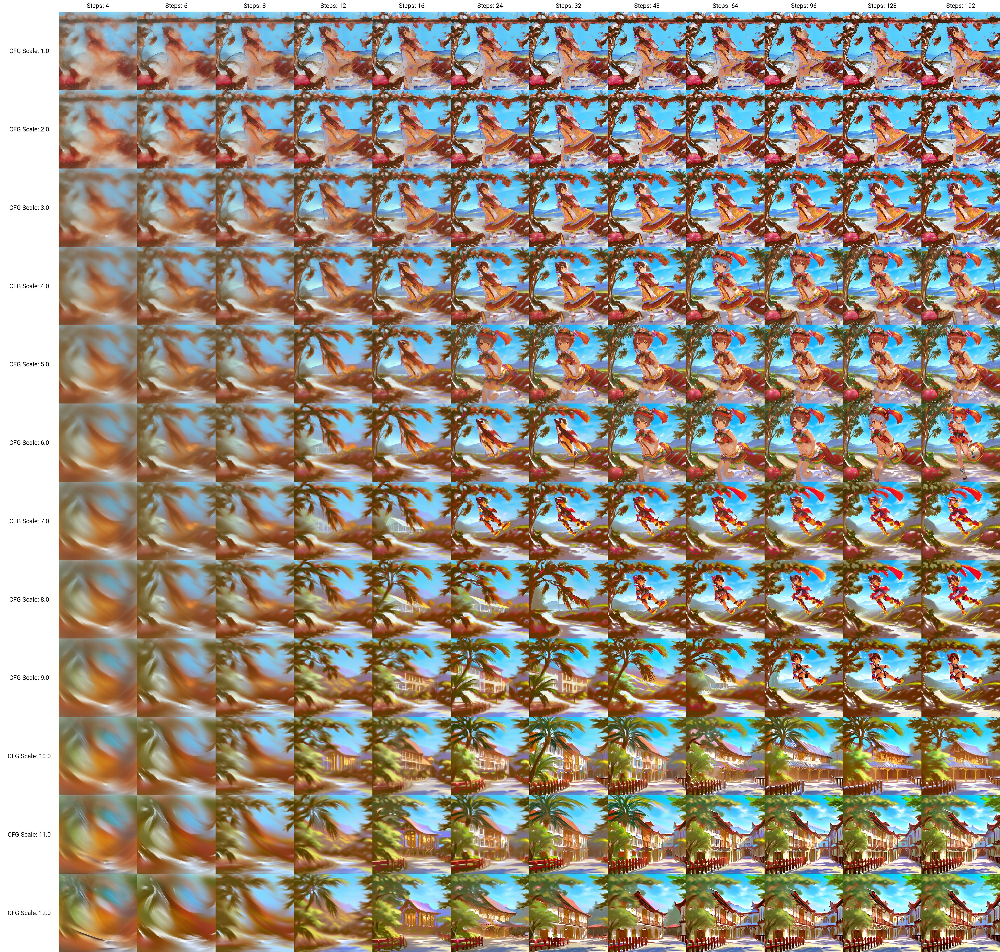
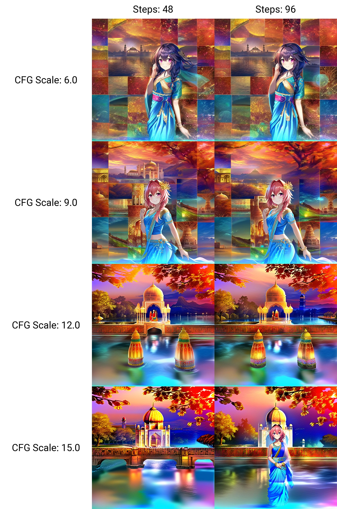

# Common content across models #

## CFG-STEP scan ##

- Perform this procedure when you received a new moedel. CFG depends on the model and the trained dataset, why will be hard to determince once you include prompts to "guide the model".

- Prompt: Just the **minimal prompt which can generate legit images** (e.g. reconizable objects)
```
(bad:0), (comic:0), (cropped:0), (error:0), (extra:0), (low:0), (lowres:0), (speech:0), (worst:0)
```

- Sampler: Euler (Momentum based, smooth curve.)
- SEED: 1337 (Or any seed you can see legit images on "initial setting")
- Initial settings: **CFG 7, STEP 48** (Most models should work)

- STEP (512x512): `4,6,8,12,16,24,32,48,64,96,128,192` (Exponential scale)
- CFG (512x512): `1,2,3,4,5,6,7,8,9,10,11,12` (Linear scale)

- STEP (512x512): `48,64,96` (Exponential scale
- CFG (768x768): `11.0,11.5,12.0,12.5,13.0,13.5` (2.25 * "512x512")
- CFG (768x768): `13.5,15.0,16.0,18.0,20.0` (2.25 * "512x512")

### Procedure ###
- Use "initial settings" to search "SEED".
- XY-prompt, size 512x512, STEPxCFG.
- Choose the optimal setting for *reconizable and legit objects*.
- Usual result: **CFG 6-8, STEP 48-96.** (some biased models may hit CFG 3-4)
- Repeat for 768x768. **Usually 2-2.25x CFG in 512x512.** (maybe 1x if there is prompt fillers)
- *Or just choose what you think is good.*

### Example (obvious) ###
- [WD 1.4](https://huggingface.co/hakurei/waifu-diffusion-v1-4)
- Result: **CFG 8, STEP 96**


### Example (hard to decide) ###

- [bp_mk5](https://huggingface.co/Crosstyan/BPModel)
- Result: **CFG 5, STEP 48**. ~~But I choose CFG 6, STEP 64 afterward.~~


- Then I choose CFG 13.5 (6*2.25) for 768x768:
