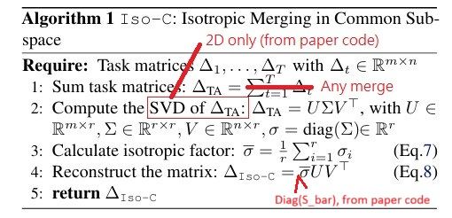
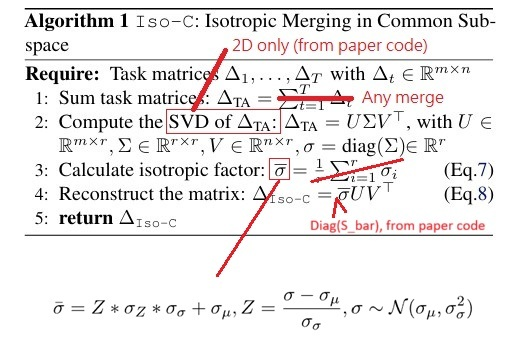

# Findings on Isotropic Merge #

## First glance ##

I will focus on `Iso-C` only. `Iso-CTS` is too complicated to implement.

Paper: [No Task Left Behind: Isotropic Model Merging with Common and Task-Specific Subspaces](https://arxiv.org/abs/2502.04959)

Code: [iso.py](https://github.com/danielm1405/iso-merging/blob/main/src/utils/iso.py)

*Code does not reflect printed algorithm, however I picked the implemented code becuase I was fooled either.*

The "sum task matrices" can be reduced to any merged state. If `n_average` $\Delta_{TA} = \frac{1}{r} \Sigma_{i=1}^r \theta_{i}$ works, "any working model or model state" will work also.

However, after experiment, it suffers from failed to preserve attention. Content has lost focus and being deformed.

## Spinoff: Iso-Z ##

- Perform a math trick to expand the mean as a [Z score](https://en.wikipedia.org/wiki/Standard_score). `Iso-C` remains when $Z=0$, meanwhile nothings happen (pure SVD reconstruction) when $Z=1$.

- From [this notebook](../ch03/iso_z/iso_z.ipynb), probably $Z=0.8$ or $Z=2.0$ may make things happen.

