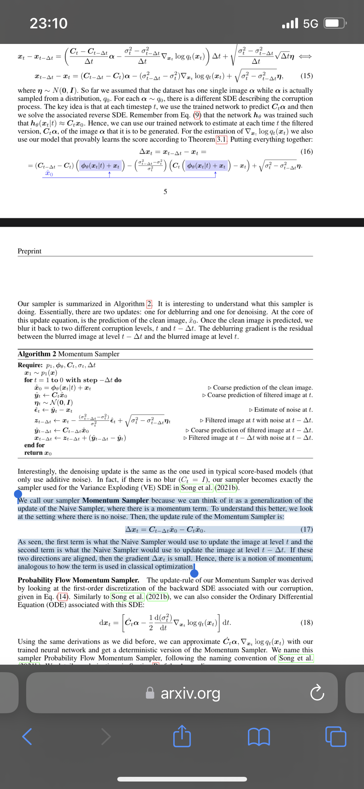
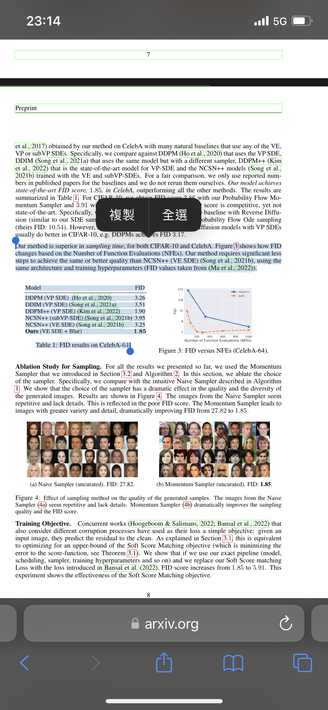

# Findings on "Euler" sampler: Momentum Sampler (Algorithm 2) #

- *Read from bottom up for result. Top session was my story on how to find it.*

- Old article from 2302, moved from ch98.

## Phenomena / confusion ##

- Was `k_euler` related to "euler method" (Euler-Maruyama)? How to link with Difusion model? 
- Can `k_euler` sample on U-NET as fine as possible? Known that DDIM has hard limit on 1000 steps? ~~And I did it with 2048 steps~~
- Does 3D / RTX effect exist / valid (low FID in some local area)? ~~Turns out it is just general performance.~~  
- How `euler` compared with DDIM / DDPM on "recovering image contents"?  
- Is such thing (sampler) independent with CFG? Will the parameter searching unaffected? ~~Yes.~~

### Some articles ###

- [CN article on DDPM.](https://zhuanlan.zhihu.com/p/563661713)

- [CN article on DDIM.](https://zhuanlan.zhihu.com/p/565698027)

- [Comparasion across samplers.](https://twitter.com/iScienceLuvr/status/1564847749073276928/photo/1)

- Original paper on "EM": [Stochastic modified equations and adaptive stochastic gradient algorithms](https://arxiv.org/abs/1511.06251)

- [Scalable Inference in SDEs by Direct Matching of the Fokker-Planck-Kolmogorov Equation](https://arxiv.org/abs/2110.15739)

- [Score-Based Generative Modeling with Critically-Damped Langevin Diffusion](https://arxiv.org/abs/2112.07068)

- *Turns out irrelevant.*

### Watching the generated images ###

- DDIM / EULER behaves differently. DDIM has solid dots, euler blurs instread.
- EULER can make clear image with 8 STEPS, and lower CFG
- `k_diffuser`'s implementation is hard to understand (without paper?)

- DDIM

- Euler

- Comparasion: 2~500 STEPS
- DDIM: `500,200,143,100,67,33,17,13,7,4,3,2`

## After investigation ##

- **Bad naming from A1111 confirmed.** Along with [Aesthetic Gradients](./ag.md)

- It is **"momentum sampler"** fused it Euler method (related to SGD)

- It shuold be more clear if it is called "momentum (euler)"

- ADAM has included "momentum", implies that `euler` won't denoise a lot slower then DDIM (for a magnitude of time complexity).

- After comparing codes between [A1111 WebUI](https://github.com/AUTOMATIC1111/stable-diffusion-webui/blob/master/modules/sd_samplers.py) and original [k_diffusion](https://github.com/crowsonkb/k-diffusion/blob/master/k_diffusion/sampling.py), both `euler` and `heun` in `k diffuser` are **momentum sampler**.

- Original paper of `k_diffusion`: [Soft Diffusion: Score Matching for General Corruptions](https://arxiv.org/abs/2209.05442)

