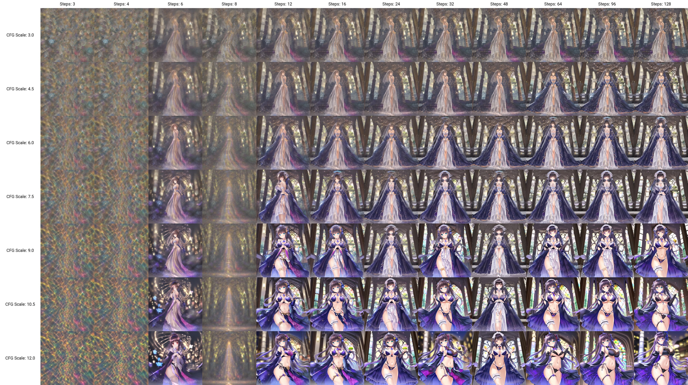
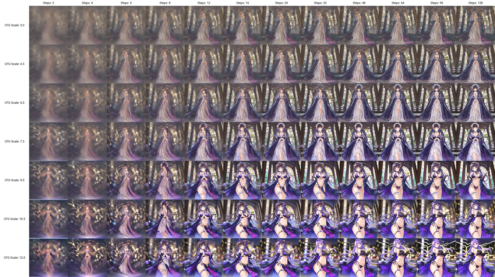
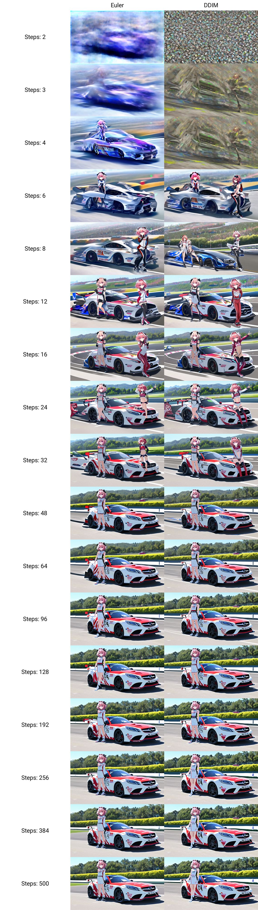
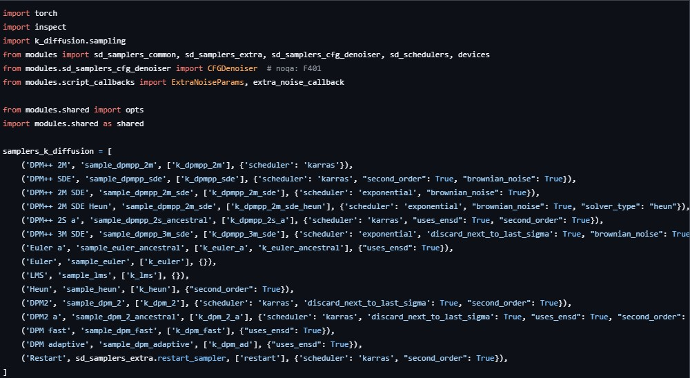
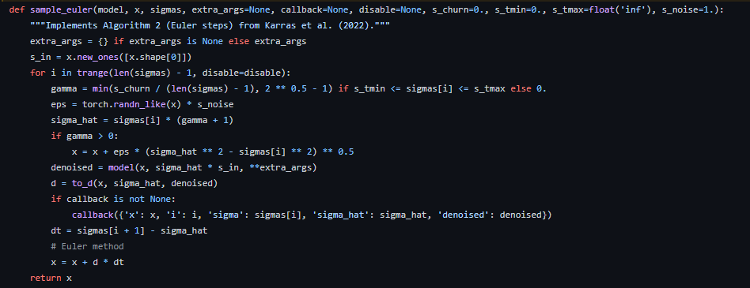
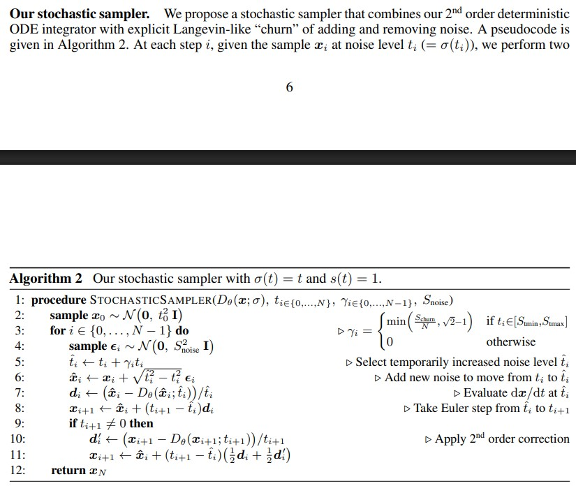
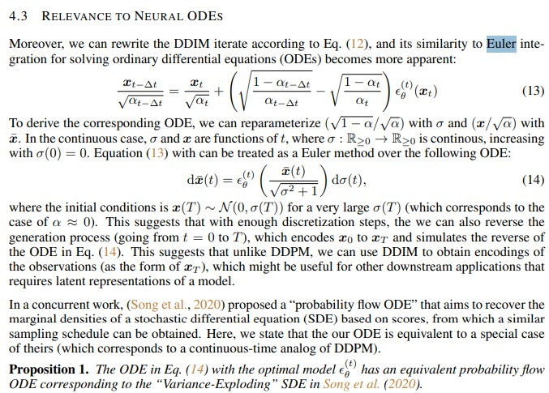
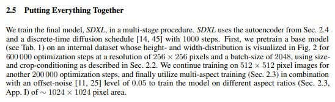

# Findings on "Euler" sampler: Momentum Sampler (Algorithm 2) #

- *Read from bottom up for result. Top session was my story on how to find it.*

- Old article from 2302, moved from ch98. *Revisited on 250529.*

## Revisited as vector field / flow model / flow matching ##

- [This lecutre series has most of the answer I want.](https://www.youtube.com/watch?v=KxWkA3KBdRI&ab_channel=StudentsforOpenandUniversalLearning)
- The concept ["flow matching"](https://arxiv.org/abs/2210.02747) was not discussed in version 2302, or even in SD communities until [SD3 appears](https://arxiv.org/abs/2403.03206) in 2403.

### Findings on the sampler / modelling of the latent space, learning objective, and the diffusion model ###

- The standard SDE / ODE algorithm is [Euler Method](https://en.wikipedia.org/wiki/Euler_method) for ODE, or [Euler–Maruyama method](https://en.wikipedia.org/wiki/Euler%E2%80%93Maruyama_method) for SDE. In application level, both of them (SDE / ODE) are viable, the key difference will be [stochastic process](https://en.wikipedia.org/wiki/Stochastic_process) aka "introducing noise". There are [discussion](https://arxiv.org/abs/2311.01410v2) on the difference in application level, however they are not critical is "work / not work", hence viable.

- The standard "euler" metods has been referred in DDIM / DDPM. *However, the WebUIs are not standard Euler Method.*  

- [Vector field](https://en.wikipedia.org/wiki/Vector_field) / [Representation theory](https://en.wikipedia.org/wiki/Representation_theory) / [Riemannian_manifold](https://en.wikipedia.org/wiki/Riemannian_manifold) / [Euclidean space](https://en.wikipedia.org/wiki/Euclidean_space) / [Flow-based generative model](https://en.wikipedia.org/wiki/Flow-based_generative_model) / [Markov chain](https://en.wikipedia.org/wiki/Markov_chain) / [Diffusion model](https://en.wikipedia.org/wiki/Diffusion_model) / [Langevin dynamics](https://en.wikipedia.org/wiki/Langevin_dynamics) (quoted by DDPM) are all yet to be linked.

- ~~Maybe it also explains why my merging method works. We may be merging gradients or vector fields.~~

## Phenomena / confusion on Euler Method in "K diffusion" ##

- *This session is written before 2023. Some debunked content has been removed.*

- Is `k_euler` related to "euler method" (Euler-Maruyama)? How to link with Diffusion model? ~~See below. Yes, but not exactly. Modification exist.~~
- Can `k_euler` sample on U-NET as fine as possible? Known that DDIM has hard limit on 1000 steps? ~~And I did it with 2048 steps~~
- Does 3D / RTX effect exist / valid (low FID in some local area)? ~~Turns out it is just general performance.~~  
- Is such thing (sampler) independent with CFG? Will the parameter searching unaffected? ~~Yes.~~

### Some articles ###

- [CN article on DDPM.](https://zhuanlan.zhihu.com/p/563661713)

- [CN article on DDIM.](https://zhuanlan.zhihu.com/p/565698027)

- [CN article on Flow Matching (is still diffusion).](https://zhuanlan.zhihu.com/p/685921518)

### Watching the generated images ###

- DDIM / EULER behaves differently. DDIM has solid dots, euler blurs instread.
- EULER can make clear image with 8 STEPS, and lower CFG
- *Given from the DDPM / DDIM papers, standard Euler Method (ODE) was used.* However they just behaves differently.

- DDIM

- Euler

- Comparasion: 2~500 STEPS
- DDIM: `500,200,143,100,67,33,17,13,7,4,3,2`

## After investigation (250529 patch) ##

### The "Euler" sampler ###

- **Bad naming from A1111 confirmed.** Along with [Aesthetic Gradients](./ag.md)

- It is a *"stochastic sampler"* fused with [Euler Method](https://en.wikipedia.org/wiki/Euler_method) for ODE.

- It shuold be more clear if it is called "stochastic (euler)"

- The code in [A1111 WebUI](https://github.com/AUTOMATIC1111/stable-diffusion-webui/blob/master/modules/sd_samplers_kdiffusion.py) has a direct mapping to [k_diffusion](https://github.com/crowsonkb/k-diffusion/blob/master/k_diffusion/sampling.py).

- Then tracing the `sample_euler` again:

- Original paper of `k_diffusion`: [Elucidating the Design Space of Diffusion-Based Generative Models](https://arxiv.org/abs/2206.00364) *Ref: Repo main page / Paper first author.*

> Our stochastic sampler. We propose a stochastic sampler that combines our 2nd order deterministic ODE integrator with explicit Langevin-like “churn” of adding and removing noise. A pseudocode is given in Algorithm 2...

### The "DDIM" sampler ###

- Code reference: [sd_samplers_timesteps_impl.py](https://github.com/AUTOMATIC1111/stable-diffusion-webui/blob/master/modules/sd_samplers_timesteps_impl.py)

- From the paper, it is virtually the Euler Method. *The code also reflects the algorithm.*

- The "sampling schedule" may be the root cause of hard limit 1000.

### The "1000" training timestep ###

- For "training timesteps", 1000 steps was a *common practice* since [DDIM](https://arxiv.org/abs/2010.02502) and [DDPM](https://arxiv.org/abs/2006.11239), and directly assigned in [SDXL's white paper](https://arxiv.org/abs/2307.01952). *2048 steps in non DDIM sampler* (e.g. `k_euler`) will be interprepted as [extrapolation](https://en.wikipedia.org/wiki/Extrapolation). Meanwhile the 1000 step hard cap is more like [coding issue](https://github.com/huggingface/diffusers/issues/10003).

