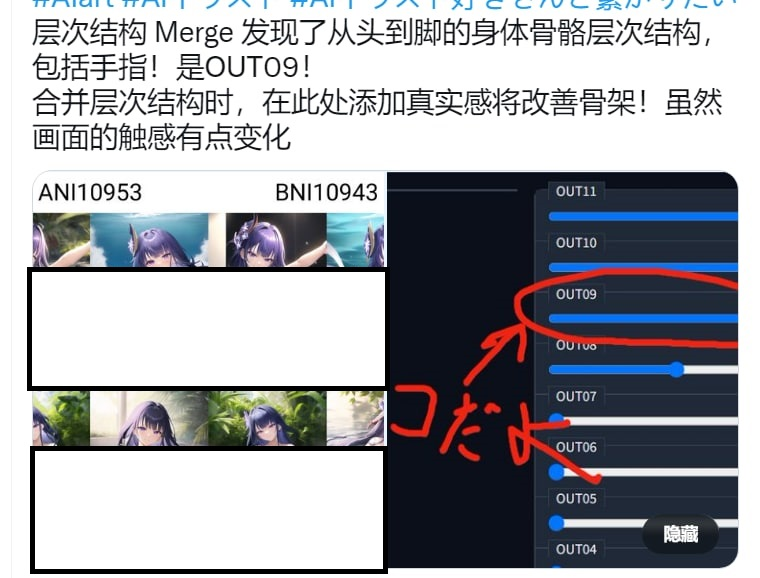
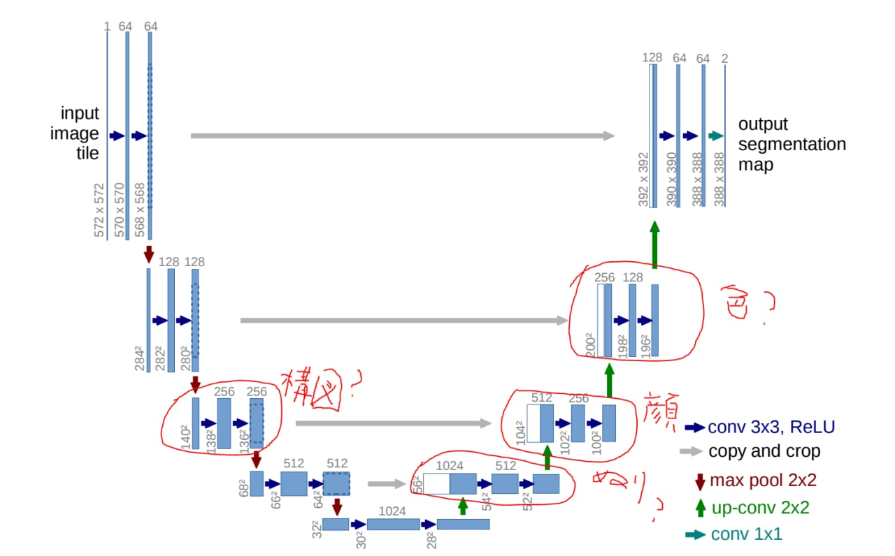
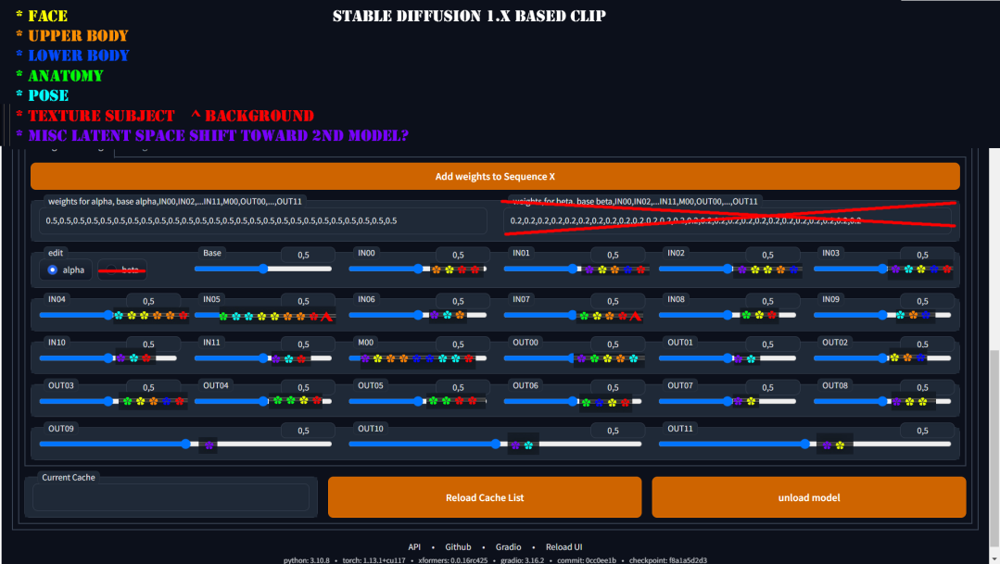
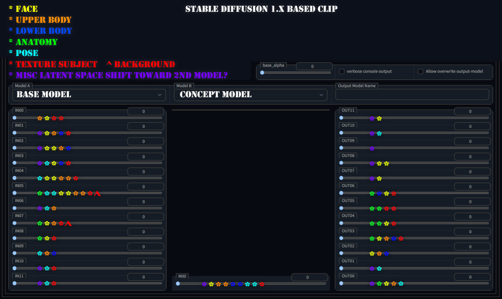

# Merging models #

### Blue pill ###

- [Articles in Rentry](https://rentry.org/RentrySD/#11112-extensions-for-model-merging)

### Blue pill, but in thesis paper ###

- [ZipIt! Merging Models from Different Tasks without Training](https://arxiv.org/abs/2305.03053)

- [Merging Models with Fisher-Weighted Averaging](https://arxiv.org/abs/2111.09832)

- [Acceleration of Stochastic Approximation by Averaging](https://epubs.siam.org/doi/abs/10.1137/0330046?journalCode=sjcodc) a.k.a "Polyak averaging"

- [Model soups: averaging weights of multiple fine-tuned models improves accuracy without increasing inference time](https://arxiv.org/abs/2203.05482)

- [Two-Tailed Averaging: Anytime, Adaptive, Once-in-a-While Optimal Weight Averaging for Better Generalization](https://arxiv.org/abs/2209.12581)

### Current materials before ranting ###

- [My merge.](../ch05/README.MD) Merge / Ensemble with *Average weighting* is a well discussed method. It is a good choice, at least for generalization.

- Merge with any recognizable patterns: [sd-webui-supermerger](https://github.com/hako-mikan/sd-webui-supermerger), ["Elemental Merge" in sd-webui-supermerger](https://github.com/hako-mikan/sd-webui-supermerger/blob/main/elemental_en.md)

- Some explaination (how to use instead of why): [BlockMergeExplained](https://rentry.org/BlockMergeExplained)

- Current meta: Merging multiple LoRAs. I don't know the procedure because I never do either LoRA or merging.

- Great potential: Select best merging hyperparameters by Reinforcement Learning [Medium article](https://medium.com/@media_97267/the-automated-stable-diffusion-checkpoint-merger-autombw-44f8dfd38871) [sdweb-auto-MBW](https://github.com/Xerxemi/sdweb-auto-MBW). Note: Score metric may not fit everybody, just like what WD / SD / NAI did. [ImageReward would be more relatable.](https://arxiv.org/abs/2304.05977)

- Circulating in QQ: [MBW魔法密录02-14](https://t.me/StableDiffusion_CN/1083749), [模型基础理论](https://docs.qq.com/doc/p/a36aa471709d1cf5758151d68ef5b59397421b2e)

- [Commentary by GhostShell, author of GhostMix](https://zhuanlan.zhihu.com/p/641434725), [description of GhostMix](https://zhuanlan.zhihu.com/p/632710727), just cite for docuemtary purpose. [Bilibili mirror 1](https://www.bilibili.com/read/cv23963021?spm_id_from=333.999.list.card_opus.click), [Bilibili mirror 2](https://www.bilibili.com/read/cv23877039?spm_id_from=333.999.list.card_opus.click)

### Not "merge" but worth mentioning ###

- [LoRA to complete model](https://github.com/kohya-ss/sd-scripts/blob/main/networks/merge_lora.py). [Video tutorial](https://www.youtube.com/watch?v=X-ZCRLBZbP0).

- [LoCon / LyCORIS to complete model](https://github.com/KohakuBlueleaf/LyCORIS/blob/main/tools/merge.py).

- Now "merging" is a *sustainable* act.

### Nice merges ###

- [majicMIX realistic](https://civitai.com/models/43331/majicmix-realistic): Better cosplay model (series). The "chained" mix is great, covering nice models from all "dimensions".

- [Chilloutmix](https://huggingface.co/TASUKU2023/Chilloutmix): Cosplay model. However there is no cosplayer in dataset. Just merging "real photo" and "anime" together.

- [AbyssOrangeMix2](https://huggingface.co/WarriorMama777/OrangeMixs#abyssorangemix2_nsfw-aom2n): Realistic anime style. More focus on muscle and proportions, which is lack in most anime models. Merging "real photo" and "anime" also.

- [PastelMix](https://huggingface.co/andite/pastel-mix): At least there is a clear theme, without owning the dataset.

- [Lawlas's yiffymix](https://huggingface.co/Airic/lawlas-yiff-mix): There is way too many speices to train. AI will get confused. [yiffy-e18](https://huggingface.co/Doubleyobro/yiffy-e18) is an example.

- [AnythingV3](https://huggingface.co/Linaqruf/anything-v3.0): SOTA for hitting the perfect spot of the market desire.

- [Bayesian Merger](https://github.com/s1dlx/sd-webui-bayesian-merger), [SD-Silicon](https://huggingface.co/Xynon/SD-Silicon): A model using auto RL to select merging hyperparameters.

### My merge (shameless advertisement) ###

- ["Uniform merge" of lots of models (original theory).](../ch05/)

### Merge by attention blocks (exclusive) ###

- [Swapping attention per layers](https://gist.github.com/crosstyan/95d14111e8e1eeb3348ef947818b338f) [ref](https://github.com/CCRcmcpe/scal-sdt/blob/e3e6a945fccb04245ad06b4ea1983852a93c7ea6/ckpt_tool.py#L254-L347). 

- [Some hints to perform such merge](https://t.me/StableDiffusion_CN/730058):
```
targets:
  - index: ["attentions"]
    targets:
      - targets:
          - index: ["attn1"]
```

- "CC" found that there is *no clear pattern* per model, as some models contribute by "FF", meanwhile some others are "sattn / xattn". [Twitter post](https://twitter.com/cross_tyan/status/1616437854208684036).

### The original and eatly stage on merging ###

- [Docuement in Official repo.](https://github.com/AUTOMATIC1111/stable-diffusion-webui/wiki/Features#checkpoint-merger) 

### The mergin method that was forgotten (nice try?) ###

- [Cross-Domain Few-Shot Learning with Meta Fine-Tuning.](https://arxiv.org/abs/2209.04836) Note: Not designed for SD!

- [Twitter post to figur out the timeline](https://twitter.com/moyix/status/1581390268368302080)

- [The SD related repo. Not even merged into webui](https://github.com/ogkalu2/Merge-Stable-Diffusion-models-without-distortion)

- [Some related discussion.](https://discord.com/channels/1038249716149928046/1038278959315570758/1042529239662084116)

- [JP article.](https://wikiwiki.jp/sd_toshiaki/Checkpoint%20Merger) [The GUI.](https://github.com/diStyApps/Merge-Stable-Diffusion-models-without-distortion-gui) 

### Start ranting ###

- ~~We had a hard tome to find something related thesis / papers.~~ (Moved to top session)

- Oh my god there is some discussion. [Robust fine-tuning of zero-shot models](https://arxiv.org/abs/2109.01903)

- [Some Chinese articles](https://www.zhihu.com/question/521497951)

- As stated in [6569e224.md](../ch99/6569e224.md), *try to theorize things formally.* You may archive more if a more appropriate mechanism is applied.

- [A nice merge: WD1.4 with SD2.1 TTE.](https://huggingface.co/p1atdev/wd-fix). ~~The TTE in WD1.4 is awful. No astolfo must be a failure. No execuses.~~

## Try to read thesis and don't try to dream about the blackbox. ##

- [Why We Will Never Open Deep Learning’s Black Box.](https://towardsdatascience.com/why-we-will-never-open-deep-learnings-black-box-4c27cd335118)

- [Nope.](https://twitter.com/butamanyasan/status/1608763093659832321)



- [Where is the bleach?](https://t.me/StableDiffusion_CN/625588) [However there is visualization tools.](https://github.com/hnmr293/stable-diffusion-webui-dumpunet) [There is always people interested.](https://medium.com/sfu-cspmp/unveiling-the-hidden-layers-of-neural-networks-6269615fb8a9) [Make sure what you're doing.](https://www.quora.com/Is-there-any-way-to-interpret-the-meanings-of-hidden-layers-and-reasoning-them-what-the-unit-values-account-for-possible-in-neural-network-learning)



- [The bruteforced result (Layer 7) is not useful for other tasks...](https://huggingface.co/syaimu/7th_Layer), [even it is supported by another popular merge model (AOM2)...](https://huggingface.co/WarriorMama777/OrangeMixs)


- So colorful...




