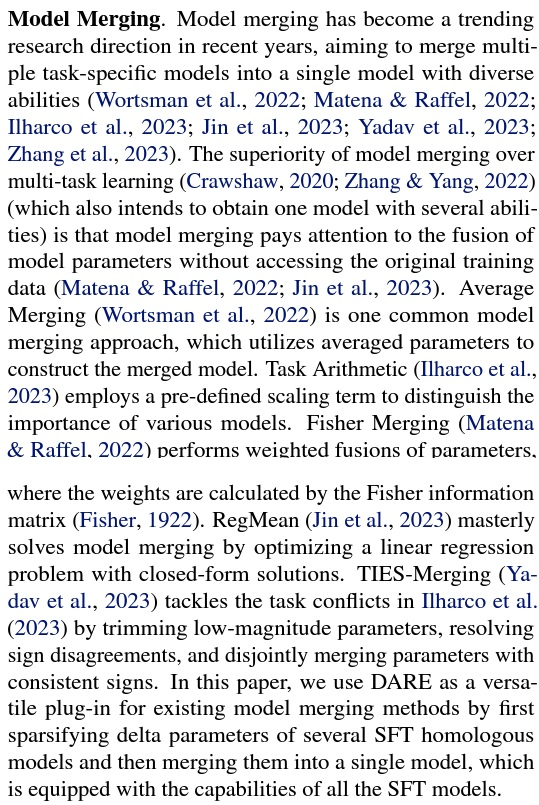
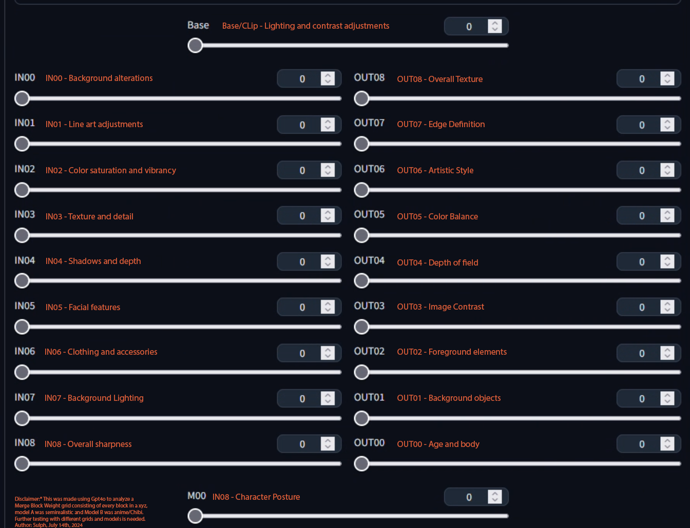

# Merging models #

*OK. Now it is being popular in LLM community. Meanwhile, it is faded in SD community. Crap.*

## Blue pill ##

- [Loads of academic paper recoded in HuggingFace, focusing on LLM.](https://huggingface.co/collections/osanseviero/model-merging-65097893623330a3a51ead66)

- [A comprehensive study from a member in LLM community.](https://www.interconnects.ai/p/model-merging)

- [More on techniques used while merging.](https://slgero.medium.com/merge-large-language-models-29897aeb1d1a) ~~Definitely not MBW.~~

- [Articles in Rentry](https://rentry.org/RentrySD/#11112-extensions-for-model-merging)

### Blue pill, but in academic paper ###

- [What Matters for Model Merging at Scale?](https://arxiv.org/abs/2410.03617) *comparative study*

- [Model Merging in LLMs, MLLMs, and Beyond: Methods, Theories, Applications and Opportunities](https://arxiv.org/abs/2408.07666) *comparative study*

- [Twin-Merging: Dynamic Integration of Modular Expertise in Model Merging](https://arxiv.org/abs/2406.15479) *Train router*

- [Merging Multi-Task Models via Weight-Ensembling Mixture of Experts](https://arxiv.org/abs/2402.00433) *Train router*

- [FusionBench: A Comprehensive Benchmark of Deep Model Fusion](https://arxiv.org/abs/2406.03280) *toolkit*

- [FuseChat: Knowledge Fusion of Chat Models](https://arxiv.org/abs/2408.07990)

- [No Task Left Behind: Isotropic Model Merging with Common and Task-Specific Subspaces](https://arxiv.org/abs/2502.04959) *Testing.*

- [Model Merging in Pre-training of Large Language Models](https://arxiv.org/abs/2505.12082v1) *Tested* [Trained with 1EP.](../ch06)

- [Mix Data or Merge Models? Optimizing for Diverse Multi-Task Learning](https://arxiv.org/abs/2410.10801) *comparative study*

- [Model Merging in LLMs, MLLMs, and Beyond: Methods, Theories, Applications and Opportunities](https://arxiv.org/abs/2408.07666) *comparative study*

- [Model merging with SVD to tie the Knots](https://arxiv.org/abs/2410.19735) *tldr: Merge LoRA OK*

- [DELLA-Merging: Reducing Interference in Model Merging through Magnitude-Based Sampling](https://arxiv.org/abs/2406.11617) *Tested*

- [Evolutionary Optimization of Model Merging Recipes](https://arxiv.org/abs/2403.13187) *Tested*

- [Arcee's MergeKit: A Toolkit for Merging Large Language Models](https://arxiv.org/abs/2403.13257) *toolkit* [Lecture video.](https://youtu.be/cvOpX75Kz4M)

- [Model Stock: All we need is just a few fine-tuned models](https://arxiv.org/abs/2403.19522) *Tested*

- [Dataless Knowledge Fusion by Merging Weights of Language Models](https://arxiv.org/abs/2212.09849)

- [Model Fusion via Optimal Transport](https://arxiv.org/abs/1910.05653)

- [Transformer Fusion with Optimal Transport](https://arxiv.org/abs/2310.05719)

- [Re-basin via implicit Sinkhorn differentiation](https://arxiv.org/abs/2212.12042)

- [Training-Free Pretrained Model Merging](https://arxiv.org/abs/2403.01753)

- [Do the Frankenstein, or how to achieve better out-of-distribution performance with manifold mixing model soup](https://arxiv.org/abs/2309.08610)

- [Language Models are Super Mario: Absorbing Abilities from Homologous Models as a Free Lunch](https://arxiv.org/abs/2311.03099) *Tested*

- [TIES-Merging: Resolving Interference When Merging Models](https://arxiv.org/abs/2306.01708) *Tested*

- [Editing Models with Task Arithmetic](https://arxiv.org/abs/2212.04089) *Tested*

- [Git Re-Basin: Merging Models modulo Permutation Symmetries](https://arxiv.org/abs/2209.04836) *Tested*

- [ZipIt! Merging Models from Different Tasks without Training](https://arxiv.org/abs/2305.03053)

- [AdapterSoup: Weight Averaging to Improve Generalization of Pretrained Language Models](https://arxiv.org/abs/2302.07027)

- [Merging Models with Fisher-Weighted Averaging](https://arxiv.org/abs/2111.09832) *Need run model*

- [Model soups: averaging weights of multiple fine-tuned models improves accuracy without increasing inference time](https://arxiv.org/abs/2203.05482) *Tested*

- [Two-Tailed Averaging: Anytime, Adaptive, Once-in-a-While Optimal Weight Averaging for Better Generalization](https://arxiv.org/abs/2209.12581)

- [On the Emergence of Cross-Task Linearity in the Pretraining-Finetuning Paradigm](https://arxiv.org/abs/2402.03660)

- [Rethink Model Re-Basin and the Linear Mode Connectivity](https://arxiv.org/abs/2402.05966v1)



### Github repos (mergers / algorithm implementations) excluding MBW / LBW ###

- ["mergekit", a LLM merger.](https://github.com/arcee-ai/mergekit)

- [My merge.](../ch05/README.MD) Merge / Ensemble with *Average weighting* is a well discussed method. It is a good choice, at least for generalization. *It refers to uniform-soup / isotropic merge in different papers.*

- [Supermario merge(DARE).](https://github.com/martyn/safetensors-merge-supermario) [Ported to SD.](https://github.com/groinge/sd-webui-untitledmerger/)

- [SD-Mecha](https://github.com/ljleb/sd-mecha), a merger focusing on serializable, extensive, efficiency, and supporting multiple algorithms.

- [Git-Rebasin stuffs.](./rebasin.md)

- [Implementation on Fisher-Weighted Averaging.](https://github.com/mmatena/model_merging/tree/master)

- Merge with any recognizable patterns: [sd-webui-supermerger](https://github.com/hako-mikan/sd-webui-supermerger), ["Elemental Merge" in sd-webui-supermerger](https://github.com/hako-mikan/sd-webui-supermerger/blob/main/elemental_en.md)

### MBW / LBW related topics ###

- SDXL discussion: [prompt_injection/1](https://github.com/cubiq/prompt_injection/discussions/1)

- Some explaination (how to use instead of why): [BlockMergeExplained](https://rentry.org/BlockMergeExplained)

- Current meta: Merging multiple LoRAs. I don't know the procedure because I never do either LoRA or merging.

- Great potential: Select best merging hyperparameters by Reinforcement Learning [Medium article](https://medium.com/@media_97267/the-automated-stable-diffusion-checkpoint-merger-autombw-44f8dfd38871) [sdweb-auto-MBW](https://github.com/Xerxemi/sdweb-auto-MBW). Note: Score metric may not fit everybody, just like what WD / SD / NAI did. [ImageReward would be more relatable.](https://arxiv.org/abs/2304.05977)

- Now boosting is available as [sd-webui-bayesian-merger](https://github.com/s1dlx/sd-webui-bayesian-merger). [autombw v2](https://github.com/Xerxemi/auto-MBW-rt) supports both bayesian boosting and ImageReward. [I will include it in my next merge](../ch05/README.MD). Currently [using my own fork to make them works, mainly code update.](https://github.com/6DammK9/auto-MBW-rt). Also see [the findings focusing on related works and general findings.](autombw.md)

- Circulating in QQ: [MBW魔法密录02-14](https://t.me/StableDiffusion_CN/1083749), [模型基础理论](https://docs.qq.com/doc/p/a36aa471709d1cf5758151d68ef5b59397421b2e)

- [Commentary by GhostShell, author of GhostMix](https://zhuanlan.zhihu.com/p/641434725), [description of GhostMix](https://zhuanlan.zhihu.com/p/632710727), just cite for docuemtary purpose. [Bilibili mirror 1](https://www.bilibili.com/read/cv23963021?spm_id_from=333.999.list.card_opus.click), [Bilibili mirror 2](https://www.bilibili.com/read/cv23877039?spm_id_from=333.999.list.card_opus.click)

- ["rimo_random_mix" which is written in Chinese](https://github.com/RimoChan/rimo_random_mix) *Note: BayesianOptimization*

### Not "merge" but worth mentioning ###

- [LoRA to complete model](https://github.com/kohya-ss/sd-scripts/blob/main/networks/merge_lora.py). [Video tutorial](https://www.youtube.com/watch?v=X-ZCRLBZbP0).

- [LoCon / LyCORIS to complete model](https://github.com/KohakuBlueleaf/LyCORIS/blob/main/tools/merge.py).

- Now "merging" is a *sustainable* act. [It has been discussed in 2403.](https://sakana.ai/evolutionary-model-merge/)

### Nice merges ###

- [majicMIX realistic](https://civitai.com/models/43331/majicmix-realistic): Better cosplay model (series). The "chained" mix is great, covering nice models from all "dimensions".

- [Chilloutmix](https://huggingface.co/TASUKU2023/Chilloutmix): Cosplay model. However there is no cosplayer in dataset. Just merging "real photo" and "anime" together.

- [AbyssOrangeMix2](https://huggingface.co/WarriorMama777/OrangeMixs#abyssorangemix2_nsfw-aom2n): Realistic anime style. More focus on muscle and proportions, which is lack in most anime models. Merging "real photo" and "anime" also.

- [PastelMix](https://huggingface.co/andite/pastel-mix): At least there is a clear theme, without owning the dataset.

- [Lawlas's yiffymix](https://huggingface.co/Airic/lawlas-yiff-mix): There is way too many speices to train. AI will get confused. [yiffy-e18](https://huggingface.co/Doubleyobro/yiffy-e18) is an example.

- [AnythingV3](https://huggingface.co/Linaqruf/anything-v3.0): SOTA for hitting the perfect spot of the market desire.

- [Bayesian Merger](https://github.com/s1dlx/sd-webui-bayesian-merger), [SD-Silicon](https://huggingface.co/Xynon/SD-Silicon): A model using auto RL to select merging hyperparameters.

### My merge (shameless advertisement) ###

- ["Uniform merge" of lots of models (original theory).](../ch05/)

### Merge by attention blocks (exclusive) ###

- [Swapping attention per layers](https://gist.github.com/crosstyan/95d14111e8e1eeb3348ef947818b338f) [ref](https://github.com/CCRcmcpe/scal-sdt/blob/e3e6a945fccb04245ad06b4ea1983852a93c7ea6/ckpt_tool.py#L254-L347).

- [Some hints to perform such merge](https://t.me/StableDiffusion_CN/730058):

```yaml
targets:
  - index: ["attentions"]
    targets:
      - targets:
          - index: ["attn1"]
```

- "CC" found that there is *no clear pattern* per model, as some models contribute by "FF", meanwhile some others are "sattn / xattn". [Twitter post](https://twitter.com/cross_tyan/status/1616437854208684036).

### The original and eatly stage on merging ###

- [Docuement in Official repo.](https://github.com/AUTOMATIC1111/stable-diffusion-webui/wiki/Features#checkpoint-merger)

### The mergin method that was forgotten (nice try?) ###

- [Cross-Domain Few-Shot Learning with Meta Fine-Tuning.](https://arxiv.org/abs/2209.04836) Note: Not designed for SD!

- [Twitter post to figur out the timeline](https://twitter.com/moyix/status/1581390268368302080)

- [The SD related repo. Not even merged into webui](https://github.com/ogkalu2/Merge-Stable-Diffusion-models-without-distortion)

- [Some related discussion.](https://discord.com/channels/1038249716149928046/1038278959315570758/1042529239662084116)

- [JP article.](https://wikiwiki.jp/sd_toshiaki/Checkpoint%20Merger) [The GUI.](https://github.com/diStyApps/Merge-Stable-Diffusion-models-without-distortion-gui)

### Start ranting ###

- ~~We had a hard tome to find something related thesis / papers.~~ (Moved to top session)

- Oh my god there is some discussion. [Robust fine-tuning of zero-shot models](https://arxiv.org/abs/2109.01903)

- [Some Chinese articles](https://www.zhihu.com/question/521497951)

- As stated in [6569e224.md](../ch99/6569e224.md), *try to theorize things formally.* You may archive more if a more appropriate mechanism is applied.

- [A nice merge: WD1.4 with SD2.1 TTE.](https://huggingface.co/p1atdev/wd-fix). ~~The TTE in WD1.4 is awful. No astolfo must be a failure. No execuses.~~

## Try to read thesis and don't try to dream about the blackbox ##

- [Why We Will Never Open Deep Learning’s Black Box.](https://towardsdatascience.com/why-we-will-never-open-deep-learnings-black-box-4c27cd335118)

- [Nope.](https://twitter.com/butamanyasan/status/1608763093659832321)


- [Where is the bleach?](https://t.me/StableDiffusion_CN/625588) [However there is visualization tools.](https://github.com/hnmr293/stable-diffusion-webui-dumpunet) [There is always people interested.](https://medium.com/sfu-cspmp/unveiling-the-hidden-layers-of-neural-networks-6269615fb8a9) [Make sure what you're doing.](https://www.quora.com/Is-there-any-way-to-interpret-the-meanings-of-hidden-layers-and-reasoning-them-what-the-unit-values-account-for-possible-in-neural-network-learning)


- [The bruteforced result (Layer 7) is not useful for other tasks...](https://huggingface.co/syaimu/7th_Layer), [even it is supported by another popular merge model (AOM2)...](https://huggingface.co/WarriorMama777/OrangeMixs)


- So colorful...


- [The SDXL version, generated by ChatGPT](https://discord.com/channels/930499730843250783/1064802771716554792/1262051942650351699):


