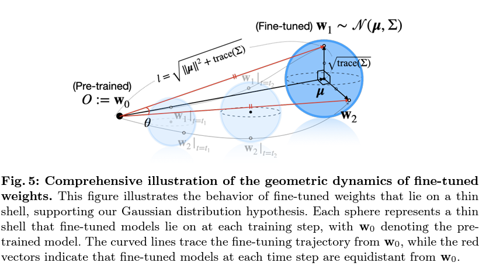
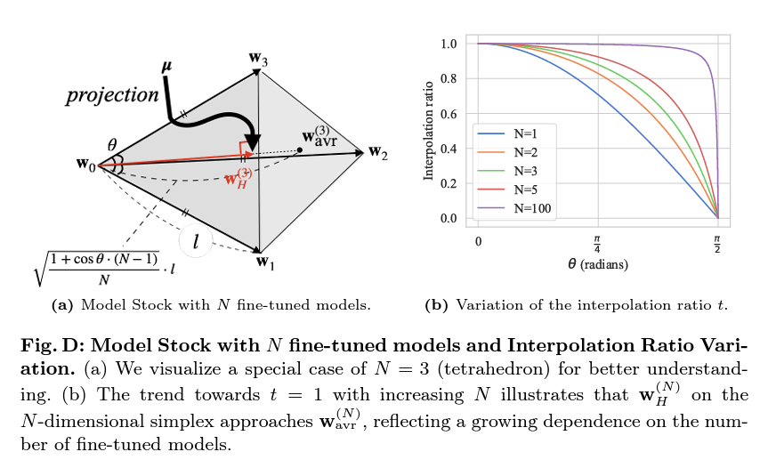
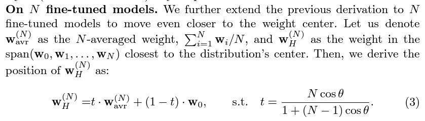
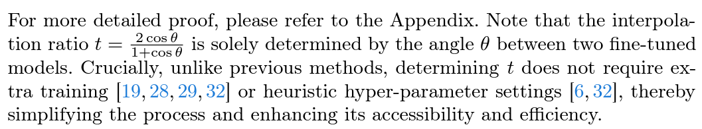

# Findings on "Model Stock" in SD #

- Paper: [Model Stock: All we need is just a few fine-tuned models](https://arxiv.org/abs/2403.19522)

- Implementation: [Official: Code is under internal review now.](https://github.com/naver-ai/model-stock) [Attempt by mergekit.](https://github.com/arcee-ai/mergekit/blob/main/mergekit/merge_methods/model_stock.py)

## Guessing the "theta" ##

- As puzzled as the mergekit, $\theta$ was not clearly defined in the paper. By common knowledge from NLP, [Cosine similarity](https://en.wikipedia.org/wiki/Cosine_similarity) $cos(\theta)$ is preferred, which is also implied in the diagram. For implementation, [CosineSimilarity](https://pytorch.org/docs/stable/generated/torch.nn.CosineSimilarity.html) is easy to apply.

- Notice that $cos(\theta)$ is based from $w_0$ which is the **pretrained model (base model)**. Actual calculation should be $CosineSimilarity(w_1-w_0,w_2-w_0)$

## Guessing for the "N" case ##

- Although there was math proof in the Appendix, I found that it still unable to state how to derive the $\theta$ from $w_n$. All we know is it tends to $t=1$ for a high dimensional space.

- Then for the final equation, it just drifts towards the *average* of the model $W_{avr}^{(N)}$, which is the baseline recipe. Maybe the slight difference can cause the [butterfly effect](https://en.wikipedia.org/wiki/Butterfly_effect) and still improve.

## Periodic merging? ##

- Paper has explictly state that it is performed **while fintuning**, so I think it is not suitable in this case, which I have nothing to train.

## TSD v2? ##

- From [TIES](./ties.md) and [DARE](./dare.md), we will find that there are still a tiny place $\tau_m$ as "averaging". *I think I can locate the "majority" and apply this equation along with dropout by pure random.* 

- For my "it works I don't know why" TIES-SOUP, $\tau_t=0$ when $w_0$ in Model Stock matches $\theta_{init}$ in TIES, Then $W_{avr}^{(N)}$ will be $\tau_m$. Instead of $\lambda=1$ from my TIES-SOUP variant, $\lambda=t$ which **Model Stock tried to determine the hyper-parameter.**

## Weighted sum between averaged model and base model? ##

- Maybe I should rename my "TSD" from "TIES-SOUP w/ DROP" to *"TIES-STOCK w/ DROP"*. Now I can expect how it performs.