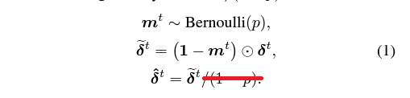
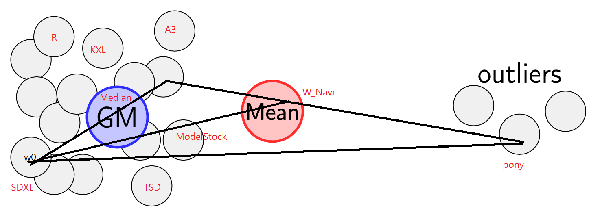
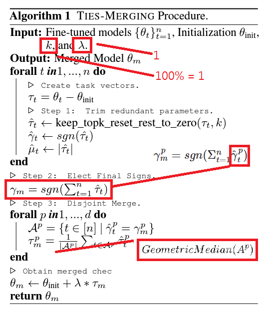

# Findings on "Model Stock" in SD #

- Paper: [Model Stock: All we need is just a few fine-tuned models](https://arxiv.org/abs/2403.19522)

- Implementation: [Official: Code is under internal review now.](https://github.com/naver-ai/model-stock) [Attempt by mergekit.](https://github.com/arcee-ai/mergekit/blob/main/mergekit/merge_methods/model_stock.py)

- tldr: *Weighted sum between averaged model and base model?*

## Guessing the "theta" ##

- As puzzled as the mergekit, $\theta$ was not clearly defined in the paper. By common knowledge from NLP, [Cosine similarity](https://en.wikipedia.org/wiki/Cosine_similarity) $cos(\theta)$ is preferred, which is also implied in the diagram. For implementation, [CosineSimilarity](https://pytorch.org/docs/stable/generated/torch.nn.CosineSimilarity.html) is easy to apply.

- Notice that $cos(\theta)$ is based from $w_0$ which is the **pretrained model (base model)**. Actual calculation should be $CosineSimilarity(w_1-w_0,w_2-w_0)$

## Range of CosineSimilarity and final interpolation ratio? ##

- *The paper didn't mention, or even consider that* $cos(\theta)$ is raged from $[-1,1]$.

- If full range of value is considered, interpolation ratio $t$ will be off chart. We can hard assign $W_0$ when $cos(\theta)=-1$.

- However, given the merge ratio, it will sounds valid. You can still get something like $3 W_0 - 2 W_{12}$ for $cos(\theta)=-1/2$.

- For the upcoming "N-case", in case the merger doesn't break, it may be still valid. *I'm puzzled to guess the theta instead.* 

## Guessing for the "N-case" ##

- Although there was math proof in the Appendix, I found that it still unable to state how to derive the $\theta$ from $w_n$. All we know is it tends to $t=1$ for a high dimensional space.

- Then for the final equation, it just drifts towards the *average* of the model $W_{avr}^{(N)}$, which is the baseline recipe. Maybe the slight difference can cause the [butterfly effect](https://en.wikipedia.org/wiki/Butterfly_effect) and still improve.

- Since **we can't just average out the theta**, we can try to ~~perform SVD~~ perform a special iterative method for [the first singular value of SVD decomposition for N vectors](https://stats.stackexchange.com/questions/239059/similarity-metrics-for-more-than-two-vectors). [torch.svd](https://pytorch.org/docs/stable/generated/torch.svd.html) is handy ( $O(mn^2)$ in time, I am scared.)

- After getting stuck for a few days, *I decided to ditch this approach becuase I can't get the result in range.* I decided to calculate [Geometric Median](https://en.wikipedia.org/wiki/Geometric_median) with [Weiszfeld's algorithm](https://github.com/scoutant/l1-median/tree/main) instead. I'll explain in session below.

- **It throws nan** for the $mean(cos(\theta))$ approach. It also supports my idea above.

## Periodic merging? ##

- Paper has explictly state that it is performed **while fintuning**, so I think it is not suitable in this case, which I have nothing to train.

## TSD v2? ##

- From [TIES](./ties.md) and [DARE](./dare.md), we will find that there are still a tiny place $\tau_m$ as "averaging". *I think I can locate the "majority" and apply this equation along with dropout by pure random.* 

- For my "it works I don't know why" TIES-SOUP, $\tau_t=0$ when $w_0$ in Model Stock matches $\theta_{init}$ in TIES, Then $W_{avr}^{(N)}$ will be $\tau_m$. Instead of $\lambda=1$ from my TIES-SOUP variant, $\lambda=t$ which **Model Stock tried to determine the hyper-parameter.**

- Then now here is my updated algorithm.

- Now it works just like no ModelStock has been applied. As the paper stated, $t \rightarrow 1$ when $N=100$. I'll move it to the Median also.

## Spinoff: "Model Stonk" by calculate Geometric Median with gradient descent ##

- Since $cos(\theta)$ is troublesome to calcule for N-Model case, I decided to calculate [Geometric Median](https://en.wikipedia.org/wiki/Geometric_median) with [Weiszfeld's algorithm](https://github.com/scoutant/l1-median/tree/main) instead. Conceptally [it is a bit different from geometry median](https://www.geeksforgeeks.org/geometric-median/), which lies between midpoint $w_{12}$ and  and vertex $w_0$, but it is well known for ignoring outliers and robust training. Such concept can be brought into model merging, *which is similar to TIES (ignoring outliers as math sign) and Model Stock (bring towards center)*. Although gradient descent is involved, *it converges in linear time* ( i.e. $O(N)$ ) because of nature of $l1-median$ problem.

- After some reading, "it is the high dimension of [Fermat point](https://en.wikipedia.org/wiki/Fermat_point)". High dimension of [centroid](https://en.wikipedia.org/wiki/Centroid) is easily found by averaging per component (i.e. ModelSoup). The finding of ModelStock is somewhat legit, but failed to link to any known and solid ML idea, or it just somehow forgot to include $W_0$ for the "finding of center". Since LLM / SD is also an [computation model](https://en.wikipedia.org/wiki/Model_of_computation) (which is as generic as it is), I think this should be a vaild idea extended from the paper.

- Also, (this may be difficult to understand), [some blockchain paper really features Geometric Median](https://arxiv.org/abs/1705.05491), because **Geometric Median has a breakdown point of 0.5.** It is same as the [51% attack](https://www.investopedia.com/terms/1/51-attack.asp): *Pony's dangerous weight shifting only break the SDXL merge when it reaches more than 51%. Meanwhile, there are ML papers mentioned Geometric Median, mentioning that it can be used as [Robust Aggregation for Federated Learning](https://arxiv.org/abs/1912.13445), and... it is about decentralized training. Along with TIES / DARE, it can minimize any contradicting weights after the voting, and being super robust.

- Implementation was easy, [there are codes almost reusable immediately](https://github.com/krishnap25/geom_median/blob/main/src/geom_median/torch/weiszfeld_list_of_array.py), [but I still need to rewrite myself](https://github.com/6DammK9/sd-mecha/commit/f2119b812e3483036183468c8b0d763e0a288dad). [List Comprehension](https://www.w3schools.com/python/python_lists_comprehension.asp) is used for parallelization and efficiency.

- It spends around 6-10x more time on merging, comparing with DARE (40x for averaging). However the result is reasonable. "Median vs Mean" is a widely discussed topic, they do behave differently. Therefore I need more image generation to determine if it works good.

## TSD v2.1 ##

- I'd call it $GeometricMedian(A^p)$ directly.

- Suprisingly, it inherits quite a lot of "styles" from median, rather than DARE. Therefore I can generate images from this implemention directly, without testing the plain median.