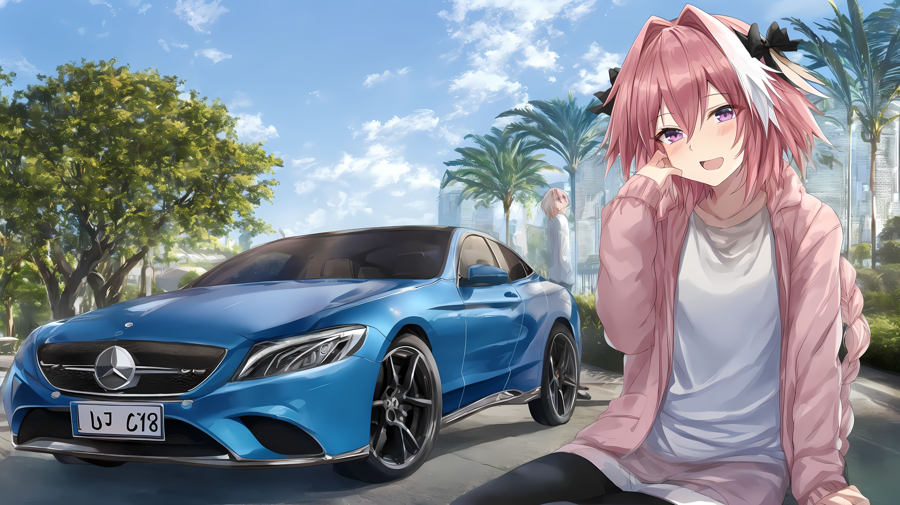

# My procedure from scratch to posting to PIXIV #

- Thie is **standarized and stable procedure** for all SD-based (including NAI based because it is) models. ~~I am lazy.~~ 
- "Postmodernism art: This is not Astolfo, but a model test."

## Example ##

- [Pixiv post "Astolfo with car"](https://www.pixiv.net/en/artworks/109982464)

- [Proof of reproducible result in Youtube](https://youtu.be/TLEsQBCO-BA)

## Before prompt engineering ##

- Find a model you're interested (I prefer non merged or TTE-ed, preferable original FT approaches with absolutely no idea on results). [VBP2.3](https://github.com/6DammK9/nai-anime-pure-negative-prompt/blob/main/ch02/f59359c175.md) is a good testing subject.
- Prior knowledge (heard from author, observation in discussion): Trained with artists with rich background. Authour feels "overfit", **and it is SFW.**
- [CFG-STEP scan.](./cfg_step.md) Result: CFG 4.5 in 768 x 768, no change with hires fix, even in 2x.
- [Hi-Res Fix scan.](./hires_fix.md) Result: 2x (yay~) with denoise ratio 0.7.
- [CFG rescale scan.](./dynamic_cfg.md) Result: 0.3.
- Must have Astolfo. Thershold: SD 1.4 **pass**, WD 1.4 **fail**. Look for pink hair, and tends to be a boy. If it "fails", TERMINATE THE TEST. Don't waste time. Report to author.
- Reason: Astolfo is the 2nd male character (`1boy`) in Danbooru. He has around 5.5k or arts. Just below Link (8k), and Touhou / Vocaloid characters.
- For non animate models (excluding "realistic mix"): Just try to reconstruct `astolfo`. I have no idea on making art without Astolfo. EARLY EXIT.

## During prompt engineering ##

### Old instruction but more detailed ###

- **Ignore model instruction (sometime there isn't).** [Standard negative prompt first](./prompt.md). [Model prior / bias will be shown](./prior.md). Skip if you have prior knowledge.
- **Keep ignore model instruction (independent test).** Make postive prompt from standard. Must include: **Interactive objects** (clothes / accessories / cars / guns etc.), **subject characters** (Astolfo / your LoRA character), **background sceneary** (a location).
- **Fix Astolfo.** `uc: breasts`
- **ALWAYS VERIFY WITH DATASET!** Now it is: `qipao`, `astolfo`, `kowloon`. If you have a special theme, add it also (`lunar new year`).
- **CHECK AGAIN WITH NLP!** `cheongsam` (Pixiv) > `china_dress` (Danbooru) > `qipao` (LAION). `happy_new_year ` (Danbooru) > `lunar new year` (LAION) > `lunar` + `new year` (CLIP).
- **KEEP BRAINSTORMING!** `lunar` + `new year` (CLIP) > `lunar` (night) + `new year` + `victoria harbor` (WIKI) > `lunar new year` + `kowloon` (LAION)
- **Adjust prompt weights and sequences!** It may be NP-hard. Position first (as attention ordering.) `qipao` > `astolfo` > `lunar new year` > `kowloon`. Then `(qipao:0.98), [astolfo], [[lunar new year]], [[[[kowloon]]]]`. *Sometimes `kowloon` comes first (e.g. TTE models, "any3")*
- **Test with low STEPS!** Usually STEP 48 batch 4.

### Recent addon information ###

- Highres step is "0", equals to original STEPS. Therefore 48 STEPS original + 48 STEPS High Res I2I.

## After prompt engineering ##

- Find a stable PC (RTX 2080ti with 65% TDP cap), count for expected time amount (6 hours), divide by large STEPS (STEP 256 batch 200).
- **HAVE A GOOD SLEEP, OR A GOOD DAY.** ("generative art")
- Cluster 36 - 225 images (glitched / missing detail / bad aesthetic / just not good enough etc.) and **pick at most best 20 images.** This requires extensive art sense. See [aesthetic.md](aesthetic.md) to try learn the formal aesthetic.
- Post to Pixiv. Done.
- (Optional) Futher upsample to make actual 4K wallpaper.



```
parameters
(aesthetic:0), (quality:0), (car:0), [[mercedes]], (1girl:0), (boy:0), [[braid]], [astolfo]
Negative prompt: (worst:0), (low:0), (bad:0), (exceptional:0), (masterpiece:0), (comic:0), (extra:0), (lowres:0), (breasts:0.5)
Steps: 48, Sampler: Euler, CFG scale: 4.5, Seed: 3844413838, Size: 1024x576, Model hash: f59359c175, Model: VBP23-1024-ep49, Denoising strength: 0.7, Clip skip: 2, Hires upscale: 2, Hires upscaler: Latent, CFG Rescale φ: 0.3, Version: v1.4.1-3-g1f45fc80
postprocessing
Postprocess upscale by: 2, Postprocess upscaler: R-ESRGAN 4x+ Anime6B
```
