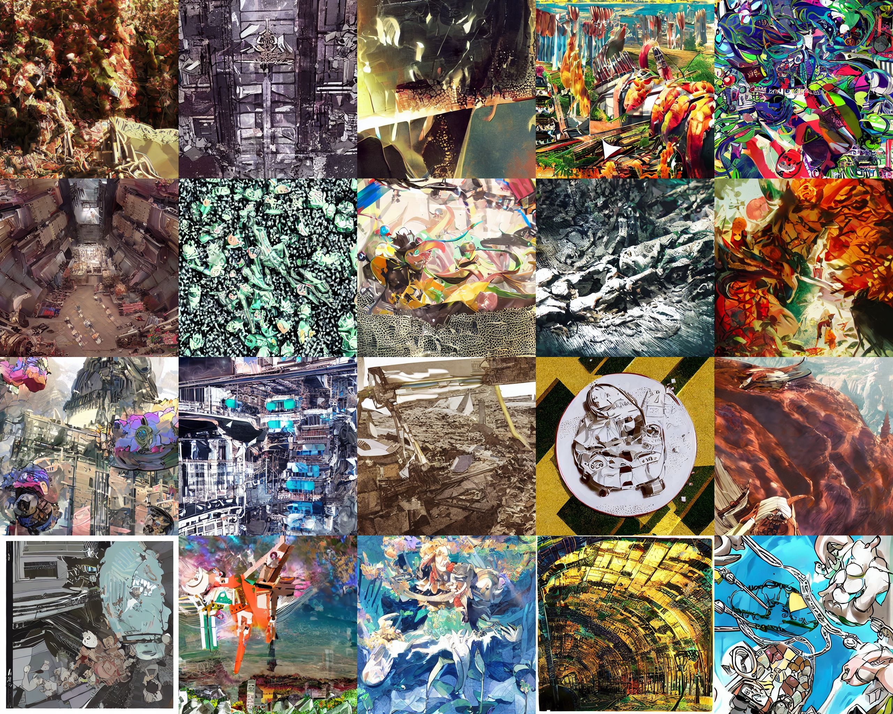
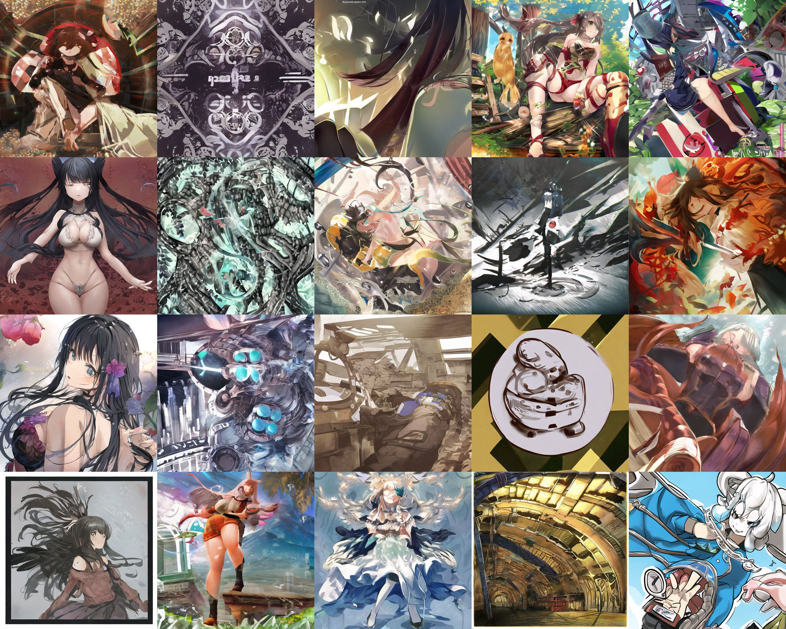
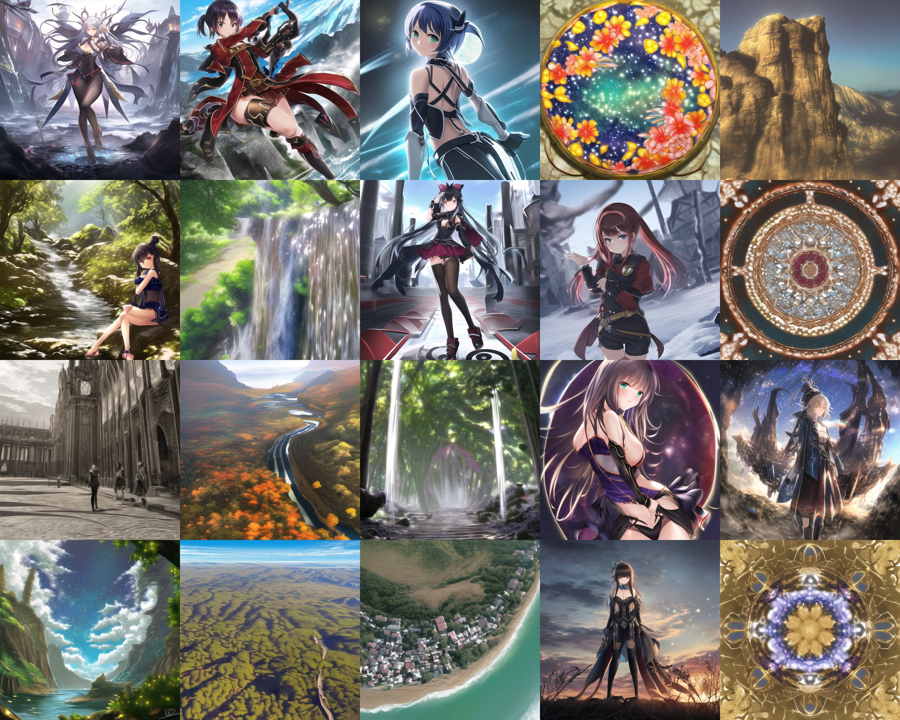
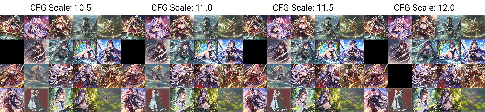

# Prior scan #

- "Dramatic explanantion" in [
ACertainsStrategyTalk](https://huggingface.co/spaces/JosephusCheung/ACertainsStrategyTalk). 
- Just the bottom part of [925997e9.md](../ch99/925997e9.md). A "waifu model" trained from general model stil have a "bias" between "human / waifu" and "general content / non-waifu". Compare the "bias / prior" or the model with you task.
- For example, I will have a hard time to generate "astolfo with hippogriff" in ANY3 beacaus it is so biased to human profait. 
- You will see if the model really trying to generate what you trained or what you aimed for.

## Procedure (V2) ##

- V1 applies. However it can be done with **absolutely no prompts** (I don't know how it is called, maybe just "denoising"?). Instead of arbitary step / sampler, just match with the original paper i.e. **DDIM 1000 STEPS** [DDIM paper](https://arxiv.org/pdf/2010.02502.pdf) [DDIM review](https://openreview.net/forum?id=St1giarCHLP). Furthermore, use *seed 1-20* to compare across models. [mega_cmp_v3](../ch03/mega_cmp_v3.ipynb) will be based from this method.

- [VBP2](https://t.me/StableDiffusion_CN/827892), [ep50](https://t.me/StableDiffusion_CN/839296). V2 of [ABPModel](https://huggingface.co/Crosstyan/BPModel/blob/main/NMFSAN/README.md). Very strong in drawing background and sceneary. However the original design is to reconstruct "art styles" (as provided TI). [Similar methods but not exactly](https://arxiv.org/abs/2302.12066).

- [ACertainDraft](https://huggingface.co/JosephusCheung/Draft). A model [trained with AIGC](https://arxiv.org/abs/2210.07574) to "make it mathically not like NAI".

## Procedure (V1) ##

- Assumed that you've already found the optimal CFG / STEP combination. Otherwise you may never able to get any valid image.
- Same minimal prompt, generate a large batch of images.
- See what it is inside.

- [bp_nman_e29](https://huggingface.co/Crosstyan/BPModel/blob/main/NMFSAN/README.md): Yep, "editor's choice".

- [Anything V3](https://huggingface.co/Linaqruf/anything-v3.0): **So biased. But SOTA anyway.** **So [momoko / momoco](https://www.pixiv.net/en/users/1113943)**

- NAI again. **No comment. Looks like there are more hidden datasets.**

- Should be `888886dc.ckpt`. I forgot. 

- Should be EVT_V3. I forgot also.
