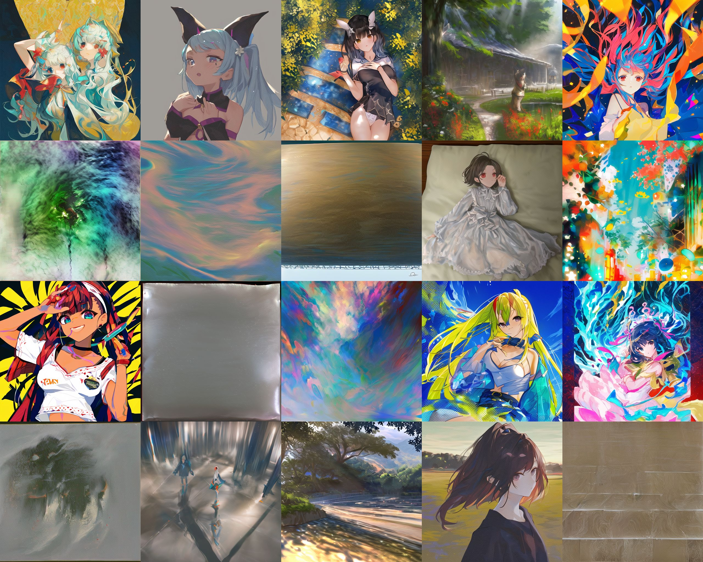

# Prior scan #

- "Dramatic explanantion" in [
ACertainsStrategyTalk](https://huggingface.co/spaces/JosephusCheung/ACertainsStrategyTalk). 
- Just the bottom part of [925997e9.md](../ch99/925997e9.md). A "waifu model" trained from general model stil have a "bias" between "human / waifu" and "general content / non-waifu". Compare the "bias / prior" or the model with you task.
- For example, I will have a hard time to generate "astolfo with hippogriff" in ANY3 beacaus it is so biased to human profait. 
- You will see if the model really trying to generate what you trained or what you aimed for.

## Procedure ##

- Assumed that you've already found the optimal CFG / STEP combination. Otherwise you may never able to get any valid image.
- Same minimal prompt, generate a large batch of images.
- See what it is inside.

- [bp_nman_e29](https://huggingface.co/Crosstyan/BPModel/blob/main/NMFSAN/README.md)

- Should be `888886dc.ckpt`. I forgot.

- Should be EVT_V3. I forgot also.
