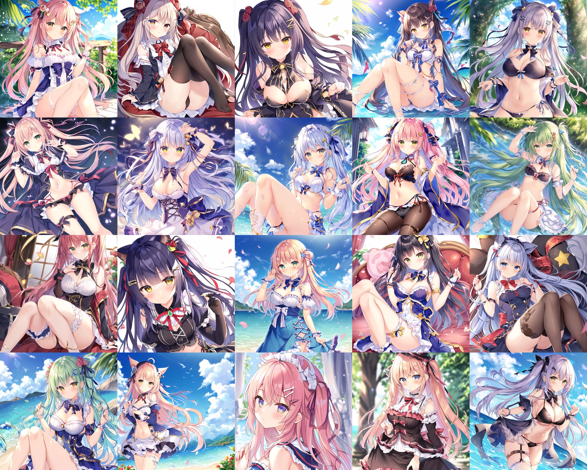
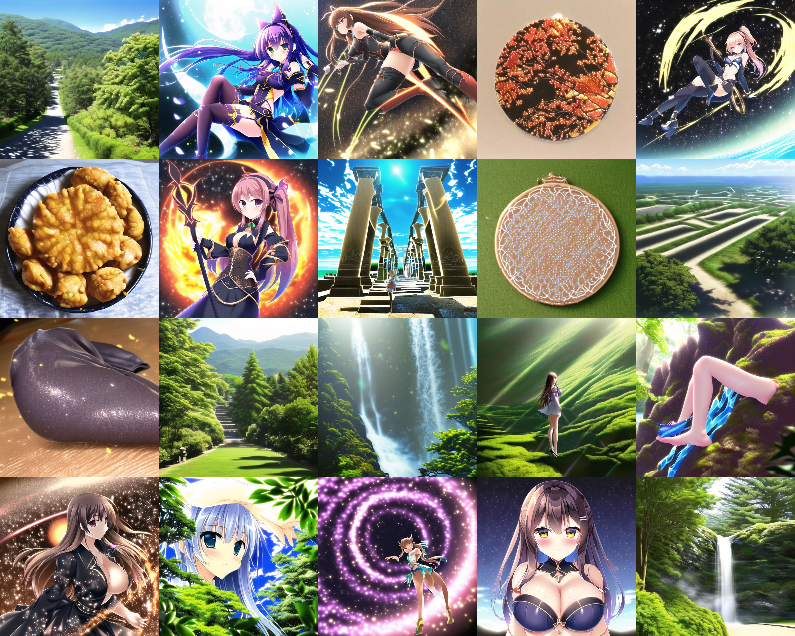

# Prior scan #

- With all prompts removed, meanwhile with specific non-text parameters, we can use SD for [Unconditional Image Generation](https://huggingface.co/tasks/unconditional-image-generation). 
[I have made an article for both demostration and technical discussion](https://civitai.com/articles/5149/untitled-denoising-to-the-random-content).

- See Procedure (V3) for some examples.

### Older description ###

- "Dramatic explanantion" in [
ACertainsStrategyTalk](https://huggingface.co/spaces/JosephusCheung/ACertainsStrategyTalk). 
- Just the bottom part of [925997e9.md](../ch99/925997e9.md). A "waifu model" trained from general model stil have a "bias" between "human / waifu" and "general content / non-waifu". Compare the "bias / prior" or the model with you task.
- For example, I will have a hard time to generate "astolfo with hippogriff" in ANY3 beacaus it is so biased to human profait. 
- You will see if the model really trying to generate what you trained or what you aimed for.

## Procedure (V3) ##

- Like the cover of the repo, since SDXL and other denoising mechanism has been improved, we can further simplify the procedure, now with arbitary random seed and less sampling steps:

```
parameters

Steps: 48, Sampler: Euler, Schedule type: Automatic, CFG scale: 3, Seed: 3649863581, Size: 1024x1024, Model hash: e276a52700, Model: x72a-AstolfoMix-240421-feefbf4, VAE hash: 26cc240b77, VAE: sd_xl_base_1.0.vae.safetensors, Clip skip: 2, FreeU Stages: "[{\"backbone_factor\": 1.1, \"skip_factor\": 0.6}, {\"backbone_factor\": 1.2, \"skip_factor\": 0.4}]", FreeU Schedule: "0.0, 1.0, 0.0", FreeU Version: 2, Dynamic thresholding enabled: True, Mimic scale: 1, Separate Feature Channels: False, Scaling Startpoint: MEAN, Variability Measure: AD, Interpolate Phi: 0.3, Threshold percentile: 100, PAG Active: True, PAG Scale: 1, Version: v1.9.3
```

- This may help us knowing which finetuning streadgy has been applied towards model (as merging models has been faded out). 
- This is [the original SDXL](https://huggingface.co/stabilityai/stable-diffusion-xl-base-1.0), you may spot some artwork:


- [Animagine XL 3.1](https://huggingface.co/cagliostrolab/animagine-xl-3.1). It is highly colorful but fragmented:


- [Kohaku XL Epsilon](https://huggingface.co/KBlueLeaf/Kohaku-XL-Epsilon). Notice for graphic design or character design:


- [Pony Diffusion V6 XL](https://civitai.com/models/257749?modelVersionId=290640). Obviously there are different species:


- Then it goes to my merged model. [AstolfoMix-XL Baseline](https://civitai.com/models/309514?modelVersionId=347383). Notice that it doesn't include Pony:


- [AstolfoMix-XL TGMD](https://civitai.com/models/309514?modelVersionId=559310). Notice that merging algorithm has been applied, and there are many models included:


## Procedure (V2) ##

- V1 applies. However it can be done with **absolutely no prompts** (I don't know how it is called, maybe just "denoising"?). Instead of arbitary step / sampler, just match with the original paper i.e. **DDIM 1000 STEPS** [DDIM paper](https://arxiv.org/pdf/2010.02502.pdf) [DDIM review](https://openreview.net/forum?id=St1giarCHLP). Furthermore, use *seed 1-20* to compare across models. [mega_cmp_v3](../ch03/mega_cmp_v3.ipynb) will be based from this method.

- [VBP2](https://t.me/StableDiffusion_CN/827892), [ep50](https://t.me/StableDiffusion_CN/839296). V2 of [ABPModel](https://huggingface.co/Crosstyan/BPModel/blob/main/NMFSAN/README.md). Very strong in drawing background and sceneary. However the original design is to reconstruct "art styles" (as provided TI). [Similar methods but not exactly](https://arxiv.org/abs/2302.12066).


- [ACertainDraft](https://huggingface.co/JosephusCheung/Draft). A model [trained with AIGC](https://arxiv.org/abs/2210.07574) to "make it mathically not like NAI".


- [ABPModel](https://huggingface.co/Crosstyan/BPModel/blob/main/NMFSAN/README.md)
ep99. "No human".


- [ACertainThing](https://huggingface.co/JosephusCheung/ACertainThing). A model [trained with AIGC](https://arxiv.org/abs/2210.07574) to "make it more overfitting".


## Procedure (V1) ##

- Assumed that you've already found the optimal CFG / STEP combination. Otherwise you may never able to get any valid image.
- Same minimal prompt, generate a large batch of images.
- See what it is inside.

- [bp_nman_e29](https://huggingface.co/Crosstyan/BPModel/blob/main/NMFSAN/README.md): Yep, "editor's choice".


- [Anything V3](https://huggingface.co/Linaqruf/anything-v3.0): **So biased. But SOTA anyway.** **So [momoko / momoco](https://www.pixiv.net/en/users/1113943)**


- NAI again. **No comment. Looks like there are more hidden datasets.**


- Should be `888886dc.ckpt`. I forgot. 


- Should be EVT_V3. I forgot also.
