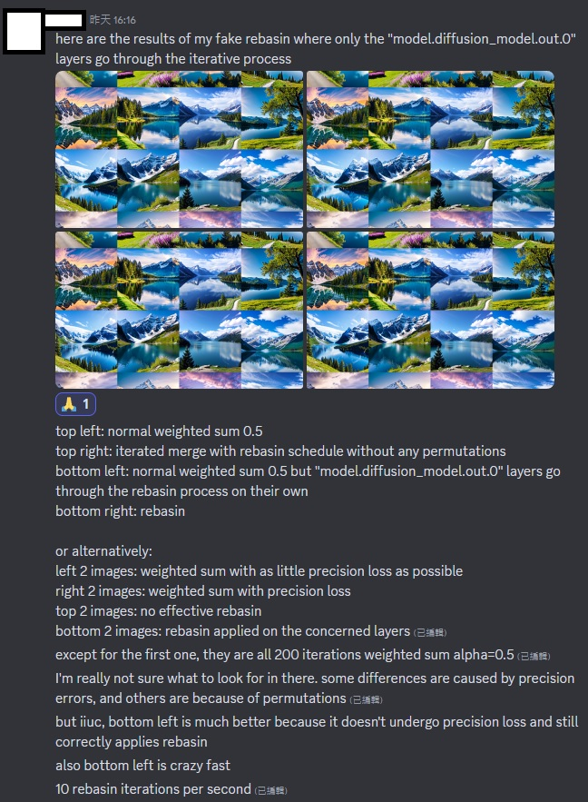
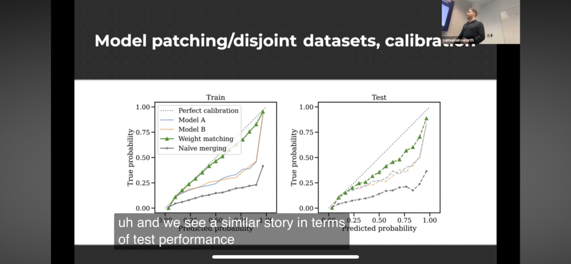

# Findings on "Git Re-Basin" in SD #

*Still in question mark. Is is irrelvant or negligible? Or it does something like what AutoMBW does? Or it improves "naive averaging"?*

## Core concept ##

- Making use of "Permutation Symmetry"

    
"Non-convex optimization"

    
(spoiler: It is a ___ algorithm)

- Alg. 1: "Activation Matching"
- Alg. 2: "Weight Matching"
- Alg. 3: "Straight-through estimator"
- Algorithm 1: Find maximized permutation
- Algorithm 2: Minimize Loss in the mid-point of permutation
- Algorithm 3: "Take average" if there are many models

## Useful links ##

- Official paper: [arxiv](https://arxiv.org/abs/2209.04836)
- Official seminar: [youtube](https://www.youtube.com/watch?v=ffZFrvuxjc8&ab_channel=ColumbiaVisionSeminar) *Not easy to search*
- Official codebase: [github](https://github.com/samuela/git-re-basin)
- `zh` [Translated article.](https://cloud.tencent.com/developer/article/2106636) [Mirror.](https://www.jiqizhixin.com/articles/2022-09-15-12)

## Known implementation which is promising ##

- [rebasin in another paper](https://github.com/zju-vipa/training_free_model_merging/tree/master/heterogeneous_tasks)

## Known integration to SD ##

- [Merge-Stable-Diffusion-models-without-distortion](https://github.com/ogkalu2/Merge-Stable-Diffusion-models-without-distortion/issues)
- [sd-webui-model-mixer](https://github.com/wkpark/sd-webui-model-mixer)
- [re-basin_merger](https://github.com/T0b1maru/re-basin_merger)
- [meh](https://github.com/s1dlx/meh)
- **new** [sd-mecha](https://github.com/ljleb/sd-mecha/blob/main/sd_mecha/sd_meh/rebasin.py)

## Notes on the seminar ##

- 18:20: author does mentioning "finetuning Stable Diffusion".
- 19:30: He don't know if applying rebasin on "SD layers" works
- 20:45: If the model weights contradict each other, rebasin won't help
- 1:07:15: Probably worse if sequence is important (still unsure for ViT / Transformer)

## Article to track history of implementation ##

- [This github issue](https://github.com/vladmandic/automatic/issues/1176)

## Important findings ##

### Implementation in SD is ineffective or misleading ###

- [Implementation](https://github.com/s1dlx/meh/blob/sdxl/sd_meh/rebasin.py) in `meh` is from the [implementation](https://github.com/ogkalu2/Merge-Stable-Diffusion-models-without-distortion/blob/main/SD_rebasin_merge.py) in `Merge-Stable-Diffusion-models-without-distortion`, which is claimed referencing the [official codebase](https://github.com/samuela/git-re-basin/tree/main).

- However, from a [training script](https://github.com/samuela/git-re-basin/blob/main/src/cifar100_resnet20_train.py), there is clearly a `batch_eval` session, and `dataset_loss_and_accuracies` will be retrieved, for Algorithm 2. `Merge-Stable-Diffusion-models-without-distortion` **doesn't ever include such algorithm.** It just `apply_permutation` with "Weighted sum" calculated from `special_keys`, which is **6 layers only**. *Note: not related to MBW.* Therefore, **it is just the implementation of Algorithm 1**, which is sure incomplete and won't have meaningful results.

- (Applies to Algorithm 2) Since `accuracies` surely related to score metric (e.g. ImageReward, see [autombw](./autombw.md)), I can assume that it takes quite a bit of iterlations to converge, **and it is a optimization streadgy!** *And I have Bayesian Optimization already. What a pity.*

- The last thing to consider is *"does permutation have some effect instead of other 'merge methods'"*? `git_rebasin` in `meh` is considered a special implementation among [merge_methods](https://github.com/s1dlx/meh/blob/sdxl/sd_meh/merge_methods.py), like the "fancy math trick" other than the OG `weighted_sum` and `add_difference`. In [autombw](./autombw.md), "linear interpolation" (`torch.lerp`) has been used, and it is quite *efficient*, because it is using torch API, meanwhile most implementation use **operators** which is considered slow. For image quality, no, *it is negligible.*

### More code analysis (240222) ###

- For `MergeMany`, I think there is the only one [original script](https://github.com/samuela/git-re-basin/blob/main/src/mnist_mlp_wm_many.py#L211) and it is in jax + tensorflow
- Don't know why `Merge-Stable-Diffusion-models-without-distortion` keep the spec in the same file, it has no point and very hard to debug
- Somehow [wkpark's fork](https://github.com/wkpark/Merge-Stable-Diffusion-models-without-distortion/blob/typo/weight_matching.py#L786) looks fine-ish
- s1dx = AI-Casanova = [sdnext](https://github.com/vladmandic/automatic/blob/master/modules/merging/merge_rebasin.py#L150 ) looks weird. Permutate shuold perform under **all layers**, meanwhile `special_layers`  use `weight_sum` because of matrix operation issue.

### Rethinking about "improvement on naive averaging" ###

- However, given the confusion on existing implementation, it still catch my interest in validating such merging method, since it is directly compared with "naive averaging", which is exactly the first half of [AstolfoMix](../ch05/README.MD).

- The score metric to compare also made me intrigued. Instad of end result (accuracy in the paper), it compares with "true probability" and "testing loss", which implies to the "confidence" of the estimator. **Given low-confidence naive averaging yields content-rich image, how about a high-confidence re-basin approach?** Also, the "MergeMany" suits my use case well, which is going to merge 50+ of SDXL models (but I probably need to build a 512GB RAM PC). And there is absolutely no attempt before.

- As soon as moving on in [AstolfoMixXL](../ch05/README_XL.MD), I think I shuold try it out, probably another PR to someone's repo.

### Yes, time to make PR. ###

- [Forked repo.](https://github.com/6DammK9/Merge-Stable-Diffusion-models-without-distortion)

- [Hand crafted the permutation spec for SDXL.](https://github.com/6DammK9/Merge-Stable-Diffusion-models-without-distortion/blob/main/merge_PermSpec_SDXL.py) [It is entirely different.](https://www.diffchecker.com/WZKq6YiP/)

- $O(N^3)$ for the SOLVELAP, $O(N)$ for major loop, $O(NlogN)$ overall, **take 6 minutes per permutation for 1498 special layers**, and total merging time will be $60*3*10=180$ minutes for default setting.

- As shown in the images, *since one of the major step is taking the midpoint between A and B*, it will still performs like averaging, but requires a lot more time. It looks better, but I think I will only replace it with AutoMBW optimization, which can keep AstolfoMix totally free from prompting / image input *(because I have no creativity at all)*.

- [As mentioned in the git issue](https://github.com/ogkalu2/Merge-Stable-Diffusion-models-without-distortion/issues/47), I think "MERGEMANY" will be impossible to deliver soon, even I think it can be somehow archieved with the use of [sd-mecha](https://github.com/ljleb/sd-mecha) and make the "OVR" permutation with a precomuted "averaged model".

## Next chapter ##

- [Re-basin via implicit Sinkhorn differentiation](https://fagp.github.io/sinkhorn-rebasin/) is the next generation of this paper. The orignal LAP problem *is not differentiable*, hence the effective but inefficient optimization algorithm. This paper use more "math tricks" to convert it as a differentiable gradient and use common gradient descent algorithm (SGD) to optimize it. ~~Should be more efficient.~~

- [Youtube](https://www.youtube.com/watch?v=RPSqoLx-ggk&ab_channel=FidelGuerreroPe%C3%B1a), [CVPR](https://openaccess.thecvf.com/content/CVPR2023/papers/Pena_Re-Basin_via_Implicit_Sinkhorn_Differentiation_CVPR_2023_paper.pdf), [github](https://github.com/fagp/sinkhorn-rebasin)

- One more: [Rethink Model Re-Basin and the Linear Mode Connectivity](https://arxiv.org/abs/2402.05966v1). [github](https://github.com/XingyuQu/rethink-re-basin)
