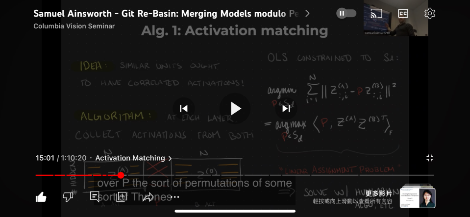
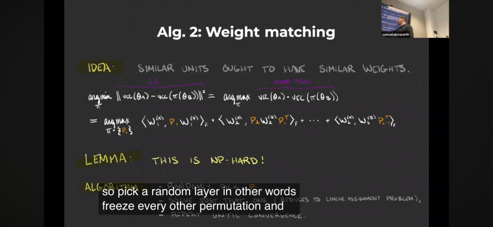
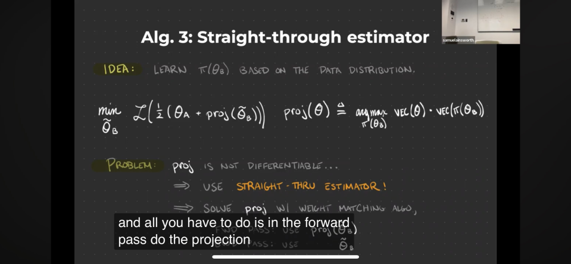
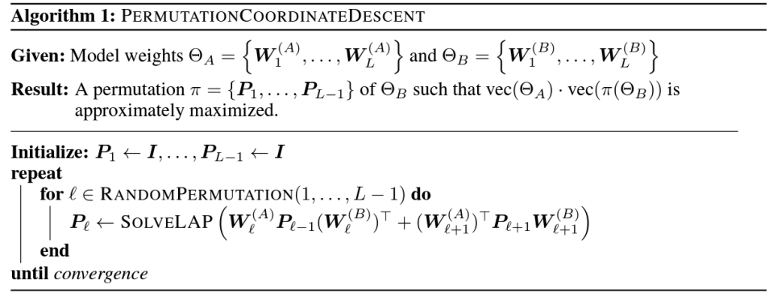
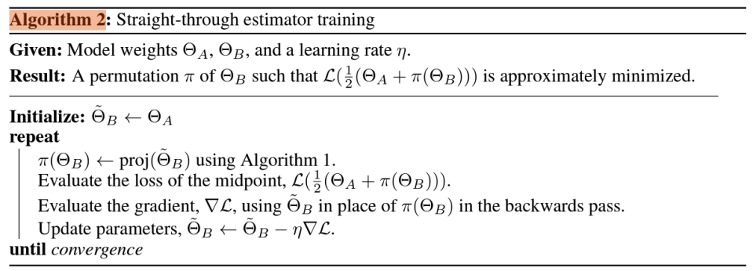
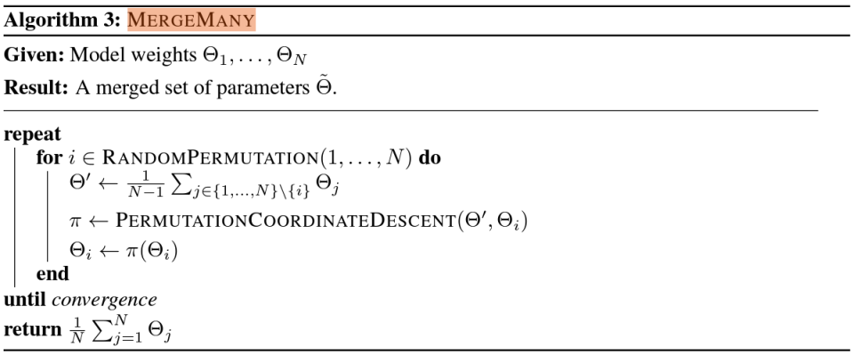

# Findings on "Git Re-Basin" in SD #

*Still in question mark. Is is irrelvant or negligible? Or it does something like what AutoMBW does?*

## Core concept ##

- Making use of "Permutation Symmetry"

    
"Non-convex optimization"

    
(spoiler: It is a ___ algorithm)

- Alg. 1: "Activation Matching"
- Alg. 2: "Weight Matching"
- Alg. 3: "Straight-through estimator"
- Algorithm 1: Find maximized permutation
- Algorithm 2: Minimize Loss in the mid-point of permutation
- Algorithm 3: "Take average" if there are many models

## Useful links ##

- Official paper: [arxiv](https://arxiv.org/abs/2209.04836)
- Official seminar: [youtube](https://www.youtube.com/watch?v=ffZFrvuxjc8&ab_channel=ColumbiaVisionSeminar) *Not easy to search*
- `zh` [Translated article.](https://cloud.tencent.com/developer/article/2106636)

## Known integration to SD ##

- [Merge-Stable-Diffusion-models-without-distortion](https://github.com/ogkalu2/Merge-Stable-Diffusion-models-without-distortion/issues)
- [sd-webui-model-mixer](https://github.com/wkpark/sd-webui-model-mixer)
- [re-basin_merger](https://github.com/T0b1maru/re-basin_merger)
- [meh](https://github.com/s1dlx/meh)

## Notes on the seminar ##

- 18:20: author does mentioning "finetuning Stable Diffusion".
- 19:30: He don't know if applying rebasin on "SD layers" works
- 20:45: If the model weights contradict each other, rebasin won't help

## Article to track history of implementation ##

- [This github issue](https://github.com/vladmandic/automatic/issues/1176)

## Important findings ##

- [Implementation](https://github.com/s1dlx/meh/blob/sdxl/sd_meh/rebasin.py) in `meh` is from the [implementation](https://github.com/ogkalu2/Merge-Stable-Diffusion-models-without-distortion/blob/main/SD_rebasin_merge.py) in `Merge-Stable-Diffusion-models-without-distortion`, which is claimed referencing the [official codebase](https://github.com/samuela/git-re-basin/tree/main).

- However, from a [training script](https://github.com/samuela/git-re-basin/blob/main/src/cifar100_resnet20_train.py), there is clearly a `batch_eval` session, and `dataset_loss_and_accuracies` will be retrieved, for Algorithm 2. `Merge-Stable-Diffusion-models-without-distortion` **doesn't ever include such algorithm.** It just `apply_permutation` with "Weighted sum" calculated from `special_keys`, which is **6 layers only**. *Note: not related to MBW.* Therefore, **it is just the implementation of Algorithm 1**, which is sure incomplete and won't have meaningful results.

- Since `accuracies` surely related to score metric (e.g. ImageReward, see [autombw](./autombw.md)), I can assume that it takes quite a bit of iterlations to converge, **and it is a optimization streadgy!** *And I have Bayesian Optimization already. What a pity.*

- The last thing to consider is *"does permutation have some effect instead of other 'merge methods'"*? `git_rebasin` in `meh` is considered a special implementation among [merge_methods](https://github.com/s1dlx/meh/blob/sdxl/sd_meh/merge_methods.py), like the "fancy math trick" other than the OG `weighted_sum` and `add_difference`. In [autombw](./autombw.md), "linear interpolation" (`torch.lerp`) has been used, and it is quite *efficient*, because it is using torch API, meanwhile most implementation use **operators** which is considered slow. For image quality, no, *it is negligible.*
