# Quick Survey on the rectified flow #

- Originated in [this paper](https://arxiv.org/abs/2209.03003). [Codebase](https://github.com/gnobitab/RectifiedFlow/blob/main/ImageGeneration/sampling.py#L68) shows that it expects plain Euler sampler only. It also expects [flow matching](./flowmatching.md) and [v-prediction](./vpred.md). This will be discussed again in below.

- [Interactive article explaining the theory and comparasions.](https://diffusionflow.github.io/)

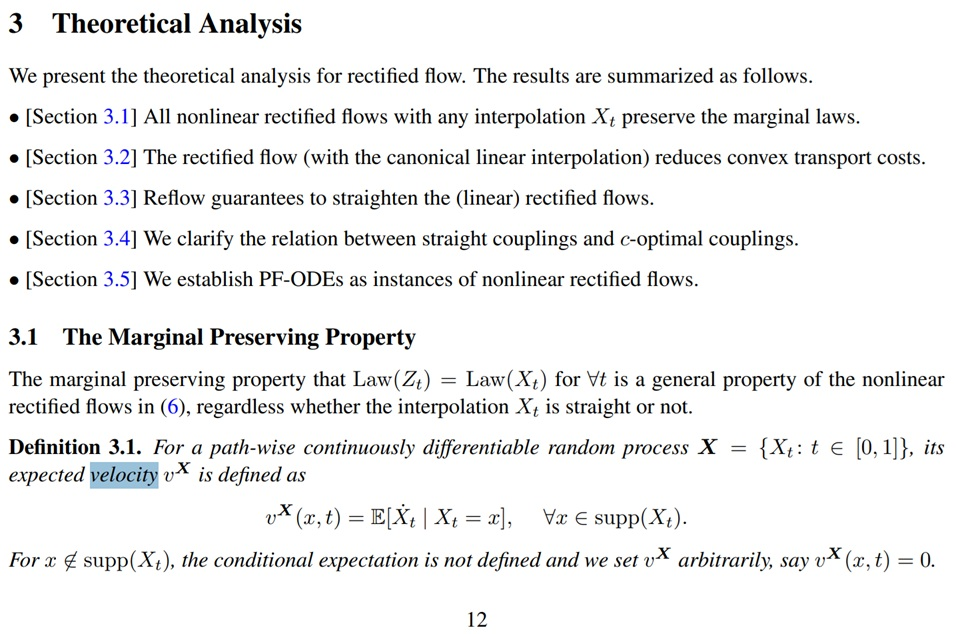

- Featured and cited in [SD3](https://arxiv.org/abs/2403.03206). [SD3 used many new theories, not just RF.](https://github.com/mini-sora/minisora/blob/main/notes/SD3_zh-CN.md)

- In contrast, original SD use *probability flow*. 

- [A1111](https://github.com/AUTOMATIC1111/stable-diffusion-webui/pull/16030) supports SD3 out of the box. From the [issue](https://github.com/AUTOMATIC1111/stable-diffusion-webui/issues/16378) regarding flux support, sampler should be limited to [Euler](./k_euler.md) only. Besides A1111, ComfyUI and [ReForge](https://github.com/Panchovix/stable-diffusion-webui-reForge) should support Flux out of the box, implies to Rectified Flow also. See [flow matching](./flowmatching.md#training--inference-with-sdxl-models) for details.

> (RD LoRA) Sampling method: Euler, DPM

> (NAI-RF) Sampler: Euler, Euler CFG++ DO NOT USE ANCESTRAL SAMPLERS!

- For trainer support, there is no direct indication, but from [this PR](https://github.com/kohya-ss/sd-scripts/pull/2037), it is probably supported as part of SD3 / Flux? [This fork](https://github.com/bluvoll/sd-scripts) has mentioned rectified flow also.

- [Rectified Diffusion](https://arxiv.org/abs/2410.07303) has been proposed afterward, [codebase](https://github.com/G-U-N/Rectified-Diffusion) and [kohyas based training script](https://github.com/RimoChan/NoobAIXL-Rectified) are developed and yielding a [LoRA](https://civitai.com/models/1355945) suppressing the oridinary timestep distillation training.

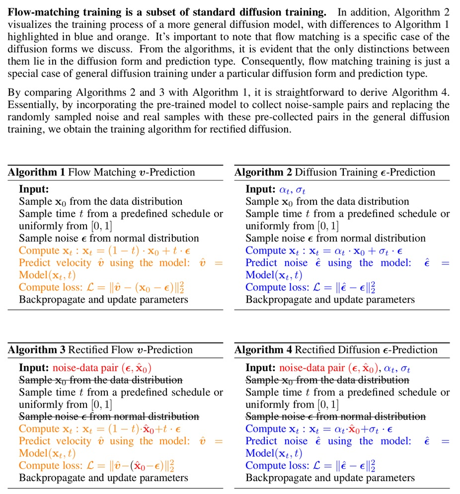

- This raise a question: Does the objective / direction aligned across the *Rectification* approach?

> (SD3) Compared to diffusion models, they can result in ODEs that are faster to simulate than the probability flow ODE associated with diffusion models. Nevertheless, they do not result in optimal transport solutions, and multiple works aim to minimize the trajectory curvature further.

> (RD) Comprehensive comparisons on rectification, distillation and phased OED segmentation demonstrate our method achieves superior trade-off between generation quality and training efficiency over rectified flow-based models.

> (RD LoRA) *Sampling steps: 4. CFG scale: 1~1.5.*

> (NAI-RF) Rectified Flow is indeed the next step in SDXL's improvement efforts... *Steps: 20-28*

- From SD3 paper, it has perfomed some basic comparasion across `eps/linear`, `v/linear`, and `rf/lognorm(0,1)`.

> Rectified flow formulations generally perform well and, compared to other formulations, their performance degrades less when reducing the number of sampling steps.

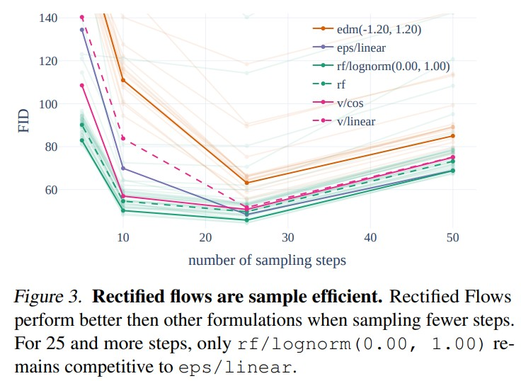

- Meanwhile, there is no direct indication that *inference code must be adapted when the training timestep distribution has been changed.*

- See [my further study](../ch06/sd-scripts-runtime/readme.md#260125-code-review-before-training) on additional algorithms used by SD3 / Flux, without switching models. [This blog](https://zhouyifan.net/2024/09/03/20240809-flux1/) and [this article](https://github.com/mini-sora/minisora/blob/main/notes/SD3_zh-CN.md) will be very useful to understand addtional concepts. I'll keep this article RF exclusive.

### Examples of SDXL Rectified flow ### 

- [Experimental NoobAI with Rectified Flow + EQ-VAE](https://civitai.com/models/2071356/experimental-noobai-with-rectified-flow-eq-vae?modelVersionId=2343811) by the author of the trainer fork.

- [CabalResearch/NoobAI-RectifiedFlow-Experimental](https://huggingface.co/CabalResearch/NoobAI-RectifiedFlow-Experimental) by the... *same author*?

- [WAI-illustrious-Rectified-4Steps](https://civitai.com/models/1355945). Note: *Rectified Diffusion*.

- [Wahtastic_FLOW_V10](https://huggingface.co/VelvetToroyashi/WahtasticMerge/blob/main/Wahtastic_FLOW_V10.safetensors) from [VelvetToroyashi/WahtasticMerge](https://huggingface.co/VelvetToroyashi/WahtasticMerge).

### Examples of non-sdxl Rectified flow ### 

- ["GRINP"](https://huggingface.co/yoinked/wan-22-experiments/blob/main/not-wan/GRINP.comfy.2.safetensors) *Added by request, unknown arch*

### Extra: EQ-VAE ###

- Written to have any chance to run the bundled "NAI-RF" model.

- Origin of EQ-VAE: [arxiv paper](https://arxiv.org/abs/2502.09509), [EQ-SDXL-VAE](https://huggingface.co/KBlueLeaf/EQ-SDXL-VAE).

> This model is heavily finetuned from SDXL-VAE and introduce a totally new latent space. YOU CAN'T USE THIS ON YOUR SDXL MODEL.

- ["EQB7" VAE](https://huggingface.co/Anzhc/MS-LC-EQ-D-VR_VAE/blob/main/EQB7.safetensors), bundled [Noobai11EQB7](https://huggingface.co/Anzhc/Noobai11-EQ/blob/main/Noobai11EQB7.safetensors). [CivitAI mirror](https://civitai.com/models/1835161/noob11eps-eq).

- The behaviour matches the model description. Both "oversharpening and ringing" and "blurry" are identified.

> This is a finetuned SDXL VAE, adapted with new regularization, and other techniques. You can use this with your existing SDXL model, but image will be quite artefacting, particularly - oversharpening and ringing. This VAE is supposed to be used for finetune, after that images will become normal. But be aware, compatibility with old VAEs, that are not EQ, will be lost(They will become blurry).

- However, the required *reflection padding* may tolerate *zero padding* as well. [Code reference in A1111.](https://github.com/AUTOMATIC1111/stable-diffusion-webui/blob/master/modules/sd_hijack.py#L318)

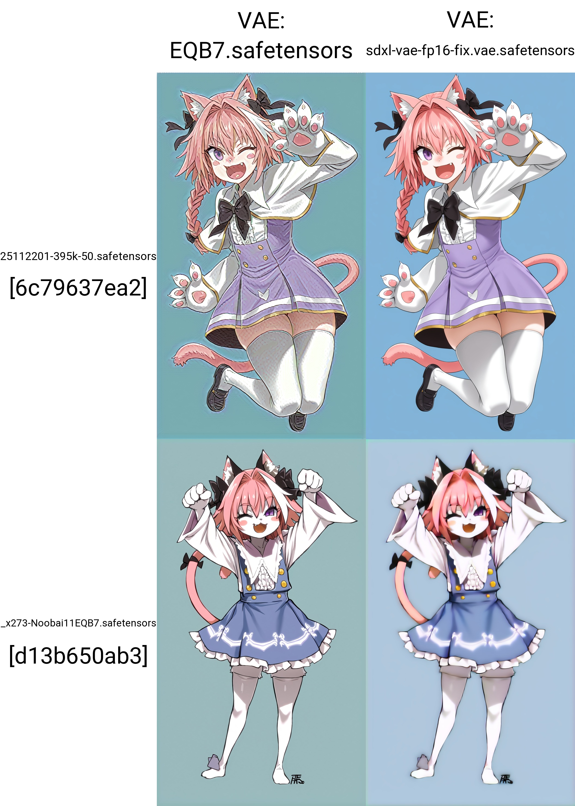

### Image comparasion ###

- 48 steps as usual. The vpred config has applied (so I compared with [AC](../ch05/README_AC.md)).

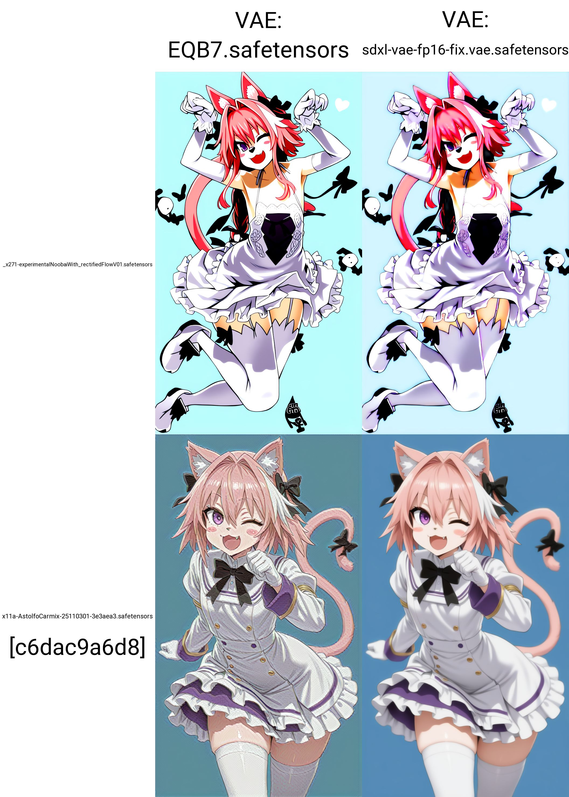

- Lowered to 8 steps. *I believe that A1111 should have some works to do for flow matching, however the VAE / vpred part is solved.*

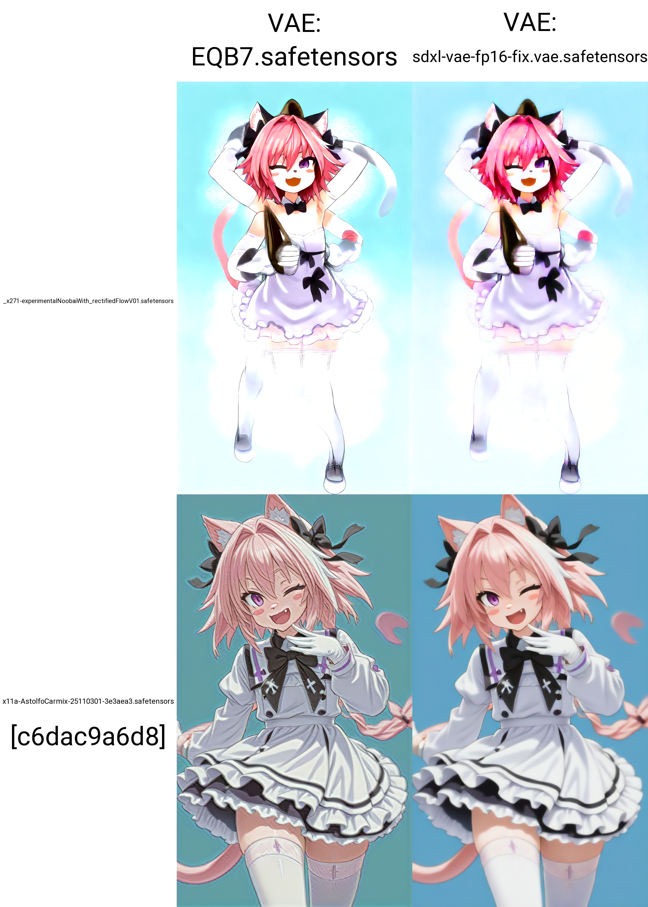

- Joining the original [~~flow matching~~ rf](https://huggingface.co/nyanko7/nyaflow-xl-alpha) model. Notice the difference of sampling steps. *It is hard to imagine the middle model is trained from SDXL 0.9 instead of NoobAI, meanwhile approaches are very different. Model publish time: 2511, 2407, 2510.*

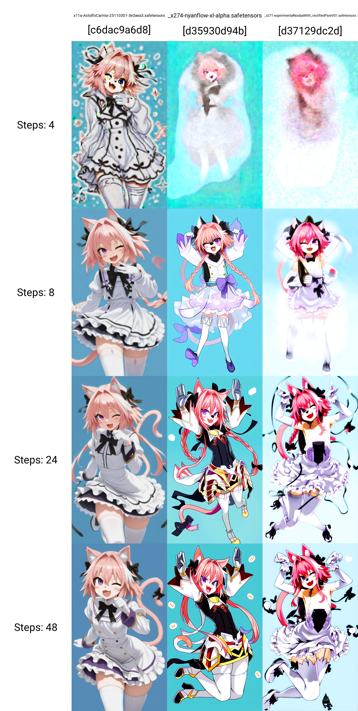

- Switch to short prompt, in 8 steps.

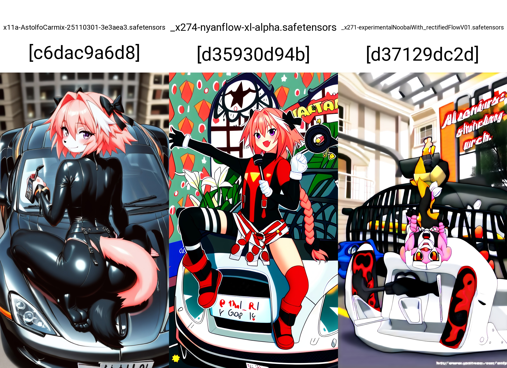

- Further to confirm in ReForge with **Comfy Backend "ldm-patched" and the SD3 sampler (RF with timeshift)**. Corresponding old config is **Discrete sampler with v-prediction and zstnr**. It is very close to A1111 backend (however the yaml approach may be lost).

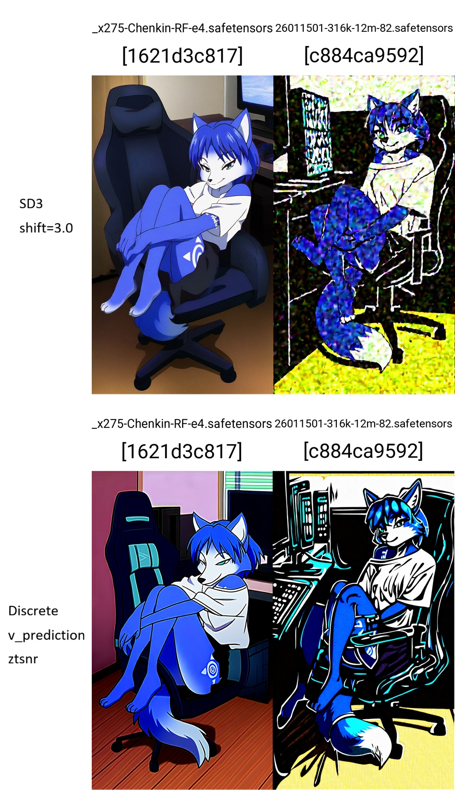

## Extra: Inferencing weakened RF as VPred Models ##

- Since most model weights are content focused instead of objective variable focused, slightly weakening them can predict as images a bit better.

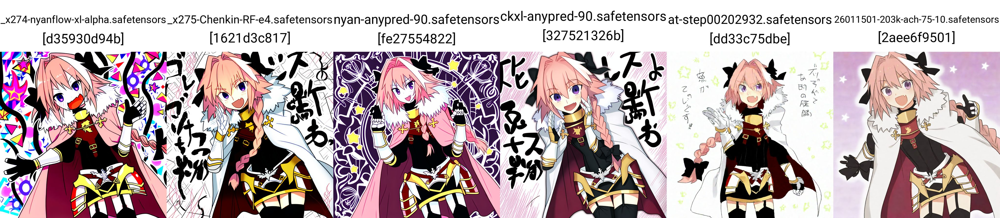

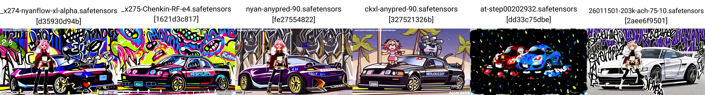

- Although the deepmind article stated that the conversion between DDPM (Euler) and DDIM, the end result shows minor difference only. It may be an issue in inferencing code, or the model (vector field) showing capabilities on multitasking. 

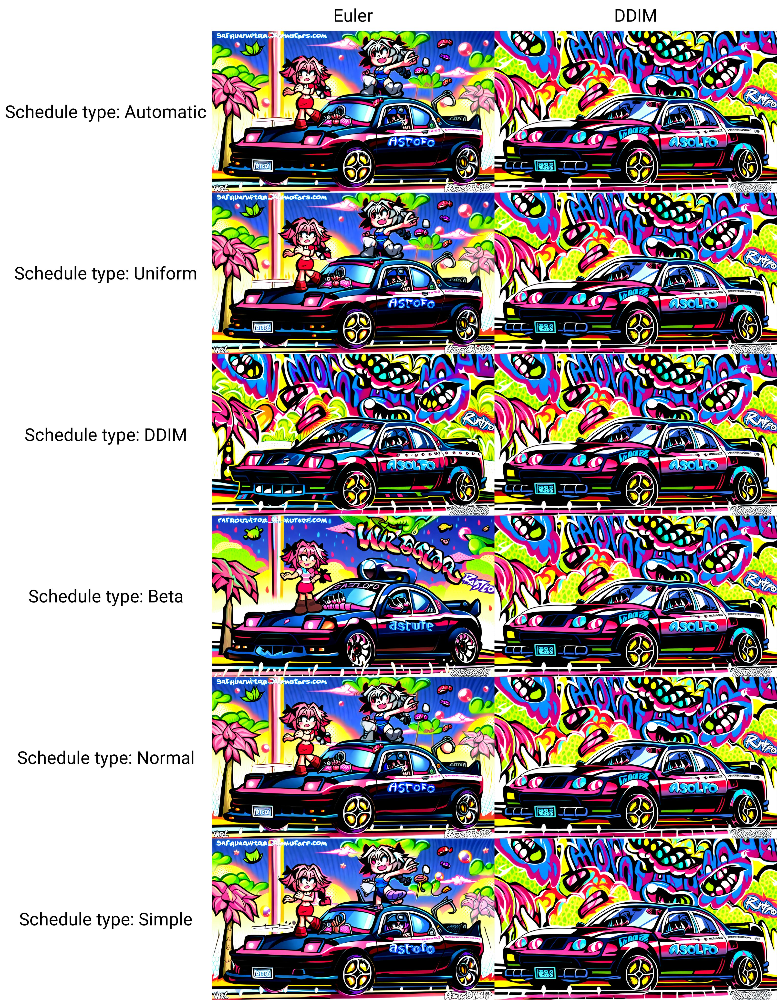

## (260315) Attempt to implement the A1111 inference mechanism in RF ##

- *Still no idea yet.*

- Short article on implementation of [EDM](https://valentinpratz.de/posts/2024-11-15-edm/) and [Trigflow](https://valentinpratz.de/posts/2024-11-14-trigflow/).

`class ModelSamplingSD3:`: [ReForge > Comfy built-in > "ldm_patched"](https://github.com/Panchovix/stable-diffusion-webui-reForge/blob/main/ldm_patched/contrib/nodes_model_advanced.py)

```py
sampling_base = ldm_patched.modules.model_sampling.ModelSamplingDiscreteFlow
sampling_type = ldm_patched.modules.model_sampling.CONST
```

`class FlowMatchingDenoiser`: [advanced model sampling](https://github.com/Panchovix/stable-diffusion-webui-reForge/blob/main/extensions-builtin/reForge-advanced_model_sampling/scripts/advanced_model_sampling_script.py)

`ldm_patched.modules.model_sampling.ModelSamplingDiscreteFlow`: [ReForge > Comfy built-in > "ldm_patched"](
https://github.com/Panchovix/stable-diffusion-webui-reForge/blob/main/ldm_patched/contrib/nodes_model_advanced.py#L130)

`class CompVisVDenoiser(DiscreteVDDPMDenoiser)`: [A1111 > k_diffusion > CompVis](
https://github.com/crowsonkb/k-diffusion/blob/master/k_diffusion/external.py#L170) *SDXL use sgm not ldm*

**sgm follows the VP in EDM framework.** See [EDM paper.](https://arxiv.org/abs/2206.00364). For glossary, *Variance Exploding (VE) vs dVariance Preserving (VP) SDEs.*

```py
# Equation 181, VP preconditioning
c_skip, c_out, c_in, c_noise = self.scaling(sigma)
denoise(network, input, sigma, cond) = network(input * c_in, c_noise, cond) * c_out + input * c_skip
```

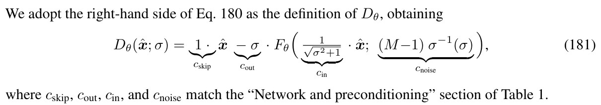

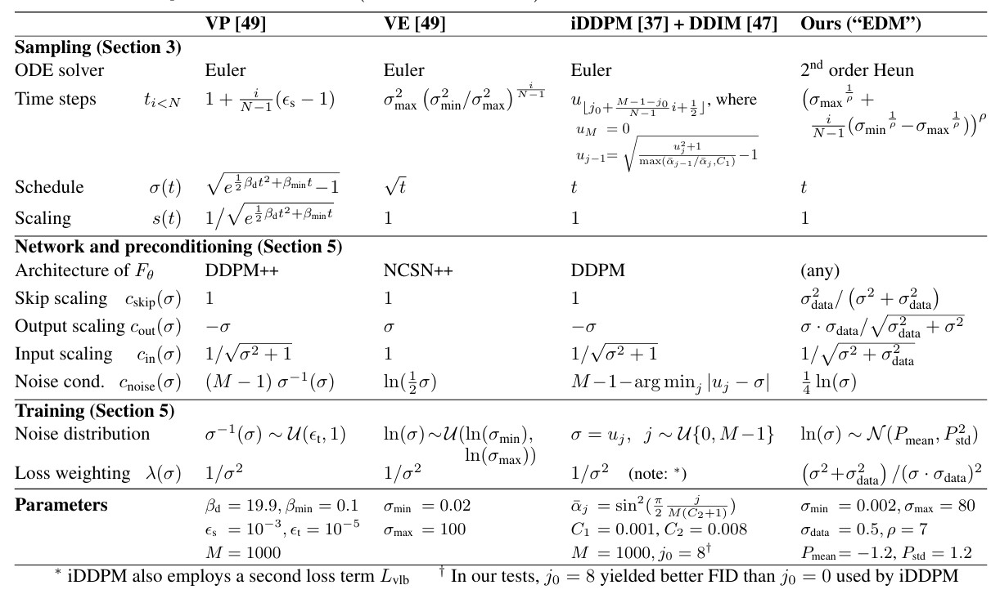

So far only `denoiser_scaling` matters in A1111. `denoiser_weighting` and `discretizer` has no effect.

`class VWeighting(EDMWeighting)`: [sgm](
https://github.com/Stability-AI/generative-models/blob/main/sgm/modules/diffusionmodules/denoiser_weighting.py#L17) 

`EDMWeighting` is plausible although there is no effect.

> The Stable Diffusion 3 weighting, a reweighted version of flow matching, is very similar to the EDM weighting 
 that is popular for diffusion models.

`class VScaling`: [sgm](
https://github.com/Stability-AI/generative-models/blob/main/sgm/modules/diffusionmodules/denoiser_scaling.py#L40) 

`class Discretization`: [sgm](
https://github.com/Stability-AI/generative-models/blob/main/sgm/modules/diffusionmodules/discretizer.py#L19C7-L19C51) *Probably the timestep - sigma part to convert*

[Comfy Custom Node using Diff2Flow, works like SD3 sampler.](https://github.com/Koratahiu/ComfyUI-Diff2Flow/blob/main/nodes/nodes_diff2flow.py#L315C70-L315C74)


> tested it with chekin .2 vs checkin rf (latest), nothing special

```py
if self.is_diff2flow:
    base_model = self.model.inner_model
    dm_t = base_model._df_convert_fm_t_to_dm_t(t0)
    sigma_for_callback = base_model.model_sampling.sigma(dm_t)
    denoised_for_preview = y0.unsqueeze(0)
```

`def get_vector_field_from_v(self, v, x_t, t)`: [Diff2Flow](https://github.com/CompVis/diff2flow/blob/main/diff2flow/flow_obj.py#L156)

[The A1111 SD3 PR.](https://github.com/AUTOMATIC1111/stable-diffusion-webui/pull/16030) *Obviously doesn't help.*

[Less satisfiable article](https://zhuanlan.zhihu.com/p/4116861550), [ASP2.5, bloated article with its own trainer](https://www.reddit.com/r/StableDiffusion/comments/1moh8ed/sd_15_with_flowmatch_released/)

### Not exactly flow matching but diffusion may be a kind of RF via DTMC ###

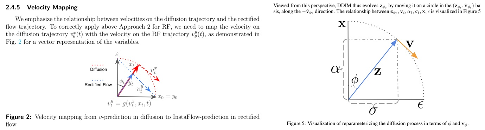

- [This hand book](https://arxiv.org/abs/2412.17162) matches well with the [original vpred paper](https://arxiv.org/abs/2202.00512), which has mentioned "probability flow ODE" also. The idea is similar to [Trigflow](https://arxiv.org/abs/2410.11081v1)

- Meanwhile, althgouh not being a T2I task, [this paper](https://arxiv.org/abs/2410.20587) has even try to bridge the concept between flow matching and diffusion models. *Warning: Many math.*

- Sadly, it still doesn't solve my [attempt to bridge the codes in SD eco-system](#260315-attempt-to-implement-the-a1111-inference-mechanism-in-rf). The official code was written in [EDM parameterization](https://arxiv.org/abs/2206.00364) which requires more math.

> EDM. The noising process simply sets αt = 1 and σt = t...

> Flow Matching. The noising process uses differentiable coefficients αt and σt, with time derivatives denoted by α′ t and σ′ t (typically, αt = 1 − t and σt = t).

> TrigFlow is a special case of flow matching (also known as stochastic interpolants or rectified flows) and v-prediction parameterization.

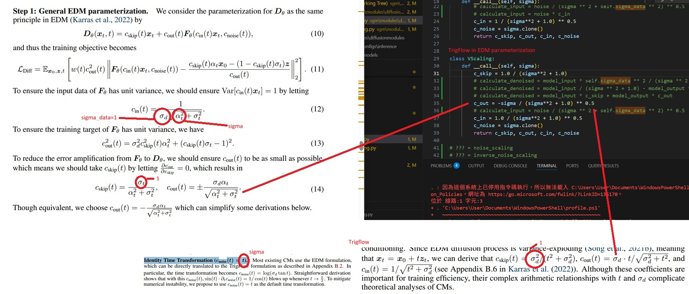

- Same author as [SiD-DiT](https://github.com/apple/ml-sid-dit?tab=readme-ov-file), [paper](https://arxiv.org/abs/2509.25127v1)