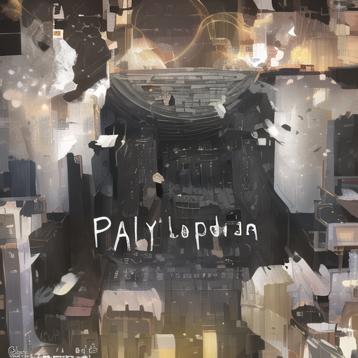

# "Similarity" based on CFG 1.0 #

- Assumed you're read [the thesis](https://arxiv.org/abs/2207.12598).

- [A similarity](https://huggingface.co/JosephusCheung/ASimilarityCalculatior) based from [Cosine similarity](https://en.wikipedia.org/wiki/Cosine_similarity) from the output of random blocks are funny. It can only shows that if the finetuned model is "well done" or "raw".

- Just [directly compare the images](https://towardsdatascience.com/image-similarity-with-deep-learning-c17d83068f59) based from a **common input with certain output**.

- "CFG 1 = No CFG". Look for math derive [CN](https://kexue.fm/archives/9257/comment-page-1) [EN](https://benanne.github.io/2022/05/26/guidance.html). Minimal prompts = greatest degree on "viewing the prior implemented on the model". Aka "what the AI have been trained".

- Now here is the **ground truth from the famous model**:

```
parameters
Negative prompt: (bad:0), (comic:0), (cropped:0), (error:0), (extra:0), (low:0), (lowres:0), (speech:0), (worst:0)
Steps: 256, Sampler: Euler, CFG scale: 1, Seed: 1337, Size: 512x512, Model hash: 925997e9, Clip skip: 2
```



- Then here are the results, **including the prototypes**:


- Note that models based from SD2.x are omitted. [Example](https://huggingface.co/JosephusCheung/RuminationDiffusion). Train a model from [AI generated images](https://www.pixiv.help/hc/en-us/articles/11866167926809-What-are-display-settings-for-AI-generated-work-) are completely in grey area and nothing can be proven formally.

- No conclusion is derived ~~(cannot be derived actually?)~~ because I am not intereseted on it. [Focus on real artist instead.](https://arxiv.org/abs/2212.03860).
Given a score metric, what will be the threshold value to accuse? There is no [DAC control](https://en.wikipedia.org/wiki/Discretionary_access_control) for an AI model. Just move on.
