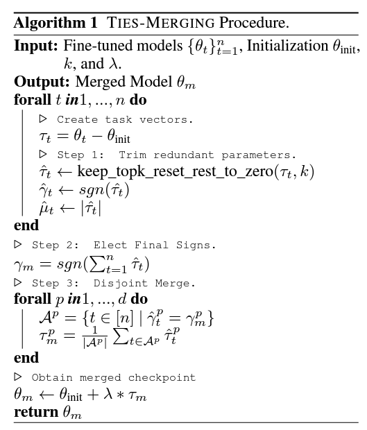
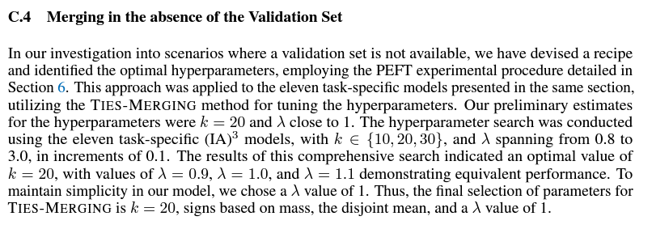
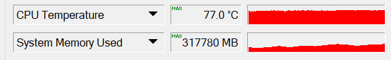

# Findings on "TIES Merge" in SD #

Paper: [TIES-Merging: Resolving Interference When Merging Models](https://arxiv.org/abs/2306.01708)

- [Merger code](https://github.com/ljleb/sd-mecha/blob/main/sd_mecha/__init__.py#L139-L167) is directly referring to the Algorithm session in the paper. *I don't validate line by line yet, but from end result, it should be valid.*

- *Since picking hyperparameter is tedious*, which is NP-Hard with weeks per trial, I naively set $\lambda=1.0$ and $k=100$ which is between paper and my experiance.

- Notice that **MEMORY USAGE is huge!**. Seems that model soup (averaging) is $O(1)$ meanwhile TIES is close to $O(N)$ in space complexity.

- From the dev of the merger, using CPU won't be too slow, and... it merges faster then GPU. WS OP.

- Will be continued in ["AstolfoMix-XL TIES"](../ch05/README_XL.MD)
