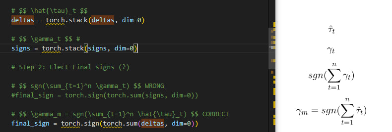
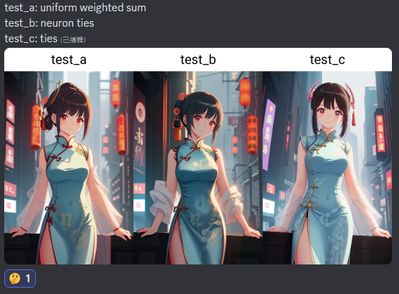
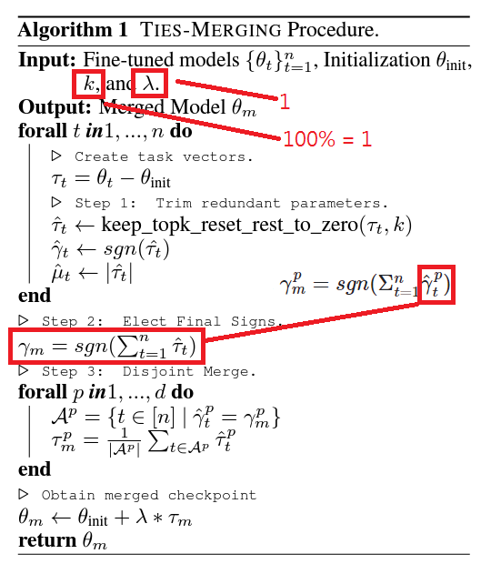
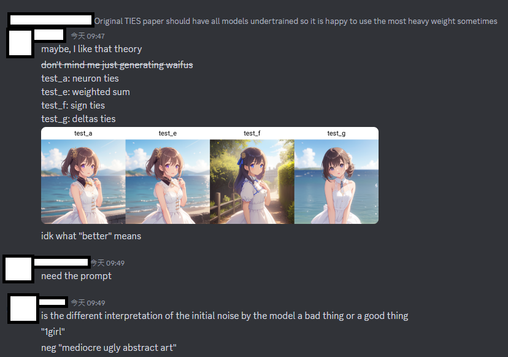
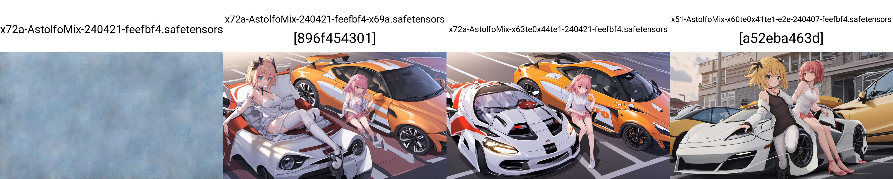

# Findings on "TIES Merge" in SD #

Paper: [TIES-Merging: Resolving Interference When Merging Models](https://arxiv.org/abs/2306.01708)

- [Merger code](https://github.com/ljleb/sd-mecha/blob/main/sd_mecha/__init__.py#L139-L167) is directly referring to the Algorithm session in the paper. **This algo expression is not even matched with the verbose session below!** See bottom for my own PoC.


- *Since picking hyperparameter is tedious*, which is NP-Hard with weeks per trial, I naively set $\lambda=1.0$ and $k=100$ which is between paper and my experiance.


- Notice that **MEMORY USAGE is huge!**. Model soup (averaging) is $O(1)$ meanwhile TIES is $O(N)$ in space complexity.


- From the dev of the merger, using CPU won't be too slow, and... it merges faster then GPU. WS OP.

- Will be continued in ["AstolfoMix-XL TIES"](../ch05/README_XL.MD)

## Spinoff: TIES-SOUP ##

- *By accident.* ~~There are neuron-ties proposed by ljleb but it is in discusssion so I'll wait for publishing.~~



- Originally model weight is contriuted in electing sign. However, we have found that **ignoring the magnitude** will yield a smoother weight transition.

- It will have less impact, but lower risk to have the model toasted. See [ch05](../ch05/README_XL.MD#ties-challenge-hyperparameter-tuning) for details.



- With some [math deriviation](https://www.quora.com/What-is-the-meaning-of-derivation-in-mathematics-What-are-its-types-and-examples-to-understand-it-better), **I have found that it can be an extended version of averaging** like [Fisher-Weighted Averaging](https://arxiv.org/abs/2111.09832), but without evaluation of the models ~~I cannot intercept the runtime.~~

### Math discussion ###

~~Looks like I don't have to write the formulas again?~~ I did it eventually.



- Switching from "sum of weights" to "sum of signs", it will be interprepted as "voting of signs". $\gamma_m^p = sgn(\Sigma_{t=1}^n \hat{\gamma}_t^p)$

- Then **with special hyperparameters** $k=100%$, all model parameters will be considered, and elect for the majority signs.

- Merged weight $\tau_m$ will be the **average of elected weights with the same sign.**

- Then **with special hyperparameters again** $\lambda=1.0$, **we have added back what we have subtracted.** $\tau_t$ and $\tau_m$ are **in the same scale.**

- Since $\tau_t$ is **forced to be in scale with** $\theta_{averaging}-\theta_{init}$, now $\tau_m$ is also at the same scale i.e. **It will behaves like averaging** (and it is)



- It is still a bit buggy under minor prompts (bias from models are inherited), *it can be resolved by performing the model filtering again.* Currently swapping ViT-G (only) will break, but swapping ViT-L or both of them will be fine.

- Grid: TIES-SOUP, TIES-SOUP with "averaged CLIP", TIES-SOUP with "averaged CLIP of filtered models", Averaging under filtered models



## Sample code (TIES) ##

- [PR has been merged!](https://github.com/ljleb/sd-mecha/pull/24)

- Kept the sample code here because the code below has been split already. 

### add_difference_ties ###
- `base`: $\theta_{init}$
- `*models`: $\{\theta_{init}\}_{t=1}^n$
- `models` after `subtract`: $\tau_t$
- `alpha`: $\lambda$
- `k`: $k$ ( From $\%$ to $1$ )
- `res`: $\lambda * \tau_m$
- `return`: $\theta_m$
### ties_sum ###
- `delta`: $\hat{\tau}_t$
- `signs`: $\gamma_t$
- `final_sign`: $\gamma_m^p = sgn(\Sigma_{t=1}^n \hat{\tau}_t^p)$
- `delta_filters`: $\{ \gamma_t^p = \gamma_m^p \}$
- `param_counts`: $|A^p|$
- `filtered_delta`: $\sum_{t\in{A^p}} \hat{\tau}_t^p$
- `return`: $\lambda * \tau_m$

```py

import torch

_alpha = 0.33
_k = 0.5
# Sudoku of 4x4, "top k" should be 2.
_models = [
    torch.tensor([    
        [-1.,2.,3.,4.],
        [4.,-3.,2.,1.],
        [3.,4.,1.,-2.],
        [2.,1.,-4.,3.],
    ]),
    torch.tensor([        
        [3.,4.,1.,-2.],
        [2.,1.,-4.,3.],
        [-1.,2.,3.,4.],
        [4.,-3.,2.,1.],
    ])
]

def ties_sum(  
    *models: torch.tensor,
    alpha: float,
    k: float = 0.2,
) -> torch.tensor:

    # Step 1: Trim redundant parameters

    # $$ \hat{\tau}_t $$ O(N) in space
    deltas = [filter_top_k(m, k) for m in models]
    deltas = torch.stack(deltas, dim=0)

    # $$ \gamma_t $$ 
    signs = torch.sign(deltas)

    # $$ \gamma_m^p = sgn(\Sigma_{t=1}^n \hat{\tau}_t^p) $$
    final_sign = torch.sign(torch.sum(deltas,dim=0)) 

    # Step 3: Disjoint merge.

    # $$ \{ \gamma_t^p = \gamma_m^p \} $$
    delta_filters = (signs == final_sign).float()

    # $$ |A^p| $$
    param_counts = torch.sum(delta_filters, dim=0)

    # $$ \sum_{t\in{A^P}} \hat{\tau}_t^p $$
    filtered_delta = (deltas * delta_filters).sum(dim=0)

    # $$ \lambda * \tau_m $$
    tau_m = alpha * torch.nan_to_num(filtered_delta / param_counts)

    res = {
        'deltas': deltas,
        'signs': signs,
        'final_sign': final_sign,
        'delta_filters': delta_filters,
        'param_counts': param_counts,
        'filtered_delta': filtered_delta,
        'tau_m': tau_m
    }
    for rk, rv in res.items():
        print(rk)
        print(rv)

    return tau_m

def filter_top_k(a: torch.Tensor, k: float):
    k = max(int((1 - k) * torch.numel(a)), 1)
    k_value, _ = torch.kthvalue(torch.abs(a.flatten()).float(), k)
    top_k_filter = (torch.abs(a) >= k_value).float()
    return a * top_k_filter


ties_sum(*_models, alpha = _alpha, k =_k)
```
