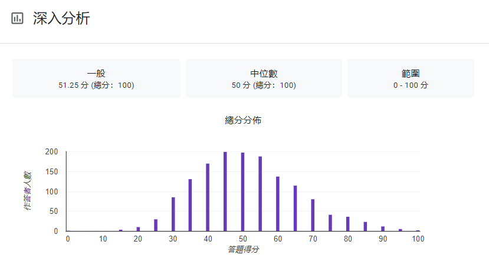
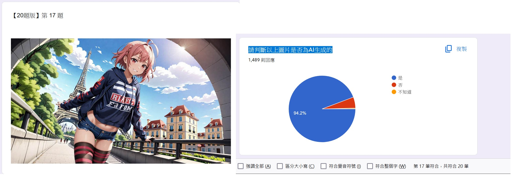
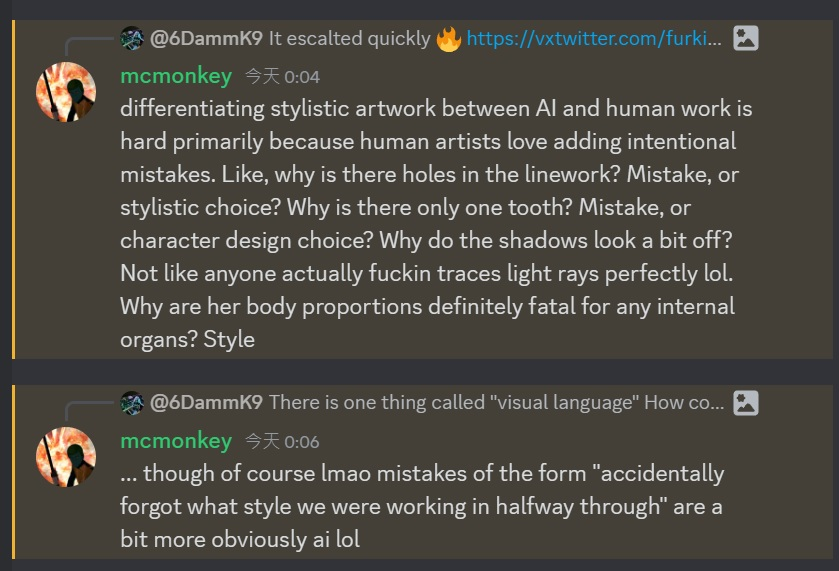
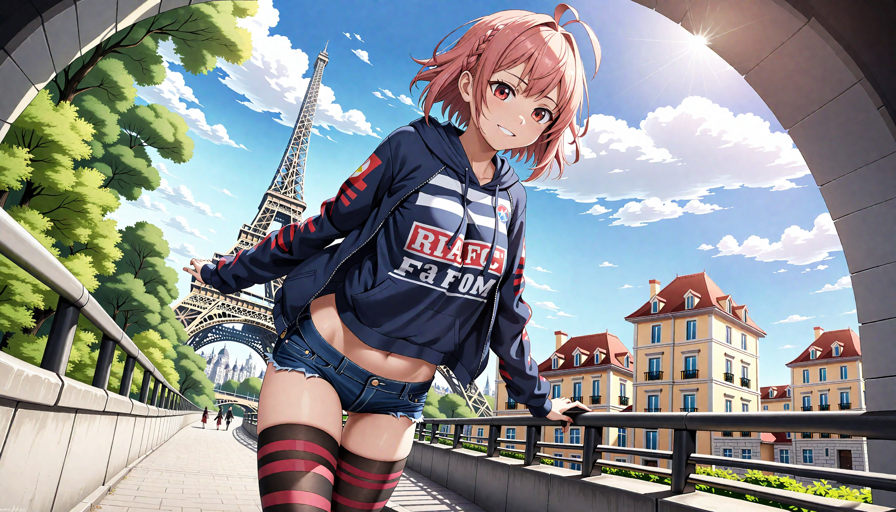

# Notes on "AI Art Turing Test on 241115" #

- The test is as simple as [Binary classification](https://en.wikipedia.org/wiki/Binary_classification), meanwhile there is lack of *objective* guidelines on how to determine the result, therefore I think it is more like a [psychological test](https://en.wikipedia.org/wiki/Psychological_testing), which "symbols" are not that important, even I can read them ~~很明顯吧~~.

- [The thread of this test in Discord.](https://discord.com/channels/1027129024054575174/1305362631409926144) [Server: 場外AI繪圖討論區](https://discord.gg/FdvjW3jy) 

- *Turing test is dead.*

## Title: AI圖靈測試 ##

*20Q are the first 20Q of the 30Q, and so on. All 100Q are just shuffled from dataset. The dataset is 50% AI and 50% human, all with reference.*

- [20Q](https://forms.gle/2iTfiaCcwSSXWs6j8)
- [30Q](https://forms.gle/hzXRtphBZSoDcQcG9)
- [50Q](https://forms.gle/cp1EprygC6mKWrzq7)
- [100Q](https://forms.gle/AYR2JiyJuxviebTp7)

## How to view analytics ##

- Load the link. Replace `viewform` to `viewanalytics`. Use Ctrl+F to search the "vote" of the poll *in sequence*, since all questions and choices are identical. 

### Full response (public view) ###

*Raw dataset need basic DS / ML operation to obtain accurate analytics.*

- [20Q](https://docs.google.com/spreadsheets/d/1wW4e4eskJNQaL_HmkBIM1yPpIzGOrFC7MGcDZmnruQY/edit?usp=sharing)
- [30Q](https://docs.google.com/spreadsheets/d/1QgMRNW6ytQ91SNDuGuEF4P39JVRwMisca584Wv8HB-o/edit?usp=sharing)
- [50Q](https://docs.google.com/spreadsheets/d/1fGnuXlztDtdIiBbvqUn29T3flBG-kIqQ-LdKMSaMcHE/edit?usp=sharing)
- [100Q](https://docs.google.com/spreadsheets/d/1LPfiOEMtiyB8pIZ9Pm-_Jgja7htJslsiNgk9AImgSzM/edit?usp=sharing)

## Normal findings ##

- From received 1500 responds for 20Q (241118, around 3.5 days), a close to perfect [binomial distribution](https://en.wikipedia.org/wiki/Binomial_distribution) is observed. Meanwhile, **mean score is close to 50/100**. [Would it lead to some insights?](https://www.investopedia.com/terms/b/binomialdistribution.asp) [Would a confusion matrix helpful to observe more things out of a pair of variables (precepted as "AI" vs really "AI") tends to be independent?](https://www.ibm.com/topics/confusion-matrix) Such task (classification) has been discussed for more than a year, *the performance* is still close to random guess, especially when presented new art forms such as [simple lineart](https://x.com/furkiwi/status/1856654658540097868).

 

## Strange findings ## 

- *The result above is natural with low amont of internet trolls or cheaters.* If the choices are made by pure random, all questions should have 50% vote, especially the dataset class split is also 50:50.

- However, [my image](https://www.pixiv.net/en/artworks/124431314) (generated from ["215a"](../ch01/della.md#spinoff-dgmla)) got a whopping **94% vote** on "is AI" choice, which is the highest on all 20Q to 100Q question set.

 

- Would it be a mix of [visual language](https://en.wikipedia.org/wiki/Visual_language) and [art appreciation](https://human.libretexts.org/Bookshelves/Art/A_World_Perspective_of_Art_Appreciation_(Gustlin_and_Gustlin)/01%3A_A_World_Perspective_of_Art_Appreciation/1.01%3A_What_Is_Art_Appreciation)? Is there many votes are comes from [reasonable doubt](https://en.wikipedia.org/wiki/Reasonable_doubt) of the opposite side, when they are not as obvious as mine, even my image has a new "art style" comparing with seen works? *That will be a nice study topic, besides of a great drama within community.*

 



```
parameters

[[striped thighhighs]], [[midriff]], [[striped shirt]], [[hoodie]], [[braid]], [astolfo], [[[[eiffel tower, france]]]]
Steps: 48, Sampler: DDIM CFG++, Schedule type: Automatic, CFG scale: 6, Seed: 431047914, Size: 1344x768, Model hash: bdb9f136b6, Model: x215a-AstolfoMix-24101101-6e545a3, VAE hash: 235745af8d, VAE: sdxl-vae-fp16-fix.vae.safetensors, Denoising strength: 0.7, Clip skip: 2, Hires upscale: 2, Hires upscaler: Latent, SEG Active: True, SEG Blur Sigma: 11, SEG Start Step: 0, SEG End Step: 2048, PAG Active: True, PAG SANF: True, PAG Scale: 1, PAG Start Step: 0, PAG End Step: 2048, Version: v1.10.1
```