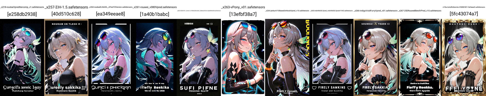

# Quick Survey on the vpred patch (which killed WD1.5 and most SD2.1 models) #

## TLDR ##

- There was an **implementation fault** which was rectified later.

- It is recently introduced to [NoobAI-XL](https://huggingface.co/Laxhar/noobai-XL-Vpred-0.9r/commit/96dc1b7a82474d1b6bfa23725de1540679a9c0df) in 2412, without direct proof.

- Despite current mixed review, it is more like a *parameter / streadgy issue* more than trainer issue.

- Meanwhile, *SD2.1 can works properly and NSFW after the trainer fix.* [Vanilla approach](../ch06) should works.

## History of the issue (chronological order) ##

- vpred was initially applied in [SD2 in 2211](https://huggingface.co/stabilityai/stable-diffusion-2-base/commit/d65c7580f058a24da4fee25ce948c25147d3bd1f). *All SD2 / 2.1 models will have vpred enforced since then, until SDXL.*

- The [Min-SNR paper](https://arxiv.org/abs/2303.09556) was published in 2303, mentioning the "SNR + 1" issue, **without code implementation.**

- vpred was introduced to [kohyas trainer](https://github.com/kohya-ss/sd-scripts/pull/308) in 2304. **The "SNR + 1" part was still missing.**

- Waifu Diffusion 1.5 series was trained at that period, around 2305. [Beta 2](https://cafeai.notion.site/WD-1-5-Beta-2-Release-Notes-2852db5a9cdd456ba52fc5730b91acfd) and [Beta 3](https://saltacc.notion.site/WD-1-5-Beta-3-Release-Notes-1e35a0ed1bb24c5b93ec79c45c217f63) was an epic fail. 

- The precide date can be traced from HF commit log. [Beta2](https://huggingface.co/waifu-diffusion/wd-1-5-beta2/commit/552da11cf44c9d35652e6de9677a90125a3d5226), [Beta3](https://huggingface.co/waifu-diffusion/wd-1-5-beta3/commit/bf201b89c6b477316c04b672604e8c18a37d3d86)

- The "SNR + 1" issue was [spotted in 2307](https://github.com/kohya-ss/sd-scripts/issues/673), [introduced in the paper repo in 2309](https://github.com/TiankaiHang/Min-SNR-Diffusion-Training/commit/46d0f16117529854da1630ccd316da373245cf97), and [the trainer fixed in 2311](https://github.com/kohya-ss/sd-scripts/pull/934/files). At that time, [SDXL was released in 2307](https://huggingface.co/stabilityai/stable-diffusion-xl-base-1.0/commit/f298da3c058bd8f1f1c62f3ecfa775244a243897) and the fix didn't get major attention (SDXL has no vpred).

- Just before the spot of the issue, [most major SD2.1 finetune (Realgar V2)](https://civitai.com/models/70713?modelVersionId=111505) was released / merged and lost most interest.

- Meanwhile, [vpred SD1.5 / SDC model (Fluffusion > Waifusion > Resonance) was trained and rigorously evaluated](https://rentry.org/fluffusion) during 2305 to 2405. [Publication is scarse, limited in a Discord server.](https://discord.gg/6ecrczvP). However [there is a (rare) customized SDC trainer.](https://github.com/Jordach/CascadeTuner)

> (2310) FAQs:
>
> Merging policy?
>
> Merges are fine against Fluffusion R3. Anything else that isn't v-prediction or zeroSNR are very cringe.

- Also, [Pony v5.5](https://civitai.com/models/95367/pony-diffusion-v5), [the one before v6](../ch02/pony_sd.md), was trained and released in 2310, which is probably **NOT** have the trainer fixed either, even having plausible results. *Yet there was close to no attention on SDXL vpred.*

- More trainers were included this fix: [Naifu Diffusion in 2402](https://github.com/Mikubill/naifu/blob/main/modules/scheduler_utils.py), and [Neurosis in 2404](https://github.com/neggles/neurosis/commit/657531c7ab785684d331d1b03a3df406e43dc0c8).

- Then [wdv-tests](https://huggingface.co/waifu-diffusion/wdv-tests/commit/03141d45a2a7b7d0499985663b98b285934cce29) appeared in 2408, *unannounced*.

- Finally [NoobAI-XL Vpred](https://huggingface.co/Laxhar/noob_sdxl_v_pred_test/commit/21586b1289c63a53f33954c9a9f7ab4537478954) was announced in 2410.

## Therefore SD2.1 was an unfortunate. ##

- Community got it wrong, meanwhile it was too late to rectify which SDXL came and put in halt for almost a year.

- However even the trainer / runtime vpred is fixed, **the optimal training streadgy is still missing**. It is still a risky move even the theory sounds good.

## Extra: SDXL vpred in A1111 ##

- [The modified yaml](../ch06/sd-scripts-runtime/sd_xl_base_vpred.yaml)

- [Difference between eps and vpred](https://www.diffchecker.com/c2ekLmwv/). [The YAML referred by A1111.](https://github.com/Stability-AI/generative-models/blob/main/configs/inference/sd_xl_base.yaml) [Class references](https://github.com/Stability-AI/generative-models/blob/main/sgm/modules/diffusionmodules/denoiser_weighting.py)

- Intead of adding `parameterization: "v"`, change from `EpsScaling`, `EpsWeighting` to `VScaling`, `VWeighting`.

- Duplicate and place `*.yaml` besides `*.safetensors`.

- **DO NOT COUNFUSE WITH Flow Matching's v-prediction**. They are different maths.

- **"SDXL VPRED" is incompatable with CosXL.**

### Examples of SDXL VPRED ### 

- Model choices are scarce.

- [Illustrious-v0.1-vpred-test](https://huggingface.co/AngelBottomless/Illustrious-v0.1-vpred-test/blob/main/20250101_convert_H100bs256rate2e_2debiasoffset/20250101_convert_H100bs256rate2e_2debiasoffset-step00056350.safetensors)

- [V-Pony](https://civitai.com/models/684052/v-pony)

- [NoobAI XL (vpred branch)](https://civitai.com/models/833294?modelVersionId=1190596)

- [Rouwei (vpred branch)](https://civitai.com/models/950531?modelVersionId=1882934)

- [MDNT_NAI-XL_vPred](https://civitai.com/models/1209786/mdntnai-xlvpred)

- [JANKUN v1.0](https://civitai.com/models/1365244/jankun-v10-based-on-noob-vpred-10-huge-improvements)

- [ΣΙΗ](https://civitai.com/models/1217645/sih) *Merged model*

- [Noob Vpred itercomp](https://civitai.com/models/980544/noob-vpred-itercomp-merge) *Merged model*

- [2.5D Rouwei Blend v-pred](https://civitai.com/models/1622108/25d-rouwei-blend-v-pred) *Merged model*
 
- [Indigo Void Furry Vpred](https://civitai.com/models/1484845/indigo-void-furry-vpred-furry-noobai-v-pred) *Merged model*

### Examples of CosXL ###

- *cannot output images with my setting.*

- [wdv-tests](https://huggingface.co/waifu-diffusion/wdv-tests)

- [XLOmni-VPred](https://huggingface.co/Clybius/XLOmni-Models/blob/main/XLOmni-VPred_00001_.safetensors) *Merged model*