# Observation of Anima #

*This will cover the basic info, and try to explain the situation on tight prompt syntax because of token misalignment.*

tldr: Place `, @artist` in the front. No `score_9` required. Example in the bottom of the page.

## Basic info and model structure ##

- Official model page: [HuggingFace](https://huggingface.co/circlestone-labs/Anima), [CivitAI](https://civitai.com/models/2458426/anima)

- Model structure:
  - Diffusion Model: **2B DiT** based from [nvidia/Cosmos-Predict2-2B-Text2Image](https://huggingface.co/nvidia/Cosmos-Predict2-2B-Text2Image)
  - Text Encoder: **0.6B (Transformer) Encoder** based from [Qwen/Qwen3-Embedding-0.6B](https://huggingface.co/Qwen/Qwen3-Embedding-0.6B)
  - VAE: VAE stripped from [Qwen/Qwen-Image](https://huggingface.co/Qwen/Qwen-Image)
  - Scheduler: Ordinary RF [Trainer code reference](https://github.com/tdrussell/diffusion-pipe/blob/main/models/cosmos_predict2.py#L353)

> `anima-base-v1.0.safetensors` goes in `ComfyUI/models/diffusion_models`
> `qwen_3_06b_base.safetensors` goes in `ComfyUI/models/text_encoders`
> `qwen_image_vae.safetensors` goes in `ComfyUI/models/vae` (this is the Qwen-Image VAE, you might already have it)

- Trainer script: [tdrussell/diffusion-pipe](https://github.com/tdrussell/diffusion-pipe)

> Note to myself / future readers:
> The timestep sampling, input construction, and loss function have a different formulation here than how Nvidia does it
> in the official code. It wasn't obvious at first, but if you work through the math you will see the this model is just
> a standard rectified flow model, the same as Flux, SD3, Lumina 2, etc.

## Modifications from Nvidia Cosmos Predict 2 ##

In general, anima **changed the Text Encoder and VAE**.

Despite lack of documentation from Cosmos Predict 2, from the diffuser inference code [Cosmos2TextToImagePipeline](https://huggingface.co/docs/diffusers/api/pipelines/cosmos#diffusers.Cosmos2TextToImagePipeline), we can expect the model structure:

- Text Encoder: **T5 XXL** from [google-t5/t5-11b](https://huggingface.co/google-t5/t5-11b).

> Frozen text-encoder. Cosmos uses T5; specifically the t5-11b variant.

- VAE: **Wan2.1 VAE** from [Wan-AI/Wan2.1](https://huggingface.co/Wan-AI/Wan2.1-VACE-1.3B-diffusers) series

- Scheduler: AB2-RF, [code](https://github.com/nvidia-cosmos/cosmos-predict2/blob/main/cosmos_predict2/schedulers/rectified_flow_scheduler.py), derived from [ABM](https://arxiv.org/abs/2503.16522v2)?

> Two step Adams-Bashforth (2-AB) evaluation in Rectified Flow form.

Switching from a T2V VAE into T2I VAE is reasonable (Latent space will require matching the media format).

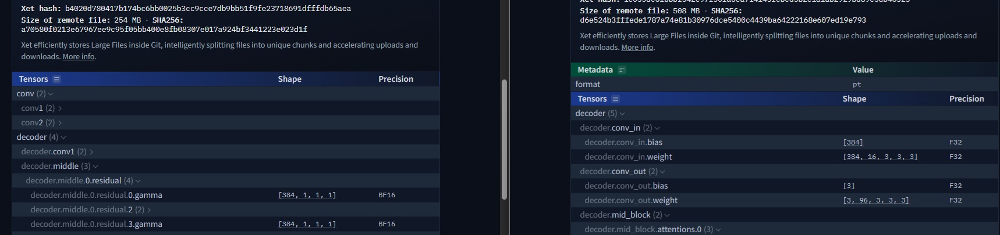

Switching back to oridinary RF is also fine (only minor difference like switching ODE solver).

However **switching the TE from T5 11B into Qwen3 0.6B will be a bold move.** With the [**missing document from nvidia**](https://github.com/nvidia-cosmos/cosmos-predict2), we dive into the diffuser code [Cosmos2TextToImagePipeline](https://huggingface.co/docs/diffusers/api/pipelines/cosmos#diffusers.Cosmos2TextToImagePipeline) and then [CosmosTransformer3DModel](https://huggingface.co/docs/diffusers/v0.38.0/en/api/models/cosmos_transformer3d#diffusers.CosmosTransformer3DModel), we have the `text_embed_dim: int = 1024`, it also matches the (gated) [model config](https://huggingface.co/nvidia/Cosmos-Predict2-2B-Text2Image/blob/main/transformer/config.json):

> Paper (coming soon!)

```json
{
 "_class_name": "CosmosTransformer3DModel",
  "text_embed_dim": 1024
}
```

From the model page in [Qwen/Qwen3-Embedding-0.6B](https://huggingface.co/Qwen/Qwen3-Embedding-0.6B), the vector length / sequence length / embedding dimension is already 1024.

> Embedding Dimension: Up to 1024, supports user-defined output dimensions ranging from 32 to 1024

Then the proposed `llm_adapter` is being wierd. *Why there is such a network?* I assume it has no connection with the [LLM-Adapters](https://arxiv.org/abs/2304.01933) in 2023.

It has a huge `embed` layer, resembles with CLIP.

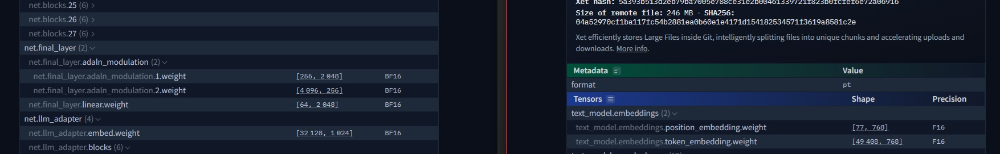

Let's [don't guess the purpose right now](https://discord.com/channels/1289048136815476778/1292341311697063947/1508332583979847762).

> The reason is simple, training running qwen3 0.6B for shuffle, dropout is far cheaper than T5 XXL. There's no other good reason to do that.

Instead, in [Cosmos-Predict2.5](https://github.com/nvidia-cosmos/cosmos-predict2.5), in [the arxiv paper](https://arxiv.org/abs/2511.00062), they concat the embeddings instead.

> For the text encoder, we leverage [Cosmos-Reason1] (NVIDIA, 2025) instead of the T5 encoder used in [CosmosPredict1]. Unlike standard approaches that rely on the output of a single transformer layer, we concatenate activations across multiple blocks for each token and project them into a 1024-dimensional space inspired by Wang et al. (2025).

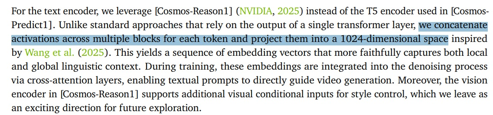

Also, from the [Cosmos-Reason1 paper](https://arxiv.org/abs/2503.15558), **the model alone is a VLM, or ViT**. Picking a non visual based embedding model (i.e. Qwen3-0.6B) will cause serious damage on transferring visual knowledge, which is a type of **token misalignment**.

> For Cosmos-Reason1-7B, we choose Qwen2.5-VL (Bai et al., 2025) as our pre-trained model and follow the same image and video processing. For Cosmos-Reason1-56B, we leverage InternViT-300M-V2.5 (Chen et al., 2024) as our vision encoder and Nemotron-H (NVIDIA, 2025) as our LLM backbone.

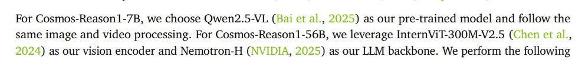

For "token misalignment", here is a [general article](https://medium.com/@velimenetipreethireddy/understanding-nlp-token-classification-4c22a6c9c293) explaining the issue. Such tokenization are not limited from subwords, **it also includes image patches**.

> Label Alignment with Subwords: BERT tokenizer splits words into subwords (e.g., “playing” → “play”, “##ing”). Aligning original labels with these subwords was tricky. The solution was to assign labels only to the first subword and ignore the rest using -100.

Unfourtunately, we have no where to guess why Cosmos2-Predict decided to [crop the T5 into 1024 dim](https://huggingface.co/nvidia/Cosmos-Predict2-2B-Text2Image/blob/main/text_encoder/config.json).

```json
{
  "architectures": [
    "T5EncoderModel"
  ],
  "d_model": 1024
}
```

It has already abondoned without discussion.

> Update Notice
> The latest version of our Cosmos-Predict is now live!
> 👉 Cosmos-Predict2.5
> We recommend all users migrate to the new version for improved performance, features, and continued support.

## How it affect Anima ##

Obviously, the author quickly spot the issue. The LLM adapter seems hijacked some critical model weights which **does unexpected things** other than a LLM adapter, Text Encoder, or diffusion model.

> Don't train the LLM adapter. ... The LLM adapter processes the text embeddings before they get to the diffusion model, and therefore has an outsized influence on the generated images. The adapter itself contains a surprising amount of knowledge and is easy to degrade by training it.

By forcefully learn through token misalignment, **some token sequence is suprisingly stiff to activate, like a triggering word**.

> Artist tags
Prefix artist with @. E.g. "@big chungus". You must put @ in front of the artist. The effect will be very weak if you don't.

As mentioned in [#57](https://huggingface.co/circlestone-labs/Anima/discussions/57#6997ae1d9ab163d4a7a5121e), author may have underestimated the difference between plain tokenization in CLIP era, and a full blown embedding in another latent space, created by a LM Encoder.

> With SDXL, spaces after commas don't matter at all. They tokenize to exactly the same thing. For LLMs, it does matter. You should use the format with spaces after commas.

Switching the TE into a larger LLM (or even the 2B VLM) won't help at all. Example: [Anima 2B - Qwen 3.5 4B Text Encoder](https://civitai.com/models/2455272/anima-2b-qwen-35-4b-text-encoder)

> The trade-off: the larger encoder needs alignment work to "speak the same language" as the diffusion model. We've done that work and ship the alignment files with this release.

When it is officially released to community ~~where people don't read or can't read in average~~, guidelines appears with images, after a bit of struggle. [JP](https://x.com/i/status/2057324039199199352), [EN](https://www.reddit.com/r/StableDiffusion/comments/1tj2rcl/stabilizing_mix_of_artist_tags_in_anima/)

The "stiffness" of such syntax `, @artist` is way beyond expectation (from SDXL which we can prompt whatever we want). For exmple, in this [discord post](https://discord.com/channels/1027129024054575174/1027429244478955530/1507343249151361096), XY plots are generated:

> 第一個全部一起 後面combine跟average "都有加空格"

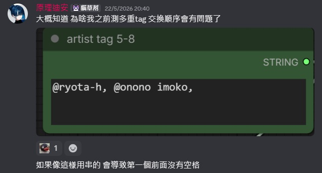

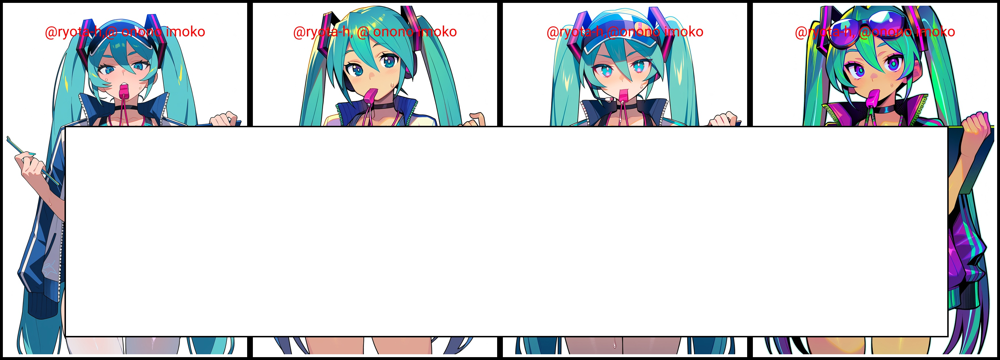

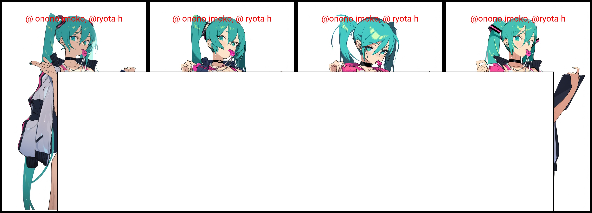

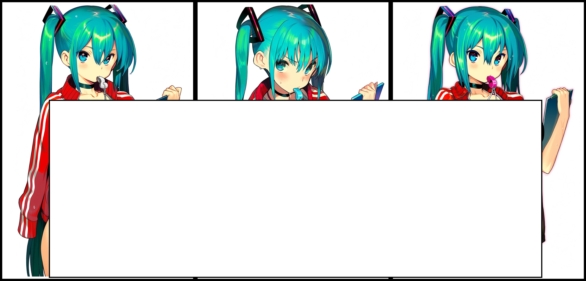

Then in another [discord post](https://discord.com/channels/1077423770106597386/1093732075355525331/1507363878575804416) attempting to train LoRA:

> 煉的話我有試過幾種資料集
> 1. Tag + NL wildcard
> 2. Trigger + NL 洗牌
> 3. Trigger + tag
> 4. NL 洗牌
> 5. trigger + NL tag wildcard
> 6. Tag + NL tag wildcard
> 3 最強，但污染也高（該死的 1girl
> 其次是 1, 然後 5, 6 的 NL 薄弱
> 2, 4 最弱
> 然後 R Lora 走 4...
> 因為下了 tag 後 R 超容易被拉走

And finally verified by me, without following the official prompt syntax:

|Without `, @`|With `, @`|
|---|---|
|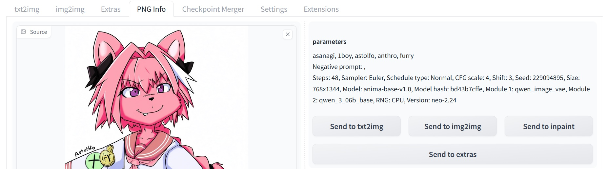|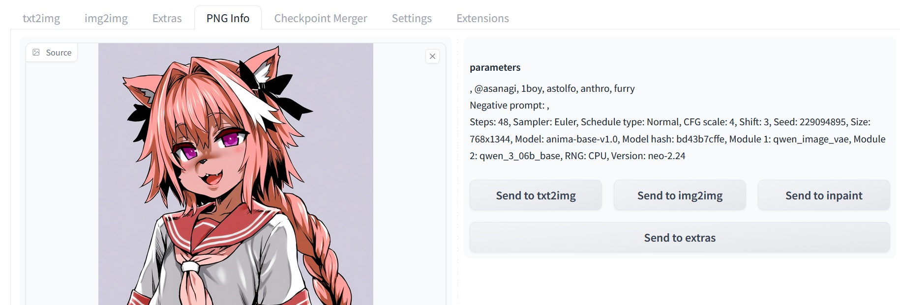|

Even I can inject `score_1` since I'm confident that the poor AI model is just learning bias and variance ~~which "trendy images" concentrates, it is neutral~~:

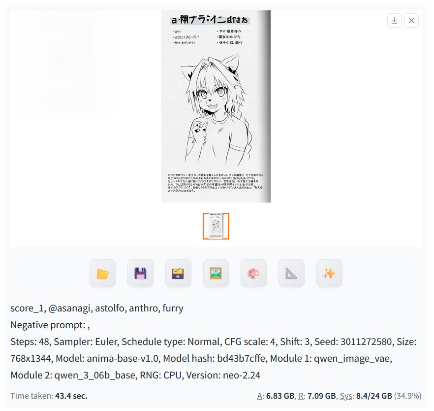
