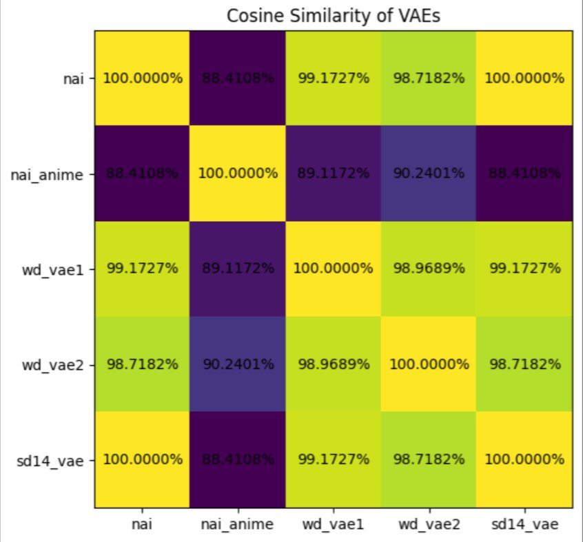

# Animevae.pt #

[Original message link.]*(https://t.me/StableDiffusion_CN/646507)

- Thanks ["AO"](https://github.com/AdjointOperator) for the detective work.

```python
for k in sd14_vae['state_dict'].keys():
    assert torch.eq(nai_vae['state_dict'][k],sd14_vae['state_dict'][k]).all()
```


- More proof on the [model comparasion](../ch03/mega_cmp.ipynb). Exact match confirmed.
- You can accuse people relies on "NAI leak" by mentioning `animevae.pt` (appears in mid Nov - early Dec 2022), but it doesn't proof that a model is really developed from "NAI leak". 
- WD has its own `kl-f8-anime2.ckpt` so if you're so scared from the trouble (medieval time, witch hunt *wink), use theirs. You only have some minor effects (sharpness / contrast) for the final result.