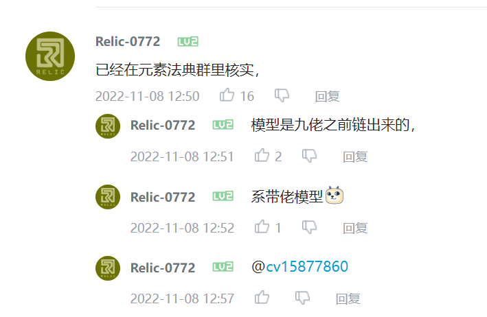
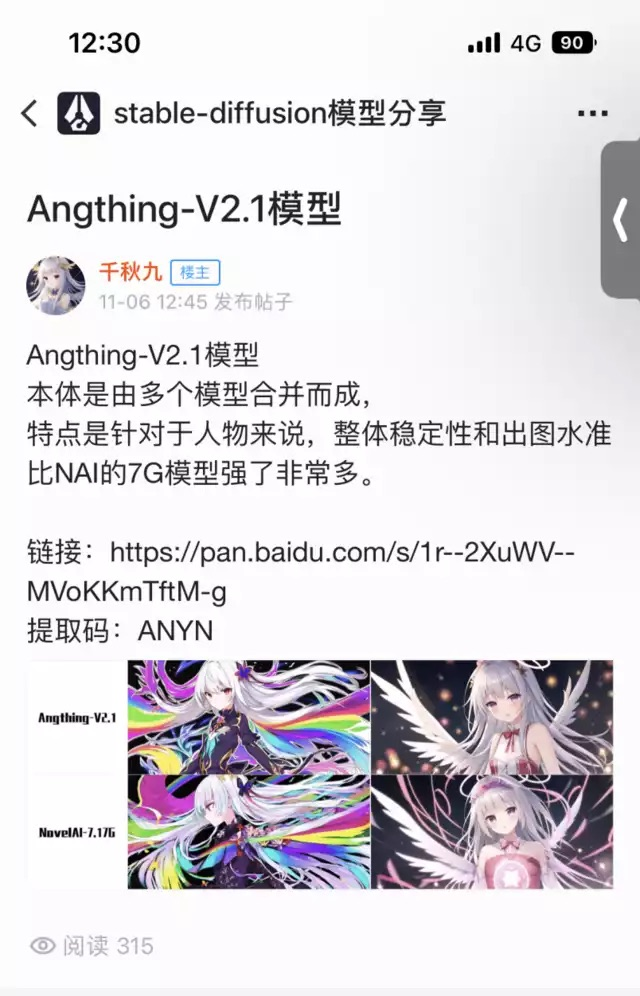
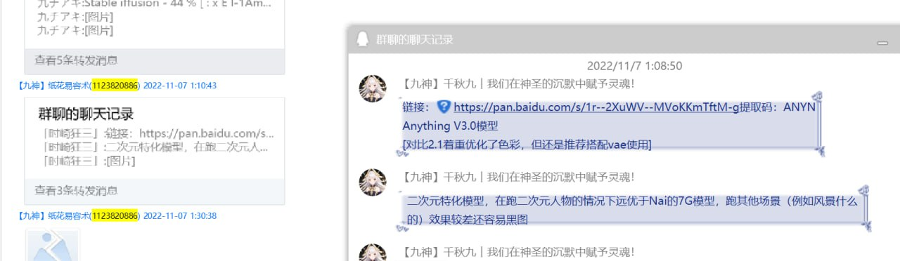
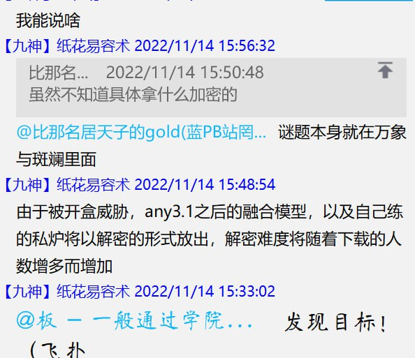
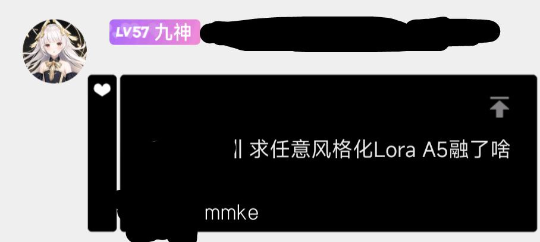
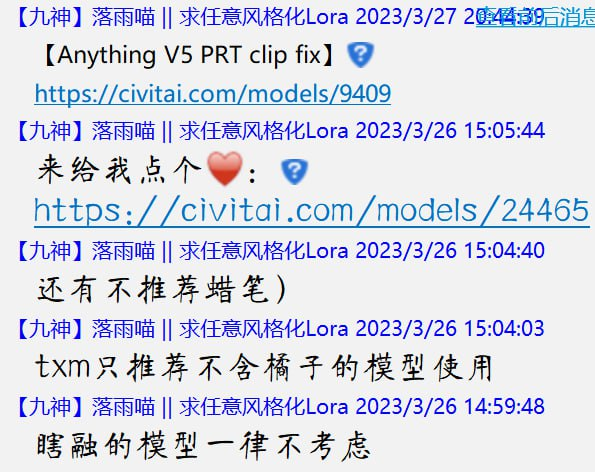

# Tracking the real author of Anything V3 down to QQ ID #

## Disclaimer ##

**I have no intention to doxx a person. I am just investigate the model stolen / leak multiple times until it reached to huggingface (and being SOTA model) by a random anon who have absolutely no connection to the original author. QQ ID is PUBLIC there. No personal information has been disclosed.** ~~[Maybe isn't.](https://www.163.com/dy/article/F845NGFC0539B46R.html)~~

- Assumption: *One consistent owner*.

- First, [this](https://huggingface.co/Linaqruf/anything-v3.0) is just a mirror uploaded by a ~~random anon~~ [a famous modeller](https://x.com/linaqruf_) [releasing one of the most apperciated SDXL model](https://civitai.com/models/260267/animagine-xl-v31). He contacted me already. ~~That's all~~ [It will be gone](https://huggingface.co/Linaqruf/anything-v3.0/discussions/133) and [there will be a spiritual successor](https://github.com/6DammK9/nai-anime-pure-negative-prompt/blob/main/ch02/any4_qqdoc.md) and... [me following the research](https://github.com/6DammK9/nai-anime-pure-negative-prompt/blob/main/ch05/README_XL.MD).

- The real author is just a person who never involved in any international commuinities, and have no public apperance outside GFW, so he stayed myster for a long period of time. Even a [QQ-involved repo](https://github.com/lllyasviel/style2paints) once wrongly cited the person in HF. [Git issue](https://github.com/lllyasviel/style2paints/issues/205).

- [The very first public article in Bilibili](https://www.bilibili.com/read/cv19603218). If you read the comment session, you will found this quote.



- Then look for "元素法典" in [one of the wiki](https://a2a.top/), then this docuement "[AI绘画——深度教程](https://docs.qq.com/doc/DQ3ZJSGFmeVpWc2ta)", you'll see his name "千秋九" (and abbreviation "九佬").


- Then **this screenshot** in [QQ APP](https://apps.apple.com/cn/app/qq/id444934666). Contents from there are *invisible from search engines*. 

- Also. The Baidu URL is **exact match** with the [rentry record](https://rentry.org/NAI-Anything_v3_0_n_v2_1). See `1r--2XuWV--MVoKKmTftM-g` in the image. [Cross valid with another rentry record](https://rentry.org/sdmodels#anything-v30-38c1ebe3-1a7df6b8-6569e224)



- Finally this screenshot shows the recent account name with the QQ ID with the matching "model release notes". **Notice that the account name is inconsistent, and the versioning is somewhat changed.** However the URL is still exact same.



- Now everthing is solved, and the proof is solid. ~~It also gives you some idea how the model is made.~~


- Well, "Anything V3.1" gains a lot less attention "because of obvious reason". [So the proof is left as an exercise](https://matheducators.stackexchange.com/questions/1896/are-the-words-easy-basic-clearly-obviously-etc-ever-helpful).



- ~~However, *due to an incident after the initial release of this article*, **some mystery remains** even I have gathered such amount of information.~~ (It is resolved after the release of AnythingV5.) However it doesn't affect the proof, and the model in the HF mirror is still legit.

- ~~Also, just forget any future version.~~ Insider told me even v3.1 doesn't even published.

- [With the suprising official successor AnythingV5](https://civitai.com/models/9409/anything-v5-or-anything-diffusion-original), the identity in Civitai should be a lot certain. Note that the icon / metadata still matches.





- With the [confirmation on one of his LoRA](https://civitai.com/models/22870/or-refrigerator-sticker-style), ~~smurf QQ accounts exists (proof left for exercise).~~ The idnedity in Civitai matches with Telegram, which points to the *incident above*.


```
Negative prompt: (bad:0), (comic:0), (cropped:0), (error:0), (extra:0), (low:0), (lowres:0), (speech:0), (worst:0)
Steps: 256, Sampler: Euler, CFG scale: 8, Seed: 1663800267, Size: 512x512, Model hash: 6569e224, Clip skip: 2
```
