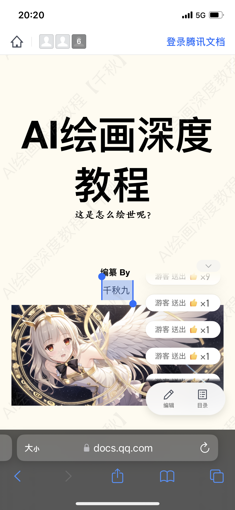

# Tracking the real author of Anything V3 down to QQ ID #

## Disclaimer ##

**I have no intention to doxx a person. I am just investigate the model stolen / leak multiple times until it reached to huggingface (and being SOTA model) by a random anon who have absolutely no connection to the original author. QQ ID is PUBLIC there. No personal information has been disclosed.** ~~[Maybe isn't.](https://www.163.com/dy/article/F845NGFC0539B46R.html)~~

- First, [this](https://huggingface.co/Linaqruf/anything-v3.0) is just a mirror uploaded by a random anon. He contacted me already. That's all.

- The real author is just a person who never involved in any international commuinities, and have no public apperance outside GFW, so he stayed myster for a long period of time. Even a [QQ-involved repo](https://github.com/lllyasviel/style2paints) once wrongly cited the person in HF. [Git issue](https://github.com/lllyasviel/style2paints/issues/205).

- [The very first public article in Bilibili](https://www.bilibili.com/read/cv19603218). If you read the comment session, you will found this quote.


- Then look for "元素法典" in [one of the wiki](https://a2a.top/), then this docuement "[AI绘画——深度教程](https://docs.qq.com/doc/DQ3ZJSGFmeVpWc2ta)", you'll see his name "千秋九" (and abbreviation "九佬").



- Then **this screenshot** in [QQ APP](https://apps.apple.com/cn/app/qq/id444934666). All conents in Chinese APP are hidden as [national level deep web](https://en.wikipedia.org/wiki/Deep_web) and **invisible in search engines**. See [this app also](https://apps.apple.com/cn/app/%E9%97%B2%E9%B1%BC-%E9%97%B2%E4%B8%8D%E4%BD%8F-%E4%B8%8A%E9%97%B2%E9%B1%BC/id510909506). ~~Can you search any second hand goods in CN as in "2.taobao"?~~


- Now *can you see the **exact same account name.** Then finally by **another screenshot** and everthing is solved.


- Wow, what a famous person in CN. ~~Famous on trashtalk and being doxxed there.~~ Note: His trashtalk is omitted here. Common as a high school student (yes, age is also PUBLIC there).


- Well, "Anything V3.1" gains a lot less attention [because of obvious reason so the proof is left as an exercise](https://matheducators.stackexchange.com/questions/1896/are-the-words-easy-basic-clearly-obviously-etc-ever-helpful).


```
Negative prompt: (bad:0), (comic:0), (cropped:0), (error:0), (extra:0), (low:0), (lowres:0), (speech:0), (worst:0)
Steps: 128, Sampler: Euler, CFG scale: 8, Seed: 1337, Size: 512x512, Model hash: 9d163b9c, Clip skip: 2, ENSD: 31337
```
