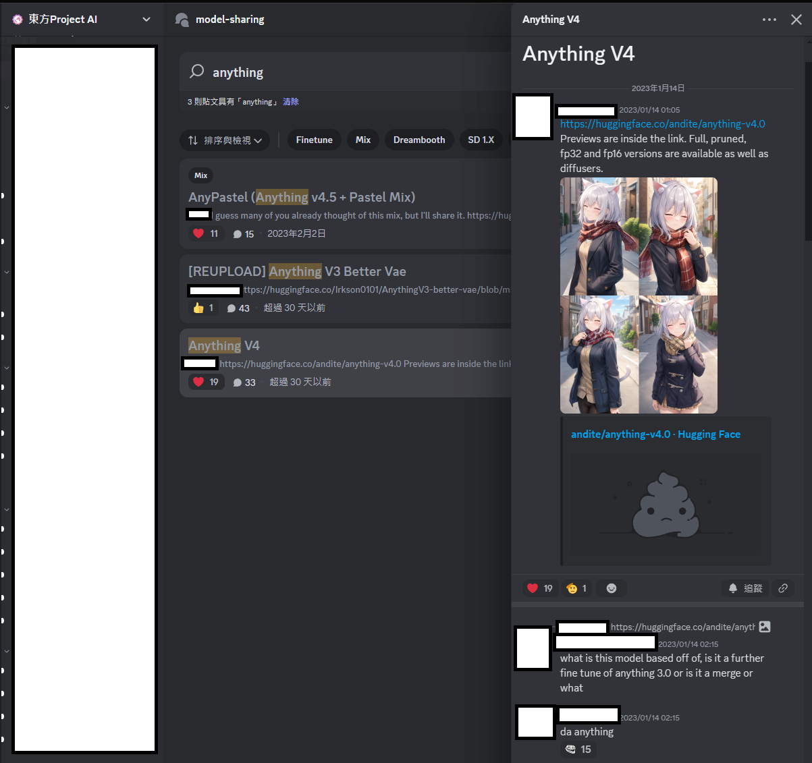
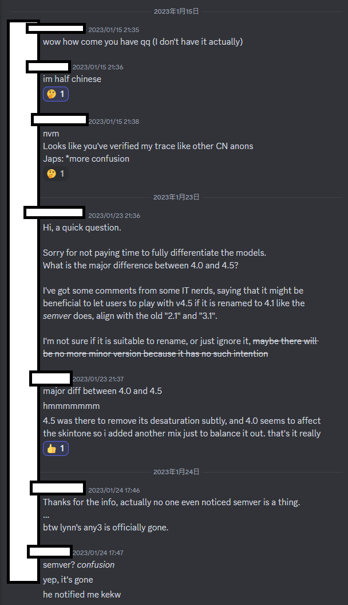
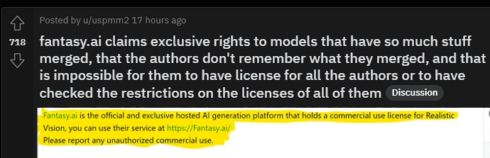
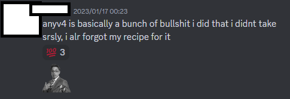
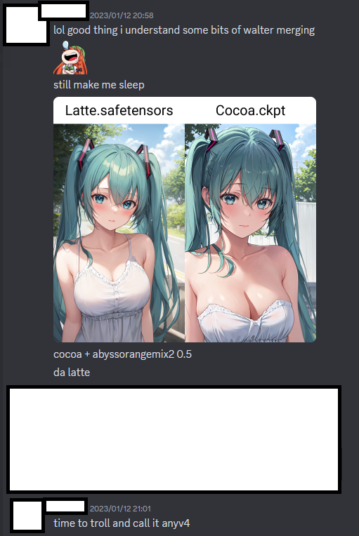

# A response about a doc in QQ about AnythingV4 #

- [The QQ article is here.](https://docs.qq.com/doc/p/64b52b36f74e68f42f89733ab9901d57917c8575) *Anonymous author.* [But the launguage tone and word frequency about "AnythingV3" is still obvious.](./any3_qqid.md)

- I may response most chapters if I'm interested *(because I am involved in some incidents, yep)*. [It needs more perspective before all the primary sources flushed away / deleted in QQ / Discord / Telegram chat history.](https://www.historyskills.com/source-criticism/analysis/perspective/)

## OK. So what's the AnythingV4? ##

> 不知道哪里的作者制作了Anything V4并且声称这是新版本的Anything。

- [CivitAI is obviously NOT the primary source because HuggingFace is the major platform at early 2023.](https://civitai.com/models/4855/anythingelse-v4)

- [Obviously the HuggingFace is long gone.](https://huggingface.co/andite/anything-v4.0)

> 仅为其他作者蹭热度所制作。

- [The author doesn't even have to advertise, because his PastelMix is more popular actually.](https://civitai.com/models/5414?modelVersionId=6297) It was one of the most famous model in Anime style distinct from "NAI".

> 曾经有一段时间，几乎所有的模型都是橘子mix或者蜡笔mix，后面还有鬼针草mix等其他模型，这期间批量生产了非常多的垃圾模型。更有很多模型被称作“私模”，很多都是融合而成的垃圾模型。

- *How about AnythingV3?* BTW PastelMix = 蜡笔mix, AOM2 = 橘子mix, and 鬼针草mix is probably... the "CGA" circulating in SDCN, and it is the [AutoMBW](../ch01/autombw.md) I've mentioned.

### What I know then ###

- (Source missing) Not long after ther model release, "andite" was accepting donation, and being sponsered by some AIGC platforms (e.g. fantasy.ai), and disappeared and deleted the stuffs in Hugging face on June 2023. I believe some drama was happened (about doxxing on early 2023, aw). 

- [One of the very original Discord release post](https://discord.com/channels/930499730843250783/1063504188081971201/1063504188081971201) still exist in "Touhou Project AI Discord" (WD Discord).

- I cannot retrieve the chat history a year ago (considering WD discord is as active as SDCN), a private chat was initiated when a screenshot was somehow leaked, showing Anything "better VAE" 3.1, meanwhile the official 3.1 was never released.

- Anything 4.5 is the "better VAE" 4.0.

- Also, it is a "mix with forgotten recipe". *That was a common knowledge that "Anything is something like you merge until you forget what you've done".* That was so common on merge belivers at that time, because no one had enough resource and knowledge to "native finetune" a model. All they can do is keep making Dreambooth / LoRAs and merge them into a nice base model.

- And... it is "almost but not exact" Latte (mix). *The abbreviation is easy for me to keep digging in the search results.*

## Extra: Back to the AnythingV3 ##

> 但由于作者在此之前并没有接触过任何的国外社群，所以当时国外的一些人并没有找到anything 的作者。

- It is because there was little trace, even "Lynn" wanted to contact him to let him reclaim the SOTA title, what a pity.

- And... eeyep, I found and prove it. Actually there was guess that the author is aleady a member of SDCN, but due to the culture in Telegram, idendity is usually not claimed or verified.

> 而由于AnythingV3模型被吹上天，

- No. Not exaggerated. Nice bias (becoming an easy "1girl generator") actually. But the "天" is really because Lynn uploaded it to HuggingFace and somewhat promoted it in WD Discord.