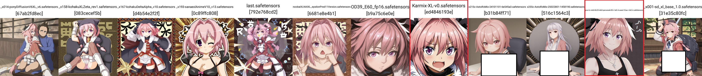
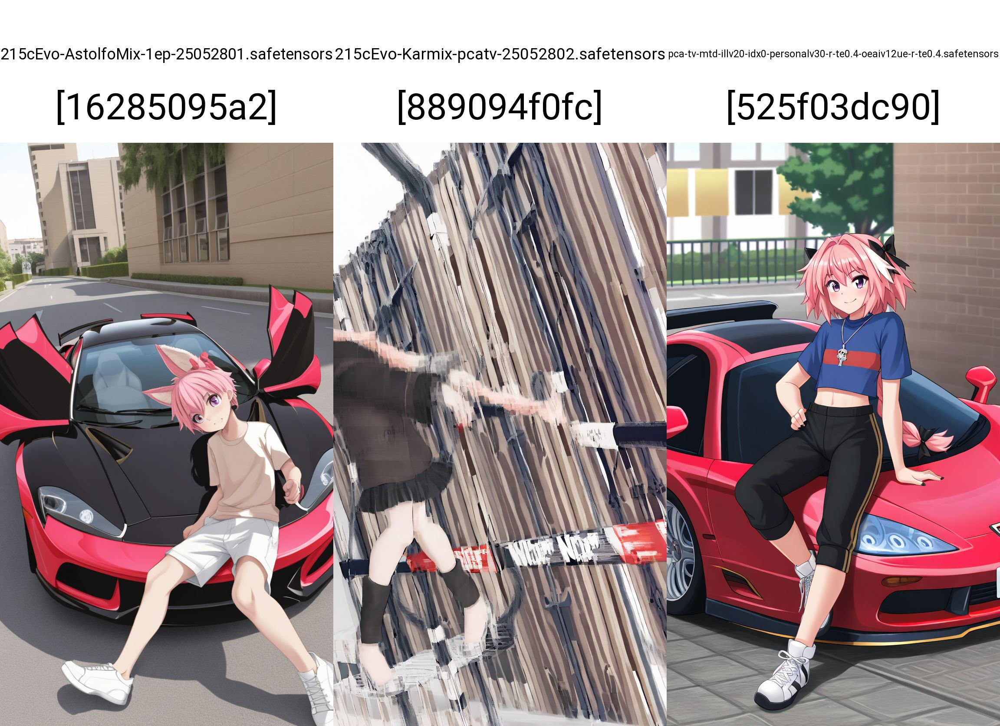

# Karmix: A great merge with Karcher mean #

- [Official model page.](https://rentry.co/-introducing-karcher-mean-experimental-model-v0)

- [Official SDCN notice.](https://t.me/StableDiffusion_CN/1873622) Official upload in the next message.

- [HF mirror.](https://huggingface.co/chemwolf/Karmix-XL-v0) *No model card.*

- [HF mirror for experimental merge.](https://huggingface.co/NullAxis/karmix-merge-experiments) *No model card.*

> There are several reasons for this:
1 - I don't understand the licenses of the models that I used and I don't want to have any problems with it
2 - for now, I don't want to fully publish the model in the form it is (v0), so it is published only in our chat
3 - I haven't even read the license

- For the "PCA TV MTD", it stands for "[Principal Component Analysis](https://en.wikipedia.org/wiki/Principal_component_analysis) with [Task Vectors](https://arxiv.org/abs/2212.04089) method".

