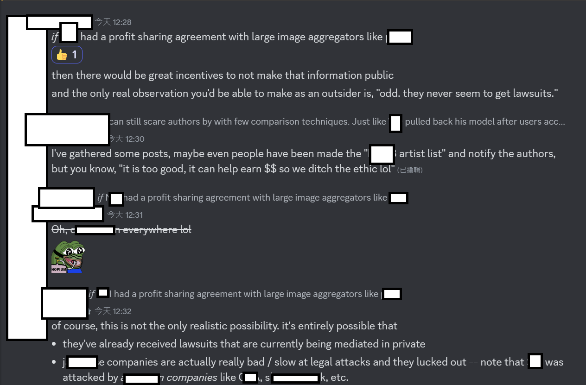
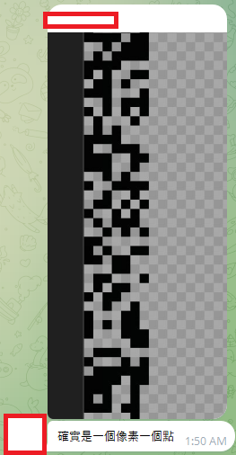

# Observation from NovelAIDiffusionV3 #


## End of line ##

- Technical report has been released: [Improvements to SDXL in NovelAI Diffusion V3](https://arxiv.org/abs/2409.15997)

> Wetrained the model on our 256x H100 cluster for many epochs and roughly 75k H100 hours.

- *Speculation of training contents is now adjusted to 100 epochs with multiple parameter search attempts. Dataset size maybe more, ranged from 1B to 2B.*

<details>
    <summary>Click to open the PNG (SFW but meh)</summary>


</details>

- [Twitter post from bdsqlsz.](https://x.com/bdsqlsz/status/1838940222622703776)

- *Many techniques from V1 has been inherted.* [See model card of V1](https://huggingface.co/NovelAI/nai-anime-v1-full).

- [Even the CLIP is frozen like V1, and leaving VAE trained.](./animevae_pt.md) It contradicted with the finding, but since it is behind API, it will be left unverified.

> Like in our previous models, we used CLIP[24] context concatenation and conditioned on CLIP’s penultimate hidden states (on this part, no change was required; SDXL base already does this).

> As in NovelAI Diffusion V1, we finetune the Stable-Diffusion (this time SDXL) VAE decoder, which decodes the low-resolution latent output of the diffusion model, into high-resolution RGB images

- Tag-based Loss Weighting was reported... *"seen".*

### Guess on V4? ###

- Likely not from a [*distilled model*](https://medium.com/@zhiwangshi28/why-flux-lora-so-hard-to-train-and-how-to-overcome-it-a0c70bc59eaf), or an [*open source model*](https://civitai.com/articles/6309/towards-pony-diffusion-v7-going-with-the-flow). [Right?](https://knowyourmeme.com/memes/for-the-better-right)


- *Ah. The taunt from the H100 cluster.*


## Old contents ##

- *Observation only.* I don't have membership, and I have no hands on experience about this.

- Do not mixed up with [V1](../ch99/925997e9.md) and V2, which is based from SD1.X.

- [My opinion on V3 (not my tweet). NAI should explain why so many artists and copyright materials are trained.](https://x.com/laz75n/status/1725042286088880587?s=20) [Another lengthy article about AI anime contents.](https://note.com/felelihasima/n/n6c29134bf5a7)

- **(240103) Extra: "MidJourney Name List"** from a court case: [PDF](https://storage.courtlistener.com/recap/gov.uscourts.cand.407208/gov.uscourts.cand.407208.129.10.pdf)

### New: Ah yes why nothing happened? ###

*Hopium.*



### New: Gift cards has been banned from Asia! ###

*Will be hard for people "in Asia" who don't have credit card.*


## Blue Pill ##

- `en` [Rentry "wiki". Recommended.](https://rentry.org/hdg-nai-v3)

- *A little bit of citation is the greatest support for me already.* Also, *be skeptic on any information, including mine.*

- `jp` [Article.](https://min.togetter.com/qDBZuI8)

- `cn` [Article.](https://weibo.com/7152334518/4969214732142387)

- `cn` [Video.](https://www.bilibili.com/video/BV1xG411i71m)

- `cn` [NAI-V3的使用守则](https://civitai.com/articles/3179/nai-v3) *Kohaku is not pleased, see blow*

### Prompting guide / Tag Explorer ###

- *analysis in lower session*.

- `en` [Danbooru Tags Explorer](https://nsk.sh/tools/danbooru-tags-explorer/), [analysis in the same site](https://nsk.sh/posts/an-analysis-of-danbooru-tags-and-metadata/)

- `en` [NAIDv3artisttagtestoverview](https://rentry.co/NAIDv3artisttagtestoverview)

- `en` NovelAI (NAI) v3 15000 Artist Comparison. [Discord thread](https://discord.com/channels/930499730843250783/1180293593336926270) [Mega](https://mega.nz/folder/AE8mFI4Z#t2A1tm6HYiXOHOj9Fk8Ncw) [HuggingFace](https://huggingface.co/datasets/deus-ex-machina/novelai-anime-v3-artist-comparison)

- `cn` 副本-500画风-NovelAI V3示例. [Discord](https://discord.com/channels/930499730843250783/1181771420045422613) [上](https://docs.qq.com/doc/DSmtHTUdHT1liaFRs) [下](https://docs.qq.com/doc/DSm5SVUVuVG5mbVNP)

- `cn` [sd tag分享](https://docs.qq.com/doc/DRVBjRVdBWld4THBV), [每日一发](https://docs.qq.com/doc/DRXRCbUxWbnlVaXVI), [300画风法典：NAI3画风收集和研究](https://docs.qq.com/sheet/DZWZMemxNZkpVR0VB?tab=BB08J2) (QQ Docs)

## Datasets / Training specs ##

- Given the "modified" prompt system (apart from A1111 and comfyUI, closer to [Nijijourney](https://nijijourney.com/en/)), **long prompts will be ineffective.** Although officially clarified, *it was once considered that some prompt segments are actually mapping to trigger LoRAs.* The swapping performance is fast (compared with PCs) because of the large H100 cluster. 


- **Unfiltered** Danbooru's "6M" and E621's "3M" is likely included. Anime screencaps / pixiv / instagram / sankakucomplex is less likely, but would be included also. 

- *Speculation* With estimation of "100-200M seen per day ( 256 H100 not 252 ~~SEO boost~~ )", "trained for around 2 weeks", it would be around "10M 280EP", which is scary but effective for SDXL. 

- Supportive materials on "256 H100": [Official NAI blog (in name of Anlatan)](https://blog.novelai.net/anlatan-acquires-hgx-h100-cluster-4b7a2e6a631e) > mention of "NVIDIA HGX H100 compute clusters" > "256 H100 GPU Pod" in [offical product page](https://developer.nvidia.com/blog/introducing-nvidia-hgx-h100-an-accelerated-server-platform-for-ai-and-high-performance-computing/). *If you see the mentioning of 252 H100 without supporting media, that's probably due to the poor translation inside the screenshot 🤣 (I am Astolfo, not Kohaku)*

- As on 240613, [now they have even more H100s](https://novelai.net/anniversary-2024). ~~256 (+8?)~~

- Obviously, with the superior [procurement](https://en.wikipedia.org/wiki/Procurement), [sponsership](https://en.wikipedia.org/wiki/Sponsor_(commercial)), and [financing](https://www.investopedia.com/terms/f/financing.asp) (*NAI is the "top 50 AI unicorn" in some media sources*), it is obviously "not in competition with community". Also, *it is not that hard to understand when "we" meet with groups of PhD students and postDocs to analyze an AI model*. Enjoy the taunt.


## Prompts ##

- **Do not apply the long nasty negative prompts!** [You may get your prompt cropped in API level.](https://vxtwitter.com/linaqruf_/status/1725397495705112983). Remember, NAI is not A1111 or ComfyUI. [NAI has been known for injecting the prompts in API level since v1.](https://docs.novelai.net/image/qualitytags.html)


- By observating in [SDCN](https://t.me/StableDiffusion_CN), **do the exact opposite of general / original contents.** Identify danbooru tags, especially `artist:xxx` ([tested sample]), `official_art`, `anime_screencap`, and copyrighted materials (`umamusume`) etc., to obtain "nice images". *Explicit contents are effective, all you need is keep rolling the dice.* ~~(Less then 100? The hype train is rapid)~~ It is believed that **there is no filter** this time, and dumped effective GPU hours. ~~(When I'm making AstolfoMix, I've found that SDXL is too large. NAI V3 supports my speculation.)~~ **Logos, signatures, key visual features etc. are well reproduced.** For the claimed "structal change" and "intensive training", it is effective ~~and designed to dodge the bullet, now the base model should be generic like AstolfoMix.~~

- Testing the artist name in Danbooru / E621 is easy (how about testing `deleted` artist?), [here is a list spotted in wild.](https://pastebin.com/T557XrsH). ~~Do not ask why the Miku artist below is not included in the list, so as VBP's 273 artists, or CivitAI's wild model etc.~~

- [Here is a "binding of presets". Put all of them into negative prompts.](https://github.com/crosstyan/random-prompt/blob/b30ac5b4ab9527a688e54a609020e86fb9e53ef2/extra/original.js#L7199-L7223)

- For quality tag (`absurdres`, `amazing quality`, `very aesthetic`), see [WD 1.5's release note](https://saltacc.notion.site/saltacc/WD-1-5-Beta-3-Release-Notes-1e35a0ed1bb24c5b93ec79c45c217f63) for idea. It is similar, but WD's execution is too bad *faceplam to justify the impact on model performance. You can see [NekoRayXL](https://civitai.com/models/136719/nekorayxl) which does not have such system applied.


- *Enjoy the taunt once again.*


- *My generic prompts may work also.* However SDXL's original contents, such as `wrc`, `ice cube`, are faded.

## Watermark (Other then PNG info / EXIF data) ##

- Official image inspector: [/inspect](https://novelai.net/inspect)

- *Looks like there is already covered by another anon long ago:* [See this gist.](https://gist.github.com/catboxanon/ca46eb79ce55e3216aecab49d5c7a3fb) Keyword: `stealth_pngcomp`

- An anon discovered that the [official website](https://novelai.net/inspect) can identify / read metadata from images generated from NAIv3, even the EXIF data was wiped and converted to JPEG, until it is compressed to a large extent.

- Later with [the recent Samsung mobile phone](https://www.theguardian.com/technology/2024/feb/05/samsung-galaxy-s24-ultra-review-the-swiss-army-knife-of-phones-now-with-ai), anon found that **there is vertical QR-code like bars in each side of the image**, probably contains hidden messages.


- With some simple image processing tools, the QR code can be visualized with around 8px (or 5 blocks) of width. Soon discovered **it is a watermark in alpha channel.**



- Then *with some observation and reverse engineering*, it is known that the watermark is generated by [sd-webui-utilities](https://github.com/space-nuko/sd-webui-utilities) and can be readed.

```
alpha - 254 = bit
```

- Binary:


- Hex:


- Finally the plaintext:


- *It may be useful for other WebUIs to implement watermark to fufill regulation.*

## Model hash / update ##

- Looks like the "NAIv3" model will be updated when new content comes. Given `"lora_unet_weights": null, "lora_clip_weights": null` in the metadata, LoRA may be hooked, *or it is left for placeholder.* 


- From this [Korean post](https://arca.live/b/aiart/91848239?p=1), **more than a model hash can be found**, and confirmed with [this deviantart post](https://www.deviantart.com/canpon1992x/art/Ishtar-of-FGO-lying-naked-with-her-eyes-closed-1012778520).

|Hash|Type|Description
|---|---|---|
|`Stable Diffusion XL C1E1DE52`|`"request_type": "PromptGenerateRequest"`  or `"request_type": "Img2ImgRequest"`|"Text to Image" or "Image to Image"|
|`Stable Diffusion XL 8BA2AF87`|`"request_type": "NativeInfillingRequest"`|"Inpainting"|
|`Stable Diffusion XL 7BCCAA2C`|`"request_type": "PromptGenerateRequest"`  or `"request_type": "Img2ImgRequest"`|"Text to Image" or "Image to Image" (Vibe Transfer)|
|`Stable Diffusion XL 1120E6A9` (Unknown)|`"request_type": "NativeInfillingRequest"`|"Inpainting"|

- More model hash (e.g. legendary `Stable Diffusion 81274D13`) can be found as previous version also. *Note that I'll post the popular hash only.* Note that "inpainting" can use the same model, instead of distinct model in V3.

|Name|Hash|
|---|---|
|NAI Diffusion Anime V1 (Full)|`Stable Diffusion 81274D13`|
|NAI Diffusion Anime V1 (Curated)|`Stable Diffusion 1D44365E`|
|NAI Diffusion Furry (Beta V1.3)|`Stable Diffusion 1D09D794`|
|NAI Diffusion Anime V2|`Stable Diffusion F1022D28`|
|NAI Diffusion Anime V3|`Stable Diffusion XL C1E1DE52`|
|NAI Diffusion Furry V3|`Stable Diffusion XL 9CC2F394`|

## Strange area ##


## 3rd party API endpoint ##

- I thought it was not public, even there are custom clients in the wild.


- Note that both endpoints' API are not identical. Auto generated API docuement is available in both [old endpoint](https://api.novelai.net/docs) and [new endpoint](https://image.novelai.net/docs/index.html).

## Strange thoughts ##

- *NAIv3 should be exclusive in NovelAI only.* It won't be available in community. Therefore this news is just a news, instead of skeak peek of some new features.


- For the part *"kohaku is not pleased"*: That article didn't consult or even notice him, and somehow it is "cited" in a strange way. Also the claims in the article is not even accurate from the source (private QQ group). Here is the "observation" redirected from an anon:

> 討論內容是:
> 
> "至少"有100EP
> 
> "至少"幾個星期 


## Use at your own risk. ##

- "API key is dead": [NaiDrawBot](https://github.com/sudoskys/NaiDrawBot) *Current speculation is a hidden rate limit checking only, around 9k per day.*

- "Distillation": [nai3_train](https://github.com/wochenlong/nai3_train)

- "I have no idea either": [random-prompt](https://github.com/crosstyan/random-prompt)

- "We need a WebUI, an account pool, and a QoS system": [Kohaku-NAI](https://github.com/KohakuBlueleaf/Kohaku-NAI)

- "Another WebUI": [Semi-Auto-NovelAI-to-Pixiv:](https://github.com/zhulinyv/Semi-Auto-NovelAI-to-Pixiv)


- *Taunt. As usual.*


## Preview ##

- I didn't made this PNG, but *technically there is no copyright...?*

<details>
    <summary>Click to open the PNG (SFW but meh)</summary>


</details>

```
{"prompt": "{granblue fantasy,official art }, year 2022, pantyhose,{1girl}, fellatio gesture, oral invitation,blush,half-closed eyes,look at viewer,from side,tongue out,smile,upper body, best quality, amazing quality, very aesthetic, absurdres", "steps": 28, "height": 1216, "width": 832, "scale": 5.0, "uncond_scale": 1.0, "cfg_rescale": 0.0, "seed": 3816166865, "n_samples": 1, "hide_debug_overlay": false, "noise_schedule": "native", "sampler": "k_euler", "controlnet_strength": 1.0, "controlnet_model": null, "dynamic_thresholding": false, "dynamic_thresholding_percentile": 0.999, "dynamic_thresholding_mimic_scale": 10.0, "sm": false, "sm_dyn": false, "skip_cfg_below_sigma": 0.0, "lora_unet_weights": null, "lora_clip_weights": null, "uc": "nsfw, lowres, {bad}, error, fewer, extra, missing, worst quality, jpeg artifacts, bad quality, watermark, unfinished, displeasing, chromatic aberration, signature, extra digits, artistic error, username, scan, [abstract], {{{1male,cock,pov,1boy}}}", "request_type": "PromptGenerateRequest"}
```


