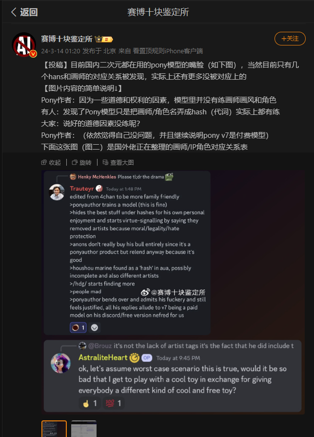
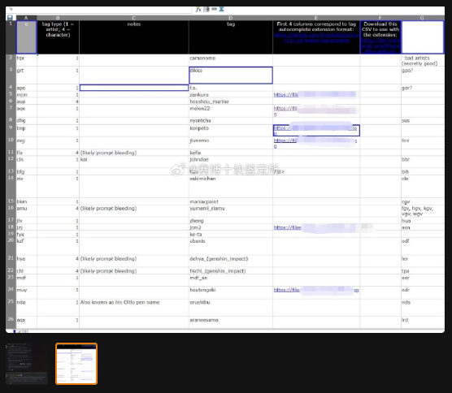
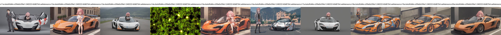
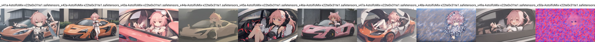
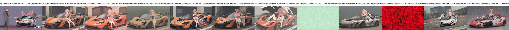
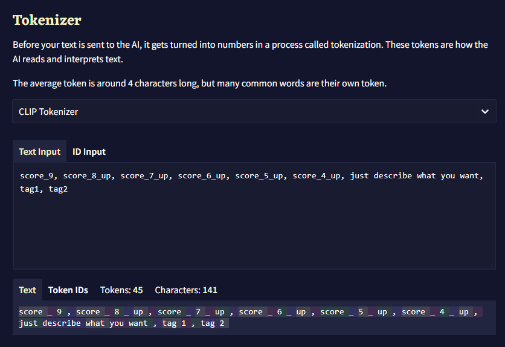
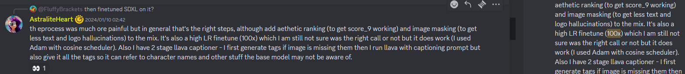
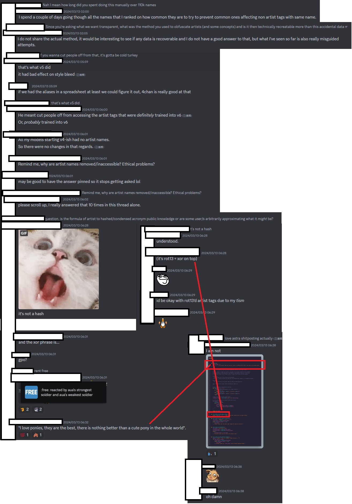

# Observation of Pony Diffusion (v5.5 SD2.1 + V6 SDXL) #

## (New) Pony SD3 will not happen ##

- [Regrettably, the ambiguous rollout of SD3’s commercial licensing have been quite disheartening.](https://civitai.com/articles/5671)

- [He join Open Model Initiative instead.](https://www.reddit.com/r/StableDiffusion/comments/1dp2as9/update_and_faq_on_the_open_model_initiative_your/) ~~BTW who is Robbert "Zavy" van Keppel and Zovya?~~

## Civitai Guest Creator Stream ##

- [Twitch link](https://m.twitch.tv/videos/2145665383)

<details>
    <summary>Keynotes from the stream.</summary>

刻意不用英文.

```txt
35:00
20 年經驗，不過不是 AIML (household engineer?)
gpt2 時期入坑，當時沒 AIML 背景
已經忘記了 v5.5 是 sd2.1，but I think it is good
繼 wd 後「第二個大 ft，emad 有打聽過」，不過也不懂為何 v6 會火
不會改名
時機問題
(主持要求 layman) 沒想過會被稱為 "底模", 也沒打算 "出位"
知悉幾乎所有 "adapter" 都用不了
"沒有很多 FT 模, 因為既花時間練, 也很容易翻車" (?)
(測試集) 試了 2 星期, 10 次在右, 調參為主, 跟 LoRA 分別頗大
翻車 = 甚麼都見不到
學習率是盲猜的
Full train 為期 3 個月, 撞到比 5.5 好就推出了
Custom build "letsgo" server, "800 big boys GPUs with 80GB of VRAM", 3D print cooling,
15-20 張 3090 都不夠 (downgrade to H800?) 很吃跨 GPU 的通訊
贊助老早就沒了，用戶的錢去了 discord bot，丹爐花了 50-60k (5-6w 刀)，前期 (preprocessing) 用了十幾張消費級 gpu
前期用了八成時間
V4 時收到匿名贊助丹爐
主持問圖庫就「遊花園」(styleGAN...)
聲稱是因為 4chan 而人坑
初頭 (at first) 是刪 artist tag （但談了很久 why it is important）
只是人家不信他刪了
I am in California
53:38 V6 是有秘密 artist list, 然後被人三字經了
不是 hash 啦，是別的手段
v7 想加 style control，暫定是匿名 (3d_55)
63:00 作者兩年前在 NAI 工作，「NAI 也刪了」(v1?)
65:20 「只是改了 preference, 隱藏 X-rated 而已」 (C 站表示支持作者決定)
V6 搬入 C 站前只有 40% 是瑟瑟, 上傳後就多到有點受不了 (極端) , 原本就只是想偏向 "卡通風"
瑟瑟檢測好難, "uncanny"
V7 還會有瑟瑟圖庫
想要 SD3 權重, 但也體諒 SAI 的處境, 能等下去
SD3 的邀請太怪了 (C 站主持: 我也沒)
SAI JP 透露月尾會有 (2405)
打算用 1280x1280 練, 前期在做也差不多, booru tag + NLP 標兩次
有自己練 tagger / classifier 然後再打標 (瑟瑟內容)
81:30 V6 的 2.6M 是從 10M 篩出來的, V7 打算從 30M 篩出 7-10M 圖
圖庫已到 100TB, 車庫架服務器 (server rack in garage)
打標器已經不止一代, 有用上 "錨" (anchor, "left of someone / right of someone")
V7 會標漫畫 (text bubble)
打標器折騰了很久 (最少兩年), 一直有人手比對
88:37 V6 很大程度上都是一人獨力完成, 信任問題
貼士:多記錄,多實驗
要預備燒錢,而且是實體機而非租雲,出外靠朋友
打標的計算量目測 "10 張 4090 跑 1 年"
資料為上 "data is king"
自製工具 (ML engineer / developer), 基建很難
沒企業負擔, 就是因為個人勢才能加瑟瑟
還有精力 / 錢捱到 V7 (SD3), 但科技難以預測
105:52 其實也沒有太多人在意 (爭議)
V7 會先傳 C 站, 仍然是免費
"多幹活" (build things)
```

</details>

## Official notice on Pony V7 ##

- [Towards Pony Diffusion V7](https://civitai.com/articles/5069)

## Red pill from 4chan ##

- [ponyxl_loras_n_stuff](https://rentry.org/ponyxl_loras_n_stuff)
- [ponyxl_lora_previews](https://rentry.org/ponyxl_lora_previews) 
- [4ttgzvd0rx-a6jf](https://lite.framacalc.org/4ttgzvd0rx-a6jf) The spreadsheet.

## Thank you for writing the draft ##

- I don't have QQ. Therefore I won't care if my "observation" will collapse the "wave function" ~~eliminate superposition a.k.a confusion~~ there.

- [Original weibo post.](https://weibo.com/7152334518/O4SGtsI7K)

- [The referenced 4chan post.](https://boards.4chan.org/h/thread/7883612)

- [Discord post 1.](https://discord.com/channels/1077510466470952990/1109884866964754644/1217145257288794163), [Discord post 2.](https://discord.com/channels/930499730843250783/1019446913268973689/1217091897697505310)





## More to come. ##

### Why CivitAI made Pony model as a distinct category? ###

- As written in title, **they are all in unaltered SD archetiture**. Unlike [Fluffusion](https://rentry.co/fluffusion), which is SD1.5 + vpred, pony diffusion doesn't do it to the extreme.
- However, with **super high learning rate**, and **some fallacy on tagging** ([CivitAI article on claimed tagging approach](https://civitai.com/articles/4248)), it shifted the model weight great enough to make it unusuable with any SD related tools, *including ControlNet.*
- Merging / training LoRA on top of it will be only applicable to its variant, and outputing *pure noise* when mating with other (mainstream) models.

Following images are referenced to [ch05](../ch05/README_XL.MDs), model components are compared with ovr manner (average of a model pool):

`_212` as V5.5


`_x14` as V6



- The recent "pony merge" is not totally false / fake, it becomes possible because **the downstream finetunes are using general techniques** (e.g. taggers common with AnimagineXL V3 / kohakuXL), and shifting the model weights into a more common space. [T-ponynai3](https://civitai.com/models/317902/t-ponynai3) and [AutismMix SDXL](https://civitai.com/models/288584/autismmix-sdxl) are nice example.

`_x48`, `_x50` as V6's downstream finetunes





### (240405) So is the "hash" legit? ### 

- *It is just random prompt injectgion / token collision.* Continue to read for verification. The claim from the author is verified **not related, or not directly related to the actual model.**

- [My attempt for the "hash".](https://www.pixiv.net/en/artworks/117451812) *It is Ubhfubh Znevar va Fnxvzvpuna fglyr (ROT13).*

### Why it looks like "hash" but not being an algorithm? ###

- It is simple: prompts are digested into embeddings by [BPE](https://huggingface.co/learn/nlp-course/chapter6/5). [Live demo straight from NovelAI.](https://novelai.net/tokenizer).
- Its *quality tagging* is actaully messed up after BPE, and **such tagging is applied across 2.6M of images.**



- With the **super high learning rate** ("100x" from a value not referenced yet), it does the *perfect score* by *outputing pure noise* with any pinch of oridinary prompts.


  
- With same technique applied, even legit hash is applied (see code block below), **BPE will break the hashes into "subwords" which are obviously short enough to have collision.**

```
Name: 24031403.PNG
Size: 32155 bytes (31 KiB)
CRC32: 44C28C62
CRC64: 81A4ABBD85D9E8B0
SHA256: 3C52AB236D77964B64DD4736BE8BE742AA6BCBA371476AF151CFD06BE11CF759
SHA1: BD2D832A3A2B3B99B2793BFDA04D9C8A48A71788
BLAKE2sp: 3E609B081A24C516DE51D9EE4BF85D5DE8B610FCA4787CAAAD052767D1180529
```

- Base64 for some random action:

```
CRC32: RMKMYg==
CRC64: gaSrvYXZ6LA=
SHA256: PFKrI213lktk3Uc2vovnQqpry6NxR2rxUc/Qa+Ec91k=
SHA1: vS2DKjorO5myeTv9oE2cikinF4g=
BLAKE2sp: PmCbCBokxRbeUdnuS/hdXei2EPykeHyqrQUnZ9EYBSk=
```

- [Live spreadsheet](https://lite.framacalc.org/4ttgzvd0rx-a6jf), [official CSV link](https://lite.framacalc.org/4ttgzvd0rx-a6jf.csv) and [an archived CSV in ROT13](https://github.com/6DammK9/nai-anime-pure-negative-prompt/blob/main/ch02/1710739486.csv) ~~Github support CSV view like PowerBI?~~

- [Known artist tags in ROT13.](./1715210999.txt)

- For example, Houshou Marine becomes `aua` (1 token) and sakimichan (-ish) style becomes `iwv`, `zix`, `px` and `smp` (3-4 tokens, any of them are fine).

### Why it is not what the author claimed, encryption / obfusciation, or hash? ###

- Under BPE / CLIP has already introduced information loss as embeddings / vectors, it *implies* to a kind of hashing.

- Predecending step can be arbitary to have a "hash like" feel, since *collision* occurs in embedding level, instead of prompt level. This is a kind of [prompt injection](https://www.robustintelligence.com/blog-posts/prompt-injection-attack-on-gpt-4), which yields "coincidence" and introducing undesired effect.

- PDv6 is claimed **artist name is not deleted nor hashed**, instead it is encrypted by [XOR](https://en.wikipedia.org/wiki/Exclusive_or) + [ROT-42](https://en.wikipedia.org/wiki/Caesar_cipher)



- And... [a random screenshot has been provided.](https://medium.com/@kristiyan.velkov/meet-devin-the-worlds-first-ai-software-engineer-f0c35f221bdd)


- Quick PoC (wanted to OCR it for integrity, but it is too blury and I used different implementation): [rot42_xor.py](./rot42_xor.py) ~~Can make a 1-liner version~~

```log
>python rot42_xor.py houshou_marine  
xekixek_cqhydu
1E♠♫K/♀▼☺∟↨Y
```

- Given ciphertext "aua" and plaintext "houshou_marin" is provided, the *encryption algorithm* **does not match the claim**. Direct prompting the cipher text will yield complete random images (the "girl" is the bias of the PDv6, a few more seeds will see no human-focused images).

- Instead, given the discovered "single token prompts" and the nature of BPE, random characters may form clusters because of their super low frequency, and the cluster may share high [cosine similarity](https://en.wikipedia.org/wiki/Cosine_similarity) (*or low distince between embeddings*) to the actual [unconditioned / "unprompted" contents](https://huggingface.co/docs/diffusers/main/en/api/pipelines/latent_diffusion_uncond). It is a [side effect](https://en.wikipedia.org/wiki/Side_effect) of finetuning / pretraining SD models.
