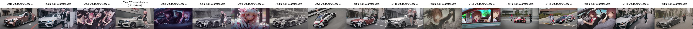

# Observation of Pony Diffusion (v5.5 SD2.1 + V6 SDXL) #

## Thank you for writing the draft ##

- I don't have QQ. Therefore I won't care if my "observation" will collapse the "wave function" ~~eliminate superposition a.k.a confusion~~ there.

- [Original weibo post.](https://weibo.com/7152334518/O4SGtsI7K)

- [The referenced 4chan post.](https://boards.4chan.org/h/thread/7883612)

- [Discord post 1.](https://discord.com/channels/1077510466470952990/1109884866964754644/1217145257288794163), [Discord post 2.](https://discord.com/channels/930499730843250783/1019446913268973689/1217091897697505310)


## More to come. ##

### Why CivitAI made Pony model as a distinct category? ###

- As written in title, **they are all in unaltered SD archetiture**. Unlike [Fluffusion](https://rentry.co/fluffusion), which is SD1.5 + vpred, pony diffusion doesn't do it to the extreme.
- However, with **super high learning rate**, and **some fallacy on tagging**, it shifted the model weight great enough to make it unusuable with any SD related tools, *including ControlNet.*
- Merging / training LoRA on top of it will be only applicable to its variant, and outputing *pure noise* when mating with other (mainstream) models.

Following images are referenced to [ch05](../ch05/README_XL.MDs), model components are compared with ovr manner (average of a model pool):

`_212` as V5.5



`_x14` as V6


- The recent "pony merge" is not totally false / fake, it becomes possible because **the downstream finetunes are using general techniques** (e.g. taggers common with AnimagineXL V3 / kohakuXL), and shifting the model weights into a more common space.

`_x48`, `_x50` as V6's downstream finetunes


### Why the "hash" seems so short? ###

- It is simple: prompts are digested into embeddings by [BPE](https://huggingface.co/learn/nlp-course/chapter6/5). [Live demo straight from NovelAI.](https://novelai.net/tokenizer).
- Its *quality tagging* is actaully messed up after BPE, and **such tagging is applied across 2.6M of images.**


- With the **super high learning rate** ("100x" from a value not referenced yet), it does the *perfect score* by *outputing pure noise* with any pinch of oridinary prompts.


  
- With same technique applied, even legit hash is applied (see code block below), **BPE will break the hashes into "subwords" which are obviously short enough to have collision.**

```
Name: 24031403.PNG
Size: 32155 bytes (31 KiB)
CRC32: 44C28C62
CRC64: 81A4ABBD85D9E8B0
SHA256: 3C52AB236D77964B64DD4736BE8BE742AA6BCBA371476AF151CFD06BE11CF759
SHA1: BD2D832A3A2B3B99B2793BFDA04D9C8A48A71788
BLAKE2sp: 3E609B081A24C516DE51D9EE4BF85D5DE8B610FCA4787CAAAD052767D1180529
```

- Base64 for some random action:

```
CRC32: RMKMYg==
CRC64: gaSrvYXZ6LA=
SHA256: PFKrI213lktk3Uc2vovnQqpry6NxR2rxUc/Qa+Ec91k=
SHA1: vS2DKjorO5myeTv9oE2cikinF4g=
BLAKE2sp: PmCbCBokxRbeUdnuS/hdXei2EPykeHyqrQUnZ9EYBSk=
```

- [Live spreadsheet](https://lite.framacalc.org/4ttgzvd0rx-a6jf), and [an archived CSV](https://github.com/6DammK9/nai-anime-pure-negative-prompt/blob/main/ch02/1710391046.csv) ~~Github support CSV view like PowerBI?~~

> houshou marine found as a 'hash' in aua, possibly incomplete

<details>
    <summary>Click to open.</summary>


</details>

### Why even it is claimed encryption / obfusciation, it is still looks like a hash? ###

- Under BPE / CLIP has already introduced information loss as embeddings / vectors, it *implies* to a kind of hashing.

- Predecending step can be arbitary to have a "hash like" feel, since *collision* occurs in embedding level, instead of prompt level. This is a kind of [prompt injection](https://www.robustintelligence.com/blog-posts/prompt-injection-attack-on-gpt-4), which yields "coincidence" and introducing undesired effect.

- PDv6 is claimed **artist name is not deleted nor hashed**, instead it is encrypted by [XOR](https://en.wikipedia.org/wiki/Exclusive_or) + [ROT-42](https://en.wikipedia.org/wiki/Caesar_cipher)


- And... [a random screenshot has been provided.](https://medium.com/@kristiyan.velkov/meet-devin-the-worlds-first-ai-software-engineer-f0c35f221bdd)


- Given ciphertext "aua" and plaintext "houshou_marin" is provided, *encryption algorithm* may be deduced:

~~I decided to include this updated session because I really think that the claims are plausible, especially the fallacy about embedding has already rooted in this model.~~
