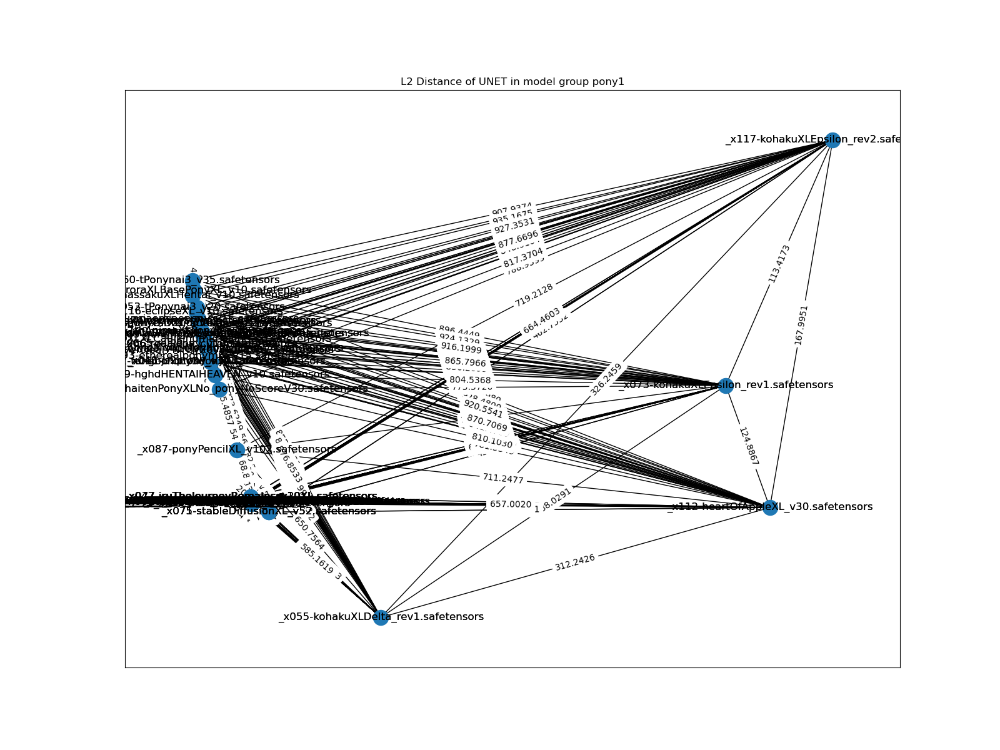
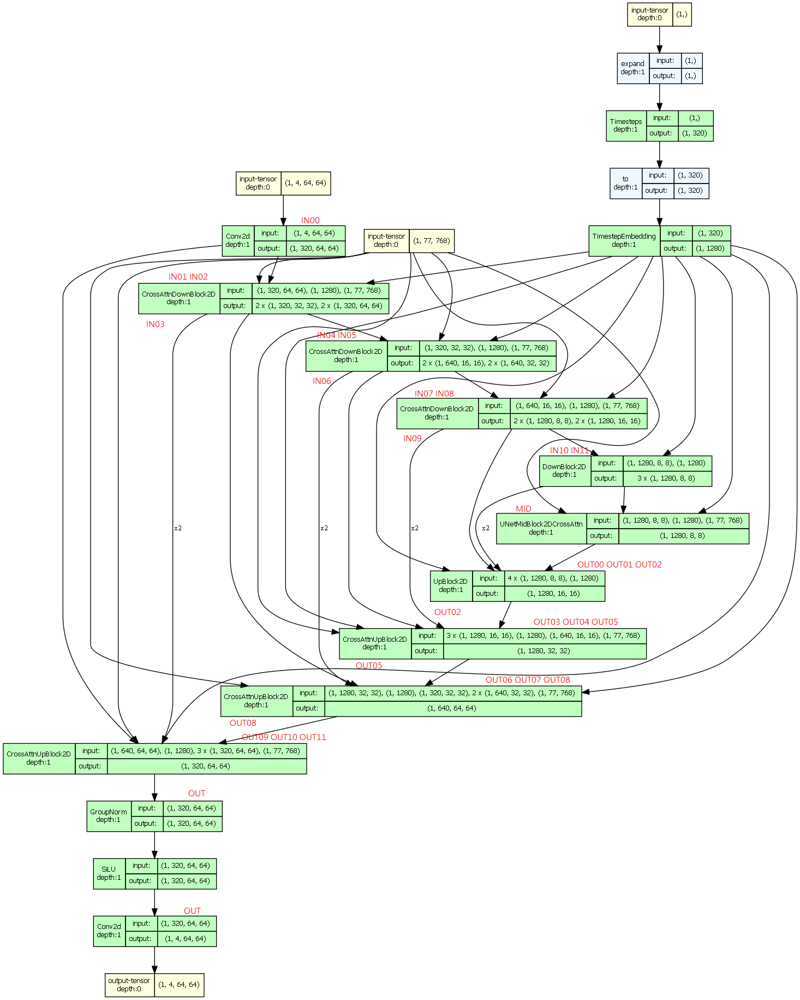
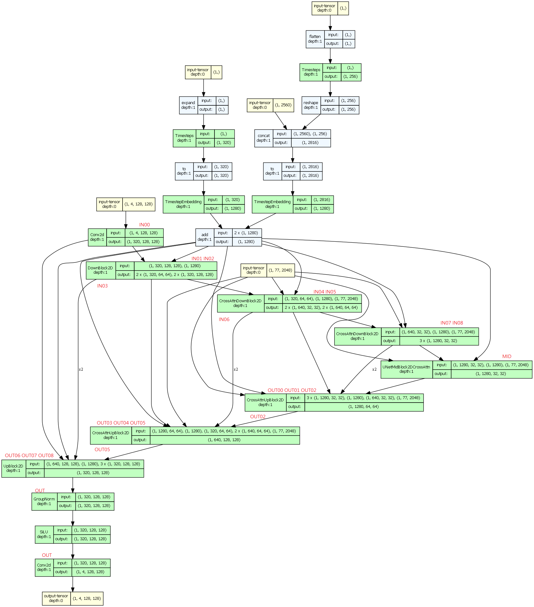

# Chapter 03: Data analysis #

Usually involves model comparasion.

- Comparasion of models **by model architecture**, with findings: [v1/mega_cmp.ipynb](v1/mega_cmp.ipynb)
- Mass scale of model comparasion, making [distance matrix](https://en.wikipedia.org/wiki/Distance_matrix) and try to plot a [weighed graph](https://en.wikipedia.org/wiki/Graph_(discrete_mathematics)) based from the distances: [v2a/mega_cmp_v2.ipynb](v2a/mega_cmp_v2.ipynb)
- Archived reports / diagrams: [v2a/results.7z](v2a/results.7z)

## Extra: Visualizing UNET ##

- Tired of diagrams drawn by hand? How about generated solely by program? [view_unet.ipynb](./view_unet/view_unet.ipynb)

SD1

SD2

SDXL

## Extra: PCA over CLIP embeddings ##
 
- As mini side request: [view_clip.ipynb](./view_clip/view_clip.ipynb)

- *More like validate my thought instead of discovery.*

